# Decisions

Every choice we made, and every choice we parked, written down so nobody argues it again by
accident. Newest thinking is at the bottom of each part.

If you only read one part, read **Part 1**. Those are the rules everything else follows.

| Part | What is in it |
|---|---|
| [1. The rules we never break](#part-1-the-rules-we-never-break) | Five rules that decide every other question |
| [2. What the product is](#part-2-what-the-product-is) | The name, who is in it, what a page shows |
| [3. What we keep](#part-3-what-we-keep) | Which data we store and why |
| [4. Making it fast enough to use](#part-4-making-it-fast-enough-to-use) | The site would not load. Here is what was wrong. |
| [5. How a statement gets built](#part-5-how-a-statement-gets-built) | Turning filings into the table you see |
| [6. The arithmetic checks](#part-6-the-arithmetic-checks) | Two days of finding out our own maths was wrong |
| [7. What we are waiting on](#part-7-what-we-are-waiting-on) | Parked, not forgotten |

---

# Part 1: the rules we never break

## Show what the company printed (2026-09-14)

Hicham's rule. **A statement page reproduces what the company printed.**

If the company printed one line, we show one line. If it printed three, we show three. We never
merge lines, never split them, and never invent a total the company did not report.

Anything we work out ourselves is a separate view, and it looks separate. Our own table can show
total revenue with a button that opens the parts underneath. That is analysis. It is not
reproduction, and a reader can tell which is which.

**Why this rule and not another one.** It makes every disagreement checkable. If our page and the
filing differ, we are wrong. There is nothing to argue about.

What it costs us: to copy a presentation we have to know the presentation. The SEC's summary files
name a tag once per line and do not say how many lines there really were. So faithful copying may
need the original filing rather than the summary. That question runs through a lot of what follows.

## Two layers: what you see, and what we join on underneath (2026-09-14)

Hicham's framing. It turns several separate decisions into one shape.

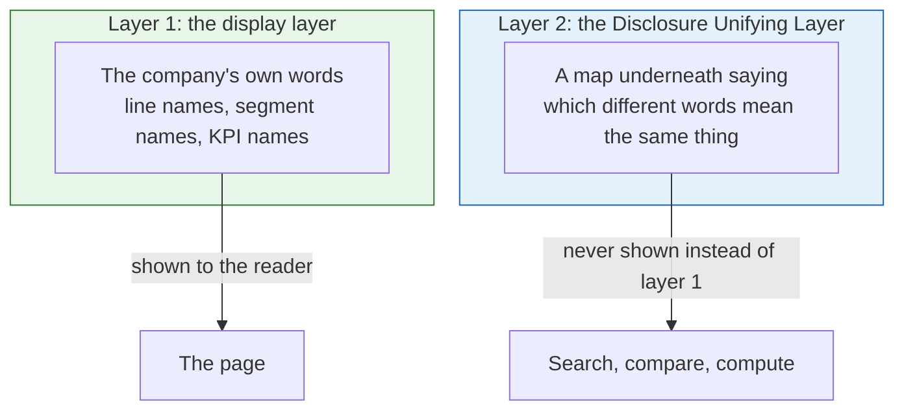

**Layer 1 is never touched.** We do not tidy up how a company presents its numbers.

**Layer 2 is a map held underneath.** It says which different names mean the same thing. It exists
so we can search and compare. It is never shown in place of the company's own words.

The example that explains it: a restaurant chain grows in two ways, more money per restaurant and
more restaurants. The first is called *Comps* or *Same Store Sales* in the US, and *Like for Like*
in the UK. Someone asking "what are the like for likes in the UK versus the US" is asking one
question in three vocabularies. Layer 2 is what makes that answerable. Layer 1 is what keeps each
company's own page honest.

Segment naming, the concept dictionary and the industry classification are all layer 2.

## A wrong check is worse than no check (2026-09-14)

We check that filings add up. A check that is itself wrong is worse than having no check, because it
makes good data look broken and teaches everyone to ignore the warnings.

This came from a real case. Our income tax check compared "profit before tax minus tax" against
whatever bottom line it found first. Citigroup passed 64% of the time. Morgan Stanley passed 64%.
Their filings were fine. Our check was wrong: it did not know that discontinued operations sit below
that line.

Two other checks were built on the same principle:

* **Earnings per share** refuses to run when preferred dividends are present and the company has not
  said what the top number was. A guess is not a check.
* **Cross statement checks** compare the *same* item on two statements, never two items that merely
  sound alike. A filing that counts restricted cash on one statement and not on the other is not a
  broken filing.

## If we show a number, we hold the filing it came from (2026-09-14)

The whole product rests on being able to show where a number came from. A link to sec.gov is not
evidence we control. Links rot, the SEC reorganises, filings are occasionally withdrawn.

So we store the filings themselves, for all 433,717 filings we take numbers from. Roughly 1.3 TB,
about 20 dollars a month, about twelve hours of downloading.

**Extended on 2026-09-14 (evening): store every exhibit too.** Not just the main document, not just
the debt agreements. Every attachment, every form, all the way back. Same reason: if we point at a
filing as evidence, we hold the whole filing, not the part we happened to want.

One number to work out before starting: every exhibit is several times the 1.3 TB the main documents
take. Storage is cheap, but the figure should be known before the download starts, not discovered
halfway through.

## The checks are for us, not for the reader (2026-09-14)

Hicham: what matters to a user is that the filings are there and are easy to understand. Our
arithmetic checks are an engineering signal. They decide what we are willing to publish and tell us
where to look. They do not appear on the page as badges, scores or warning triangles.

## Ask who the number answers to (2026-09-15)

A group of companies reports two profit figures, and two of our checks use different ones. Earnings
per share uses the parent's share. Profit before tax minus tax uses the whole group's total. Hicham
confirmed both.

We had written down the wrong reason. We said the two checks "want opposite figures", as if earnings
per share were an exception to the tax rule. That is not a rule. It is two answers that happen to
differ, and it tells you nothing about the next case.

Hicham's reason is the real one:

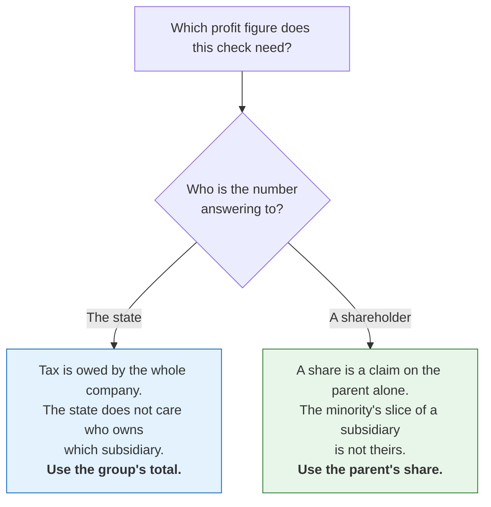

Ask who the number answers to, and the right figure follows. That generalises to the next check of
this shape. "Earnings per share is the reverse of the tax one" does not.

No code changed. The checks already took the right figure in both places. The comment above them and
the document explaining them did not.

---

# Part 2: what the product is

## It is called Disclosure (2026-09-13)

Everything a person sees says **Disclosure**: the site, page titles, sign-in emails, the creator
field inside an exported workbook.

The names inside the code stay as they are (`filings_hub`, the `filings-hub` command, the storage
prefix, the server names). Renaming them would move live web addresses and passwords for no gain
that anyone can see. Revisit when the domain name is bought.

## Foreign companies that file with the SEC are in (2026-09-14)

Companies based abroad that file a 20-F or 40-F are not "international filers" and are not a
question of scope. They file under US rules, they are listed in the US, and an investor can buy
them. So they are in.

We hold 2,020 of them, 1,363 listed, 1,208 on NYSE or Nasdaq, from 2009 onward.

## Real coverage of other countries needs a new source each time (2026-09-14)

Our data is SEC only. So today "Europe" and "Canada" means the foreign companies that file with the
SEC. Real coverage means a new source per country, not a longer list of companies.

The order is not the obvious one:

| Region | Difficulty | Why |
|---|---|---|
| Europe | **Easiest** | Annual reports are filed as inline XBRL, the same format our reader already handles. It is a question of getting the files, not reading them. |
| Canada | Harder than it looks | Filings go through SEDAR+, and Canada never widely required XBRL. Likely means working with documents, not tagged data. |
| Australia and New Zealand | Like Canada | Same shape as Canada, not like Europe. |

One thing to do now: the company list should carry an identifier that works across countries, such
as ISIN or LEI. A ticker does not. We already store LEI where the SEC gives it.

## Foreign companies are thinner than they look (2026-09-15)

Hicham's observation. A foreign company files a full annual report and no quarterly one. Its interim
figures arrive on a **6-K**, which is a press release, so it is a document rather than labelled
numbers. (6-K, not 8-K. 8-K is the domestic form.)

This is not a "cover more companies" problem. It is a "the companies we already cover are thinner
than they look" problem, which is the same family as late filers and restatements. **A gap is fine.
A hidden gap is not.**

**It also breaks something we had already built.** Our late-filer rule flags a company when more than
five months pass between quarterly reports. A foreign company never files one, so every single one
would show as permanently overdue. The rule has to know the filer type first.

Order of work, so the unknown gets resolved first: count how many foreign filers we hold and how
stale each one is. Then put an honest label on the page. Only then decide whether to pull numbers
out of the press releases.

**The rule if we ever do that:** a figure taken from a press release is never presented as carrying
the weight of an audited annual report.

## Ownership is three different things, never mixed (2026-09-13)

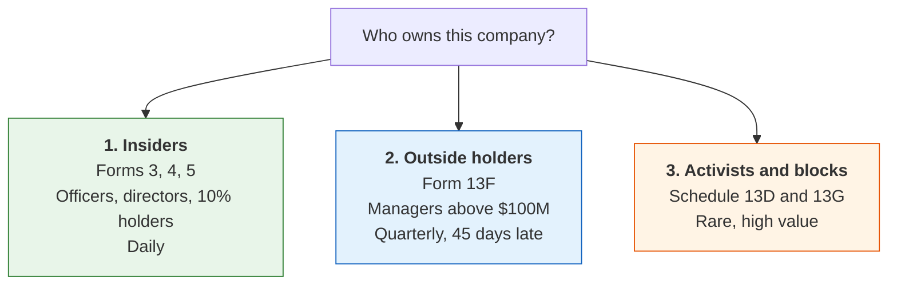

These are kept apart everywhere: separate tables, separate sections on the page, separate alerts,
separate exports. Nothing ever shows a director's Form 4 next to a fund's 13F.

Only the large managers are ever visible in 13F data, so the page says "reported holders", never
"owners".

**Order of work:** the live flow first, so each new filing is parsed the day it arrives. Presentation
second, once real data is moving. Backfill last. The value is in the movement going forward, not in
the level on the first day. **Collect all the history** when we do backfill, not a chosen number of
years, because a person's behaviour over many years is the point.

### An insider row has to say who the person is and how big the move was

A name on its own is not information. Someone looking at a company for the first time cannot tell
whether John McGovern matters.

So every insider row carries, taken from the form itself: the person's role; what kind of transaction
it was (a grant is not a purchase, and exercising options and selling immediately is not conviction);
how big it was relative to what they already held; whether it was a pre-arranged plan; and how many
other insiders moved the same way.

The row reads as a sentence:

> "John McGovern, Chief Financial Officer, sold 40,000 shares (12% of his holding) at $52.10 under a
> pre-arranged plan."

**One card per person, not a table row.** Name on top, job underneath, the move as a sentence, a
small chart of that person's holding over time, and little chips for context ("3 insiders bought
this month", "director"). Clicking the card opens the filing underneath it.

The same shape for the other two: a card per manager, a card per event. One big table with everything
in it is the thing this design exists to avoid.

## Segments keep the company's words, with a type tag underneath (2026-09-14)

Hicham settled this, and not the way it was asked. The page keeps the company's own wording, because
an analyst takes those words into a call with management and an invented division name is useless
there.

What gets standardised is not the name but the **kind** of split. Four kinds cover about 90% of
cases: **geography, product, sub-company, customer.**

So Apple carries `Apple: geography` and `Apple: product`, because it reports revenue by region and
separately discloses units by product. We can offer these views without ever renaming what the
company said.

**Why this is much cheaper.** Mapping the names would have meant reviewing about 14,000 invented
names. Classifying the *kind* is one decision per company per axis, and the SEC's own axis names give
three of the four almost free.

Odd cases outside the four kinds are deferred. Hicham: we will meet them, there are not many, do not
design for them now.

## Industry groups come from how analysts cover a name (2026-09-14)

Commercial schemes classify a company by what it sells. We turn that around. We start from how
analysts actually cover a name, make those the groups, and place companies into them afterwards.

```
Industrials > Transportation > Trucking > Brokers
Industrials > Transportation > Trucking > LTL Carriers
Industrials > Transportation > Trucking > TL Carriers
Industrials > Transportation > Trucking > 3PL
```

**Why this is worth something.** An LTL carrier and a TL carrier both sell freight movement, so a
scheme based on products puts them together. But they have different cost structures, different
cycles, different questions and different analysts. You cannot work that out from the financials.
Nobody can rebuild it from public data. It is judgement, and it is ours.

It also fixes the licensing position. GICS is licensed, so we cannot use it. SIC is not a research
map. Something we write ourselves, we own.

**Two changes from Mbarek, both accepted.**

*Depth varies.* Four levels fits Transportation. It will not fit everywhere. So we store a tree with
a pointer to the parent, not four fixed columns.

*One main group, plus other memberships.* A diversified transport company belongs in both trucking
and brokerage. An analyst needs to tell a focused operator from a big company with a small arm. So a
membership records whether it is the main one, and how big the exposure is.

| Table | Holds |
|---|---|
| `classification` | node, its parent, level, name, a definition sentence, other names for search |
| `company_classification` | company to node, main or not, exposure, who assigned it and when |
| `companies` | unchanged. SIC stays exactly as the SEC gives it. |

The definition sentence matters. It is how someone reviews an assignment later, and it forces "3PL"
to mean one thing instead of covering anything logistics-shaped.

**Transportation first.** Write the groups, write a definition for each, place a few dozen companies
we know. The obvious test is whether the expected peers come back. The better test: write down the
hard companies *before* placing them, then see if the structure handles them. Any scheme handles the
easy ones.

**Two warnings.** Do not merge this with the coverage tiers: tiers measure whether our data is
complete, this helps people navigate, and one field doing both does neither well. And the hard calls
are human, and someone has to keep reviewing them as companies change.

**Hicham is doing the groups (2026-09-14, evening).** The method is settled. The groups themselves and
the difficult placements are his. We can suggest placements from the filings.

## The fourth statement waits; five disclosures come first (2026-09-14)

Hicham: the statement of changes in equity is a real statement, but it is "nowhere close to" the
importance of the balance sheet, income statement and cash flow. It should exist eventually.

Ahead of it, in his order, the things analysts actually reach for:

1. Segmentation
2. Debt schedule
3. Preferred equity and other hybrids
4. Acquisitions
5. KPIs

## Debt gets its own page, and maturities become real years (2026-09-14)

Hicham wants debt structure as a page in its own right, not a line on a statement.

Filings describe when debt is due in two ways: relative ("due within one year", "year two") or
absolute ("2027"). Both mean the same thing. **We resolve both to the actual year.**

For a filing ending 2025-12-31: "within 12 months" is 2026, "year two" is 2027, "year three" is 2028.

Two reasons, both his. An analyst thinks in years, not offsets. And a time series only works on
absolute years: debt due in 2028, tracked across filings, rising is bad and falling is good. That
comparison is impossible if every filing's "year three" means a different year.

**The trap.** The year is relative to the company's own financial year end, not the calendar. A June
year end means "year two" is financial year 2027, which runs from mid-2026 to mid-2027. Labelling it
2027 without saying "financial year" would be wrong. It is the same class of mistake as reading a
table as thousands when it is millions: silent, and it makes the number useless.

## KPIs are left alone for now (2026-09-14)

59,755 company-invented tags in a single quarter, in nearly every filing. The work is not mapping
names, it is understanding definitions, and that is its own project.

Deferred deliberately, not forgotten. It becomes important when we go beyond the US, because that is
when the same idea starts carrying different words by country.

---

# Part 3: what we keep

## Nothing the SEC publishes gets dropped (2026-09-14)

The loader used to keep a fixed list of columns, and used to throw away rows that carried a breakdown
(by segment, by geography, by investment) on the reasoning that statements only use totals.

That quietly lost the breakdowns the SEC publishes, and eleven address columns.

**The rule now: nothing the SEC publishes is dropped.** Important columns stay properly typed. Every
other column passes through as text, so a column the SEC adds next year lands without anyone changing
code.

Keeping everything roughly doubles the size of the numbers table. Worth it.

## Lines the SEC broke by accident are repaired, not thrown away (2026-09-14)

The SEC's data files separate fields with tabs and do not normally quote anything. So we read them
with quoting turned off, and anything we cannot place is recorded as a reject rather than guessed at.

Four quarters had 152 such lines. All of them were investment rows where the *name of the investment*
contained a tab, and the SEC's writer had wrapped that one value in quotes. Read with quoting off,
the line had one field too many.

The loader now does a check before deciding anything: if a line is too wide, and the extra fields are
exactly explained by one quoted run, it is re-joined and counted as repaired. Anything else still
goes to the rejects. We repair what we can prove, and we never guess.

## Every field of the company header is kept (2026-09-14)

We used to keep seventeen fields from the SEC's company document and drop the rest: both addresses,
the owning organisation, the LEI, the description, the investor website, the flags, the dates on
former names.

The raw files only exist on the machine that ran the backfill, so for anyone reading our data those
fields simply did not exist.

Now every top-level field is kept, plus a catch-all field holding anything we have no column for, so
a field the SEC adds later arrives on the next refresh without a code change. The database change is
migration `0018`; the reused-ticker column below is `0020`.

Rows already stored read back with the new columns empty until the next refresh. One thing we log
rather than store: a per-filing field we have no column for. The filings table is 27 million rows, so
adding a column to it is a decision, not a default.

## Five separate problems all have the same answer (2026-09-14)

We verified something uncomfortable. The SEC's summary files lag by a quarter or two, so the newest
filing for any company is built a different, thinner way. Triumph Financial's April filing has its
fee breakdown. Its July filing does not.

That gap cannot be closed with anything we currently download. Nor can four other things:

| The problem | Why the summary files cannot solve it |
|---|---|
| The newest quarter has no breakdown lines | The SEC has not published it yet |
| Correct labels for a broken-out line | The summary names the tag once, with one label, and never mentions the parts |
| Proving a statement adds up | The filing's own arithmetic is dropped from the summary. Our guess is based on position and is unreliable. |
| The debt maturity schedule | 2 filings out of 4,802 tag it. The rest is a table in the notes. |
| Holding the source of every number | The trust rule: if we took the data, we take the source |

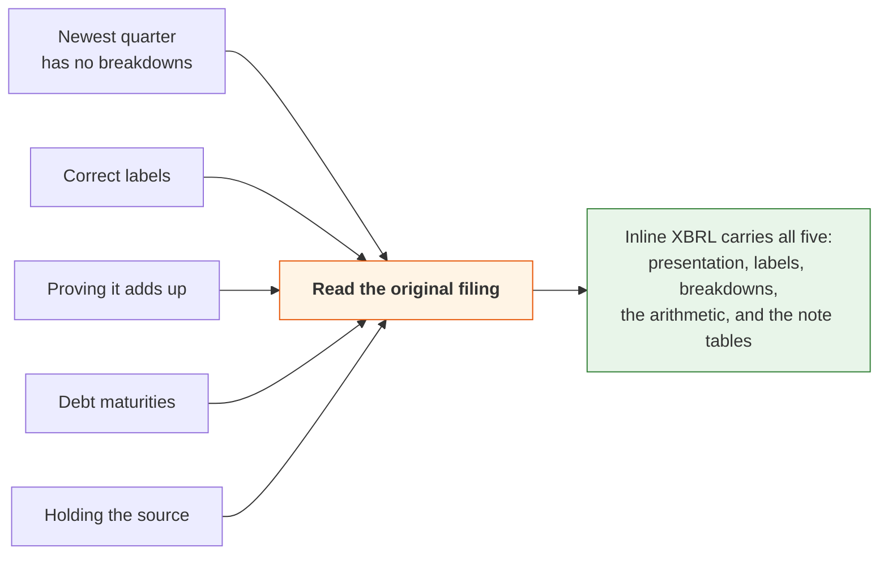

So this is **one project, not five**. And it moves the SEC's summary files from being our only source
to being a second opinion. That is a strengthening: two sources built independently that agree is
real evidence.

Meanwhile the gap is shown, not hidden. Periods built the thin way carry a label on the page, and the
Excel export says "provisional (built from XBRL facts; the SEC summary is not published yet)".

## History before 2009: use each company's own dictionary, backwards (2026-09-14)

No tagged data exists before about 2009, only HTML tables with English labels. Parsing those
generically means guessing across thousands of label variations, which is exactly the kind of
guessing we spent a day removing.

The approach instead: a company's statement barely changes from year to year. So for any company that
filed with tags in 2009 or later, **we already know its own wording**. Apply that company's own
dictionary backwards to its own older filings. No cross-company guessing. A company is only ever
matched to itself.

It only works for companies still filing after 2009. Hicham: fine, nobody analyses Blockbuster. Dead
companies become a separate project later.

Scope: listed companies, annual reports, 2001 onwards. Before 2001 it is plain text rather than
tables and stops being worth it. Roughly 75,000 documents, under a day to fetch.

**Anything read this way is labelled as read, not filed.** These values come from a table, not from a
tag. A reader must always know which numbers are reproductions and which are readings.

The remaining hard parts: getting the "in thousands / in millions" header right, negative numbers
written in brackets, and companies that changed their layout mid-period.

---

# Part 4: making it fast enough to use

## Never list the whole storage folder (2026-09-13)

The first real upload to cloud storage (27M filings, 125M facts, statements for 46,000 companies)
exposed what the layout cost. Listing a folder takes about a second per thousand files. The
statements folder alone is millions of files. And the site listed it at startup, every ten minutes,
and on every request.

Startup never finished. The live site showed no data at all.

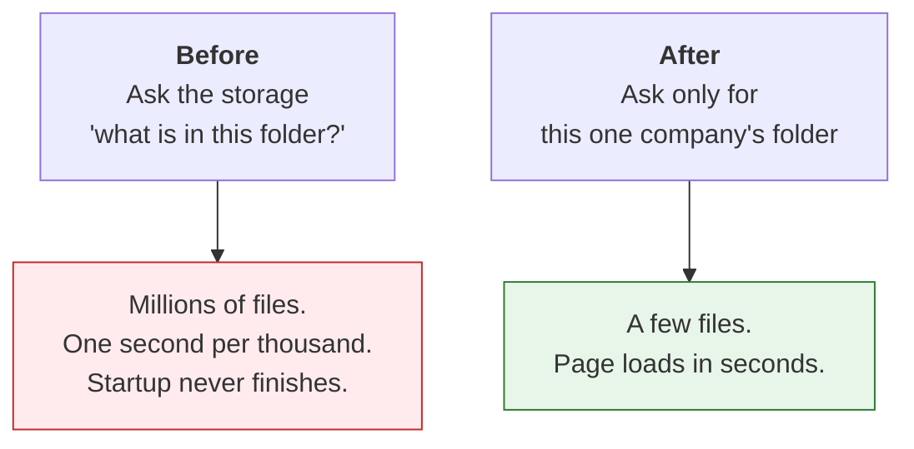

**The rule: we never list a per-company folder as a whole.** Checking something exists is one
request. A company's data is read from that company's own folder. The small tables that cover
everybody are copied locally. Summaries of the whole collection answer from those local copies, and
say so.

Measured against the live site afterwards: startup about two minutes, search 0.3 seconds, a company
page 4 to 8 seconds cold, under 0.1 seconds on a repeat visit.

## The site must answer "are you alive?" before it reads any data (2026-09-13)

The next deploy still never came up. Two reasons.

Opening a table reads the footer of every file in it, about a second each over cloud storage, and
startup opened 126 files plus another 278 before it would accept a single request. Then it counted
some rows while holding the only lock, so the platform's "are you alive?" check waited behind it and
gave up.

**The rules now.** The site opens no large table at startup. Warm-up happens on its own connection,
in the background, and until it finishes the table simply reads as empty. The "are you alive?" check
never waits on data: it gives the lock one second and otherwise answers "busy".

The other cost was per file rather than per table. Our database asks the storage for a file's size
and date about seven times per file, and each one was a separate request. A company's seventy files
took 84 seconds. We now remember folder listings for a minute, which answers those from information
we already fetched. The same seventy files: **7.8 seconds cold, 1 second warm.**

## Next.js 15 silently swallowed one navigation in four (2026-09-13)

Measured against a real build: clicking a link that had not been prefetched did nothing 20 to 30% of
the time. Pressing Enter on a link, a touch, or a click before the hover prefetch landed. The request
completed, the page loaded, and then the screen never changed and no error appeared. Hovering first
always worked.

This is a known bug in the framework, and the code path that causes it does not exist in the next
version.

It was also making our automated browser tests fail at random, and it affected real keyboard and
touch users. So we upgraded rather than loosening the tests.

Done the same day: the site runs **Next 16.3.5 on React 19.3**. Two things the upgrade forced,
worth knowing before anyone goes looking for them: `middleware.ts` is now `proxy.ts`, as the
framework requires, and `next lint` no longer exists.

Thirty scripted clicks with no prefetch: **zero stalls**, where the old version stalled about one in
four.

---

# Part 5: how a statement gets built

## A line is a concept plus its breakdown (2026-09-14)

The builder only took values with no breakdown attached. So if a company reported something *only*
broken out, and never as a total, that line vanished from the statement completely.

Measured: 46,672 lines in one quarter, 6.5% of all lines, across 91% of filings. On NYSE and Nasdaq,
**32% of filings lost income statement or cash flow lines.** Berkshire Hathaway among them.

**The rule now.** A line takes the total where the filing reports one. Where the filing reports only
the parts, each part becomes its own line. Two parts under one tag are two ordered lines, not one.

The company's own label is left exactly as it is. The breakdown sits in its own column, so the
decision about how to display it stays with the page and nothing is renamed in the data.

**Checks compare totals only.** Without that guard, Erie Indemnity's Class A earnings per share of
3.23 could be divided by Class B's 2,542 shares. Same failure as the Citigroup one: a check that does
not know what it is comparing.

## A reused ticker resolves to whoever owns it now (2026-09-14, evening)

Seven symbols were each claimed by two companies, so a lookup could land on a dead one.

Fixed when the data is built, not on every search: one owner per symbol is marked as current, ranked
by still filing, then most recent, then most filings. A symbol with only one owner is current even if
that owner is defunct. **We never drop the history.**

Why at build time: the tie-break is the same everywhere a symbol becomes a company. Deciding it once
keeps every one of those a plain filter that reads the same and cannot drift apart.

## The line grouping is a guess, and now says so (2026-09-14, evening)

The columns that say which line rolls up into which total are a **guess based on position**. The
SEC's summary files drop the filing's own arithmetic, so we assume each line rolls into the next
subtotal below it.

Two things were true and both mattered.

**There was no check to turn off.** A check built on this guess was never switched on. It would have
flagged 98.3% of filings. The guessed columns only feed the display. So the job was not "stop running
the check", it was "stop presenting a guess as a fact".

**The guess reaches a person in exactly two places:** the data we hand to the API, and the Excel
workbook. Both now carry a plain note saying the grouping is worked out from the order lines appear
in, not from the filing's own arithmetic, and is provisional.

Deliberately not done: a new stored column marking which groupings are guesses. Every one of them is a
guess today, so the marker would say the same thing on every row. It becomes worth adding when real
arithmetic from the filing starts mixing in with guesses.

## One statement, one currency (2026-09-15)

This was found by accident, and it is the only bug in this whole document that a reader could see.

A foreign company prints its statements in its home currency, with a US dollar translation beside
them. The SEC's files carry both. So one line could have two values at the same date, in two
different currencies.

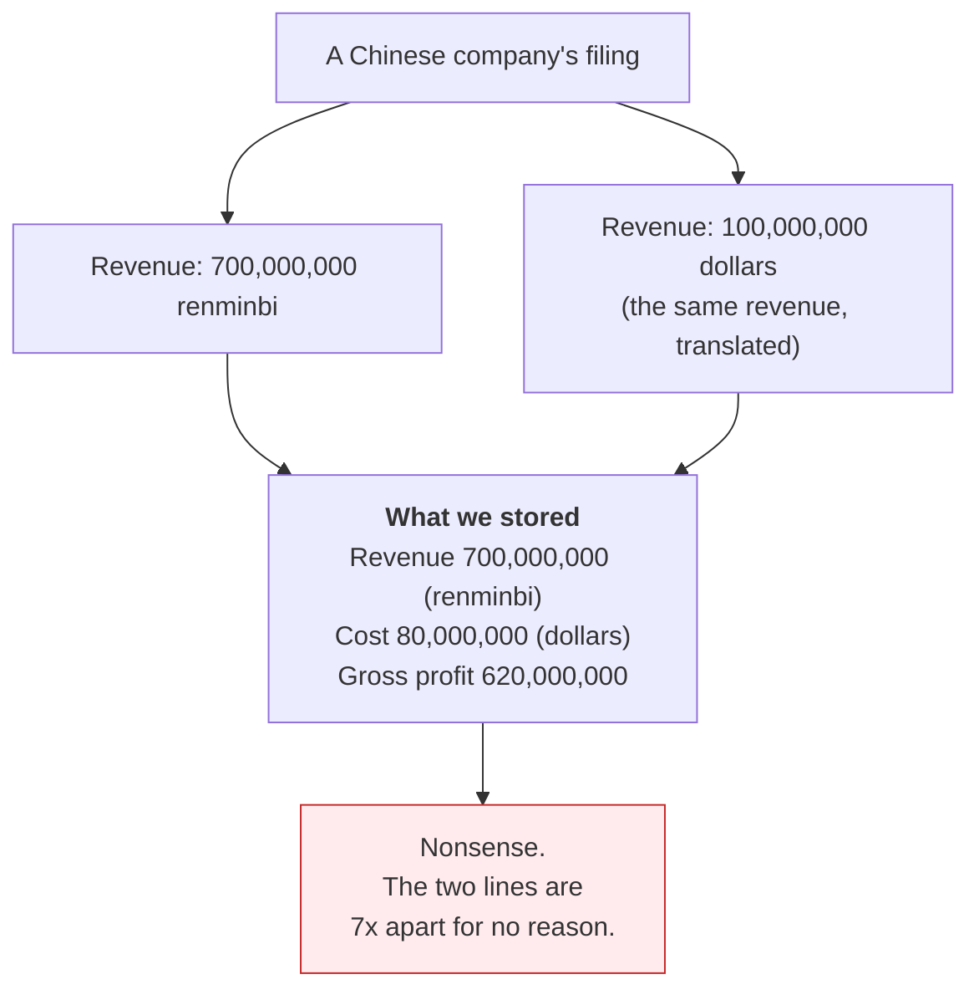

Measured: in one quarter, 3,502 values had this problem. **All 3,502 differed by currency and none by
anything else.** Renminbi and dollars was 2,222 of them, then Hong Kong, Singapore, Taiwan, Malaysia,
yen, peso, rupee. Across 167 filings, about 2% of that quarter's filers.

Three things went wrong, in order of seriousness. The company page showed whichever row happened to
be read first, line by line, so a renminbi revenue could sit above a dollar cost. A check compared a
renminbi revenue with a dollar cost and failed for no real reason. And the build produced a different
answer each time it ran.

**The rule.** A statement is kept in one currency: the one most of its lines use. The dollar breaks a
tie, then alphabetical order. Share counts and percentages are untouched. A per-share figure follows
its currency.

**A line that only exists in the translation shows nothing**, rather than showing the wrong currency.
The translation is not lost: we still hold every value. It just no longer competes for the line.

**Rejected:** keeping both and letting the page choose. The page identifies a line by its name, so the
second row silently replaced the first. That *was* the bug.

## The currency fix was checked on a real page layout, not just counted (2026-09-15)

Everything that verified the currency fix until then counted rows or counted failing checks. The code
that lays out what a reader actually sees had never been run against a two-currency filing at all.

So we now build the page twice, before and after a company adds a translated copy of every line, and
the two must come out identical.

Both directions were rendered and read, not just asserted. With the dollar winning, the statement is
unchanged line for line. With the home currency winning, which is the dangerous direction because the
dollar rows are the ones dropped, the statement reads in that currency from top to bottom, every
figure is exactly the translated one, no line is empty, and the statement still adds up inside itself
(980 − 525 = 455, 455 − 112 = 343, 343 − 56 = 287).

**What this does not prove:** that a particular real company's page is right. The test filing is one
we wrote. This shows the code lays out the page correctly, which is a different claim. The honest
status is "fixed, rebuilt, page layout proven, real page not yet opened".

One thing noticed and deliberately left alone: a per-share line still carries the company's own
printed label ("in dollars per share") beside a renminbi unit. That is the company's wording, and the
rule is that the page shows the company's words. The unit beside it is ours, and it is correct.

---

# Part 6: the arithmetic checks

Two days of work. It started with 9.2% of checks failing and ended at 1.7%. **Almost none of the
original 9.2% was real.** It was our own maths being wrong, not the filings.

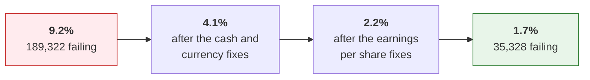

## First, measure whether the tolerance is hiding anything (2026-09-14, evening)

Before changing how close two numbers have to be, find out whether the current setting is letting
real breaks through.

Three choices worth recording. The measurement **imports the real tolerance rather than copying it**,
so it can never quietly drift from the thing it measures. Checks on tiny numbers pass on a different
rule, so they are **reported separately** and do not flatter the result. Earnings per share is
measured on its own line.

**The answer (same evening): the tolerance is fine.** Of 1,502,846 passes it governs, 99.48% are
exact and 711 are near misses. So the plan to give every line its own tolerance is **deferred**. Low
value, and it needs the filing download anyway.

The real signal was elsewhere. About 9% of checks *fail*, and most fail by more than ten times the
limit. That is not a tolerance question. That is something genuinely not adding up.

## Know which companies we never check at all (2026-09-14, evening)

A tool that answers "what should we hold, and where does it differ from what we do".

Choices worth recording:

* **Tiered, because a gap means different things in different places.** NYSE and Nasdaq, other
  listed, filing but unlisted, everything else. A gap in the first tier is a bug. A gap in the last is
  usually a shell company that never filed accounts. The report never counts an expected absence as a
  failure.
* **The headline is companies getting zero checks.** A company whose filings never trip any check is
  unverified, and nothing said so before.
* **Every gap carries a reason**: foreign filer, gone dark, blank-cheque company, or "unexplained,
  investigate". The unexplained ones in the top two tiers are the list to work.

## The reader gets twenty real filings to prove itself on (2026-09-15)

Every test of our filing reader used a filing we had written ourselves. So we took 26 awkward real
ones and made them permanent tests.

* **Which filings.** The set we already watch, plus the cases it lacked: a bank with fee breakdowns, a
  company with discontinued operations, a foreign filer, a filing from the first year of tagged data,
  and small companies with invented labels. Each row says why it is there.
* **Fetched once, then offline forever.** The build machine cannot reach sec.gov, so the files are
  fetched on the Mac and committed, compressed. **Rejected:** fetching inside the test. A test that
  needs the SEC is a test that fails when the SEC is slow.
* **Report everything, stop at nothing.** The checker runs every stage and records each failure
  against its stage rather than stopping at the first. That is how twenty filings become a list of
  things to fix.
* **Never silent.** One test per filing, plus one test that fails if any filing has no fixture.
  **Rejected:** skipping when files are missing. That is exactly the silent failure this exists to
  prevent.

## Four big companies hide their structure inside another file (2026-09-15)

The first run over real filings read 20 of 24 cleanly. The four that failed were Microsoft, Prologis,
Royal Bank of Canada and Toyota. They share one filing agent and one shape: the SEC holds only two
files for them, and the descriptions of labels, layout and arithmetic are **embedded inside** one of
those two rather than sitting in separate files. Microsoft's carries 1,103 layout instructions.

There was no separate file to fetch. The fetch was right and the reader was blind.

**Fixed in the reader, not the fetch.** The reader now asks every document what it carries, and merges
what it finds. For the twenty filings that keep separate files, nothing changes.

**Rejected:** treating a two-file filing as incomplete and skipping it. That would silently drop
Microsoft.

## The two causes of the 9.2%, one right and one wrong (2026-09-14 evening, corrected 2026-09-15)

We found two causes. One fix was right. One was wrong and was reverted the next day.

**Cause 1, the cash check compared the wrong two numbers. This fix was right.**

Cash appears twice on a cash flow statement: at the start of the year and at the end. Our check
grabbed whichever it happened to find.

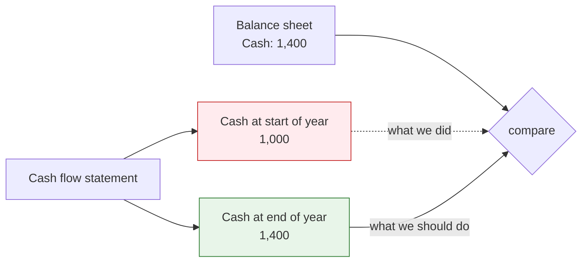

Taking the later-dated figure removed the problem almost entirely. **99,102 failures fell to zero.**

**Cause 2, the sign. This fix was wrong.**

Companies sometimes record a cost as a negative number, and the filing carries a flag saying "show
this flipped". The page already used the flipped version. The checks used the raw one.

So we made the checks use the flipped one too. That was backwards. Our checks are *written* for the
raw value: costs positive, cash flow items signed. Feeding them the display version inverted every
line a company shows in brackets. A cost shown as (cost) became a negative cost, so revenue *minus*
cost started *adding*.

| Check | Before the wrong fix | After it |
|---|---|---|
| Income after tax | 13,480 | **72,443** |
| Gross profit | 4,802 | **17,058** |
| Net income agrees across statements | 806 | **2,585** |

About 60,000 new failures, created to cure roughly 800 real oddities. Reverted the same day.

**What the 800 are.** Companies that tagged a line with the wrong sign. Texas Pacific Land Trust
filed its total assets as −24,284,031 and shows it as +24,284,031, and its parts add up exactly
(6,623,235 + 17,660,796 = 24,284,031). The page balanced. Only the check failed.

These are genuine anomalies in the filings and our check is right to flag them. They stay flagged.
They are 0.04% of all checks.

**The lesson, and it is the important part of this entry.** The diagnosis came from the list of worst
offenders, where sign flips dominate **because a flip is the largest error possible, not the most
common one**. The query that measured the pattern across *all* failures came second and contradicted
it. It should have come first.

## Changing a check no longer costs a full rebuild (2026-09-15)

Three full rebuilds in two days, 46 minutes each, all for changes to the checks alone.

The checks are worked out from the same rows the statements table already holds. So they can be
recomputed from what we already stored, without rebuilding anything. **46 minutes becomes 6.**

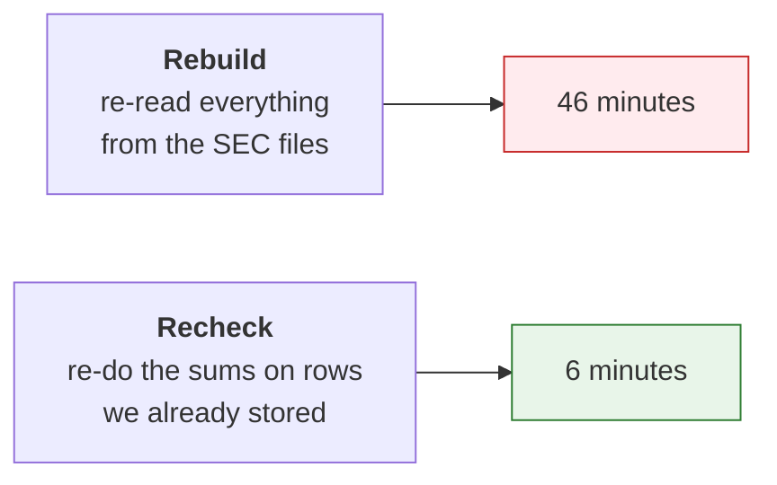

Held in place by two tests: one runs it on a built collection and requires the checks to come out
**identical, row for row**. The other changes the pass rule and requires every verdict to move while
every number stays. It recomputes. It does not copy.

Deliberately not refreshed: the pass or fail flag stored on each statement row, because refreshing
that means rewriting the statements table, which is the expensive part. It catches up on the next
real build, and the command says so.

**Proven on the real data:** after the currency fix, rebuilding one quarter the slow way gave the
identical result, to the row.

## After the cash and currency fixes: 4.1% (2026-09-15)

| Check | Before | After |
|---|---|---|
| Ending cash agrees, cash flow to balance sheet | 434 | **0** |
| Net income agrees, income statement to cash flow | 807 | **1** |
| Balance sheet balances | 1,403 | 322 |
| Net change in cash | 7,048 | 5,585 |
| Income after tax | 13,347 | 12,134 |
| Gross profit | 4,787 | 3,900 |
| Operating income | 3,425 | 2,854 |
| Earnings per share | 59,666 | 58,926 |

Every remaining ending-cash failure, and all but one net-income failure, was currency mixing. So were
three-quarters of the balance sheet failures.

What is left is earnings per share, 70% of the remainder.

## Earnings per share was using the wrong profit (2026-09-15)

Measured across **all** 58,926 failures before changing anything: 41,549 of them, 70%, used the
group's total profit as the top number. That top number failed 41.8% of the time. Every other choice
failed 5 to 7%.

The group's total includes the minority shareholders' slice of subsidiaries. Earnings per share is
per share of **the parent's** shareholders.

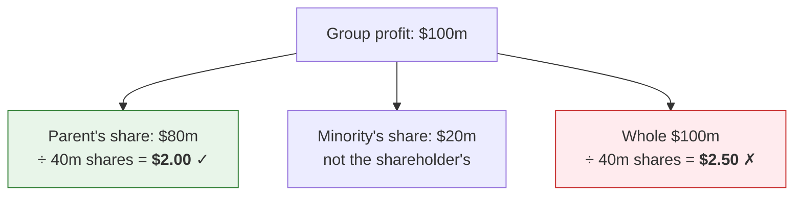

**Result: 33,212 failures cleared.** Diluted fell from 30,750 to 15,010, basic from 28,176 to 10,704.

**Method note, and it is why this one worked.** This was diagnosed from the pattern across every
failure first. No fix was written until the pattern was measured.

## When we have to guess the top number, the check says "approximate" (2026-09-15)

25,700 failures remained and 70% had no obvious pattern: our figure was 1 to 20% away from theirs.

Measured across all of them, only 21% showed anything on the income statement that could explain the
gap. Fifteen filings read in full settled it.

Profitable companies came out 1 to 6% **above** the reported figure. Loss-making small companies came
out **below**. Two different, completely legitimate adjustments:

| Who | What they take out first | Where it is disclosed |
|---|---|---|
| Profitable companies | Earnings promised to unvested shares that earn dividends, routinely 1 to 4% | The notes at the back |
| Loss-making small companies | Preferred dividends, added to the loss | The notes at the back |

Both live in the notes, not on the face of the income statement. **A check that reads the statement
cannot see them.** Neither is a bug in our check, and neither is an error by the company.

**The rule.** When the company tagged its own top number, the check is exact: 1%, or one cent, and a
failure is real. When it did not, net income stands in and the check is **approximate**: tolerance
5%, and labelled approximate everywhere it appears.

* **Rejected: just loosening the tolerance for everyone.** That would hide real errors on the filings
  where we *do* have the company's own number.
* **Rejected: skipping the check when we have to guess.** 317,000 such checks, 94% of them passing,
  are real evidence of consistency, and they are the only coverage most small companies get.

## The tax check had the same problem, in the opposite direction (2026-09-15)

Income after tax was now the biggest bucket: 12,134 failures.

Measured by which line the check compared against: one line ran 23,159 times and failed **26%**. Every
other line failed 1.6 to 6.7%. Half of all the failures came from that one line.

It was continuing income **attributable to the parent**, after the minority's slice comes out. But
profit before tax minus tax is the **consolidated** figure, minority included. Three of fifteen
sampled filings proved it to the dollar.

Fixed by preferring the consolidated line. **12,134 failures fell to 8,682.**

## A tag's name is not evidence of how a company used it (2026-09-15)

Digging into what remained corrected the previous entry on two counts, and this is the most useful
thing we learned all week.

**The minority bridge was wrong 69% of the time.** Adding the minority's share to the parent's line
ran 1,538 times and failed 1,067. QVC showed why: *their* version of that tag is already the
consolidated figure, equal to the group total to the dollar. So adding the minority's share broke it.
Other companies use the same tag for the parent's portion. **One tag, both meanings.**

**A tag is used against its own name.** Six of eight sampled filings using a tag whose name says
"excluding income from equity-method investments" closed exactly *without* that adjustment. CHS to
the dollar: 419,878 + 4,091 = 423,969, which is the group total. Also United Security, Susser,
Donegal, City National and QVC. The name says the subtotal excludes it. Most companies tag a subtotal
that includes it.

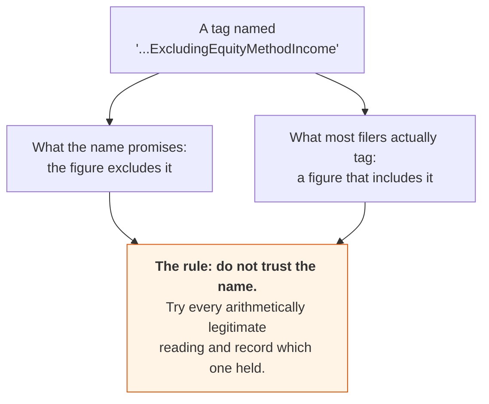

**The rule now.** The check asks whether profit before tax minus tax equals **any** legitimate
after-tax line the filing offers, in a stated order of preference, and records which one held. A
wrong tax figure or a wrong bottom line still matches none of them. Only the ambiguity of the tags is
absorbed.

**Rejected:** picking one meaning per tag. The data says there is no such thing.

## The exchange-rate effect sits outside the total, not inside it (2026-09-15)

A tag whose name says the exchange-rate effect is included in it failed 19.2% of the time. Its
sibling tag failed 0.6%.

Seven of fifteen sampled filings were one pattern, exact to the dollar: the three activities add up to
the stated total, and adding the exchange-rate effect **misses by exactly that effect**. Companies
show it on its own line underneath the subtotal, in both US and international accounting.

Both readings are now tried, the one the tag's name promises first. A company that does include it
still passes on its own reading. A total that matches neither still fails.

**2,252 failures cleared**, against an estimate of about 2,200 from the sample.

## Three smaller gaps in the tax check (2026-09-15)

* **The domestic line is not the total.** A tag for domestic pretax income failed 6.6%, three times
  any other. It is the domestic half. The foreign half is its own tag and the two add up. Both
  readings are now offered, because some companies tag the whole thing under the domestic name.
* **The bottom line stands as a candidate on its own.** China Jo-Jo's pretax figure already carries
  the discontinued result, so the plain bottom line closed to the dollar while "bottom line minus
  discontinued" missed by 644,308.
* **Both bottom-line tags are offered.** Texas Capital tagged one of them after preferred dividends
  and the other as the consolidated total. Only the first one found was tried before.

**The trade-off, stated plainly.** Every candidate we add makes the check more permissive. The tax
check now has up to eight possible right-hand readings.

That is deliberate. Every candidate is an arithmetically legitimate reading of the filing. A wrong tax
figure or a wrong bottom line still matches none of them. And the alternative, one fixed reading,
produced thousands of failures that were our misreading rather than the company's error. A test holds
the line: a filing whose tax figure is genuinely wrong still fails.

**Known and deferred.** Two of fifteen sampled filings close to the dollar once equity-method income
is added, but they tag it only on the cash flow statement, and the income statement check only sees
income statement values. Worth perhaps 500 failures. It needs the check to read across statements,
which both build paths would have to pass through, so it waits rather than being bolted on.

## All four fixes measured: 1.7% (2026-09-15)

**9.2% to 1.7%.** Companies with at least one failing check: 71.6% to 33.0%.

| Bug | Failures cleared | Did a reader ever see it? |
|---|---|---|
| Cash compared the start of the year to the end of it | 99,102, to zero | No |
| Home currency and dollar translation both kept | about 2% of filers | **Yes** |
| Earnings per share used the group's profit | 41,549 | No |
| The exchange-rate effect counted twice | 2,252 | No |

What remains, 35,328:

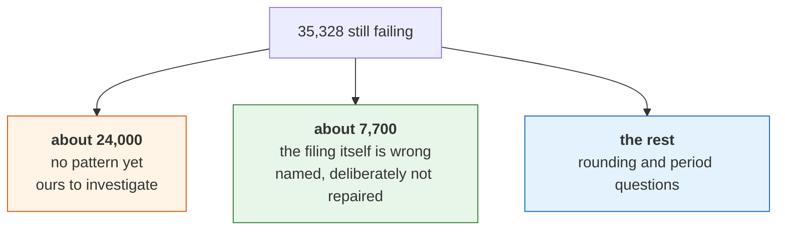

**The two checks that never moved:** gross profit (3,900) and operating income (2,854). Nothing fixed
so far touches them. They are next, and they may need the filing's own declared arithmetic rather than
another round of tuning.

## Where the remaining gaps sit in the plan (2026-09-15)

Four gaps named after two days on the checks, and where each already lives:

| The gap | Where it belongs |
|---|---|
| Our formula guesses how a company adds up its statement | **Step 8.** Each round of tuning returns less. Step 8 replaces the guess with the filing's own arithmetic, and these failures go by construction. |
| Everything still comes from the summary files | **Steps 6 and 7.** The currency bug was invisible precisely because nothing independent could contradict them. |
| Nobody has looked at a page since the data changed | **New step 8b**, because the plan had no rule for it. Tests and counts are necessary and neither shows what a user sees. |
| What "100% correct" actually means | Already written, now sharpened: **no failure caused by us**, every other one named with a reason, and "unexplained" the only count that should be shrinking. |

---

# Part 7: what we are waiting on

## Market data is parked until a lawyer answers (2026-09-14)

Hicham asked for end-of-day prices and market value.

The data side is nearly solved already. Share counts are in our data from the filings, including the
split by class that market value needs for companies with more than one (Alphabet: Class A 5,824m,
Class B 836m, Class C 5,456m, adding to the reported 12,116m). Only the price is missing, and a price
feed is about 20 euros a month for the whole world.

**None of that is the deciding factor.** The deciding factor is whether the seller's agreement lets us
show their price to a paying subscriber. That is a question for a lawyer.

So the whole workstream is parked. No seller engaged, no key obtained, no price data enters our
storage until the legal question is answered.

Two things settled on the way, which stand whatever the lawyer says:

* **We buy prices only, never financial statements.** Sellers compile statements by scraping
  announcements, news feeds and company websites. That is a copy of a copy. It is the same reason we
  turned down a FactSet login. If a seller's number and the filing disagree, the filing is right, and
  we would have no way to show which is which. **Filings we own end to end. Prices we rent, because we
  cannot add anything to a closing price.**
* **Building a price feed ourselves is a licensing project, not an engineering one.** The code is a
  file a day. The hard parts are the exchange agreements, which are what the seller actually sells,
  and adjusting for splits and dividends, which is where the bugs live. At 20 euros a month the
  arithmetic is not close.

Also noted for the lawyer: the UK still has the EU database right and the US has no equivalent. So
extracting data from someone else's compilation is a **bigger** risk here than it would be in the US.
That makes scraping worse for a UK company, not better.

## Business-email-only sign-up is built and switched off

The sign-up form can reject Gmail, Outlook, Yahoo and similar with "please enter a valid business
email address", the way AlphaSense does. It is built and tested, and it is **off by default**, because
the owner's own address is a Gmail one and is needed for testing.

**Revisit once the domain name is bought.** Then turn it on in the server's settings and the form
starts refusing free-mail addresses.

## Also waiting on the domain name

* Sign-up and sign-in emails need an email relay and a public web address. Until then the pages say
  email is not configured, and visitors keep their choices in their own browser.
* Accounts need a read-write storage key. The read-only one cannot store users.
