# Decisions

This is where I write down every choice we have made and every choice we have parked, so that
nobody, including me, ends up arguing the same thing twice by accident. Within each part, the
newest thinking is at the bottom.

If you are only going to read one part of this, read Part 1. Those are the rules that decide
everything else, and most of the arguments we have had since were really about one of them.

| Part | What is in it |
|---|---|
| [1. The rules we never break](#part-1-the-rules-we-never-break) | Five rules that settle every other question |
| [2. What the product is](#part-2-what-the-product-is) | The name, who is in it, and what a page shows |
| [3. What we keep](#part-3-what-we-keep) | Which data we store, and why we store all of it |
| [4. Making it fast enough to use](#part-4-making-it-fast-enough-to-use) | The site would not load at all. Here is what was wrong. |
| [5. How a statement gets built](#part-5-how-a-statement-gets-built) | Turning a filing into the table you actually see |
| [6. The arithmetic checks](#part-6-the-arithmetic-checks) | Two days of discovering that our own maths was wrong |
| [7. What we are waiting on](#part-7-what-we-are-waiting-on) | Parked deliberately, not forgotten |

---

# Part 1: the rules we never break

## We show what the company printed (2026-09-14)

This is Hicham's rule, and it is the one I would keep if I had to throw the rest away. **A statement
page reproduces what the company printed.**

If the company printed one line, we show one line. If it printed three, we show three. We do not
merge lines together, we do not split them apart, and we never invent a total that the company did
not report itself.

That does not mean we can never do any analysis. It means that anything we work out ourselves has to
be a separate view, and it has to look separate. Our own table can show total revenue with a button
that opens up the parts underneath it, and that is fine, because the reader can see at a glance which
part is the company talking and which part is us talking.

The reason I like this rule more than any of the alternatives is that it makes every disagreement
checkable. If our page and the filing say different things, then we are wrong. There is no judgement
call for anyone to defend and no conversation to have about it.

What it costs us is real, though. If we want to reproduce how a company presented something, we have
to know how they presented it, and the SEC's summary files name a tag once per line without telling
us how many lines there actually were. So faithful copying may well mean reading the original filing
rather than the summary, and that question runs through a lot of what comes later in this document.

## There are two layers: what you see, and what we join on underneath (2026-09-14)

This is Hicham's framing, and once he said it out loud it turned a handful of separate arguments into
a single shape that I can now apply to new questions without having to think very hard.

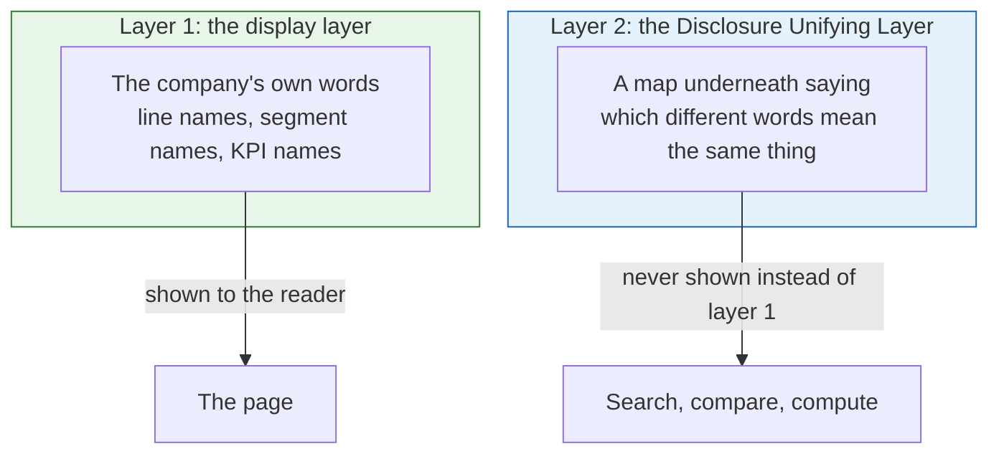

The first layer is the one we never touch. We do not tidy up, standardise or improve the way a
company presents its own numbers.

The second layer is a map that sits underneath and records which different names mean the same thing.
It exists so that we can search and compare across companies, and it is never shown to anyone in
place of the company's own words.

The example that made it click for me is the restaurant one. A restaurant chain grows in two
different ways, by making more money in the restaurants it already has and by opening new ones. The
first of those is called Comps or Same Store Sales if you are American and Like for Like if you are
British, so somebody asking "what are the like for likes in the UK compared to the US" is really
asking a single question in three different vocabularies. Layer two is the thing that makes that
question answerable at all, and layer one is the thing that keeps each individual company's page
honest while we do it.

Segment naming, the concept dictionary and the industry classification are all layer two, which is
why they stopped feeling like three separate problems once we had this framing.

## A wrong check is worse than having no check at all (2026-09-14)

We check that the filings add up. A check that is itself wrong is worse than not checking anything,
because it makes perfectly good data look broken and it teaches everybody to ignore the warnings,
which means the real ones get ignored too.

I learned this from a case that was genuinely embarrassing. Our income tax check compared "profit
before tax minus tax" against whatever bottom line it happened to find first, and on that basis
Citigroup passed only 64% of the time and Morgan Stanley did no better. Their filings were fine. Our
check simply did not know that discontinued operations sit below the line it was looking at.

Two other checks were built on the same principle once we understood it. The earnings per share check
refuses to run at all when preferred dividends are present and the company has not said what the top
number was, because a guess is not a check. And the checks that compare across two statements always
compare the *same* item on both, never two items that merely sound alike, so that a filing which
counts restricted cash on one statement and not on the other does not get reported as broken when it
is nothing of the sort.

## If we show a number, we hold the filing it came from (2026-09-14)

The whole product rests on being able to show somebody where a number came from, and a link to
sec.gov is not evidence that we control. Links rot, the SEC reorganises its site, and filings are
occasionally withdrawn.

So we store the filings themselves, for all 433,717 filings that we take numbers from. That works out
at roughly 1.3 TB, about 20 dollars a month, and about twelve hours of downloading, which is cheap
enough that the decision was easy.

In the evening of the same day we extended this to cover every exhibit as well, not just the main
document and not just the debt agreements. Every attachment, every form, all the way back. The reason
is the same one: if we are going to point at a filing as our evidence, then we should hold the whole
filing rather than only the part we happened to want at the time.

There is one number I want worked out before we start rather than discovered halfway through, which
is that every exhibit across all those filings is several times the 1.3 TB that the main documents
take. Storage is cheap, but I would rather know the figure and budget for it than find out during the
download.

## The checks are for us, not for the reader (2026-09-14)

Hicham was clear about this. What matters to somebody using the site is that the filings are there
and that everything is easy to understand. Our arithmetic checks are an engineering signal: they
decide what we are willing to publish and they tell us where to go looking. They do not appear on the
page as badges, scores or little warning triangles.

## Ask who the number is answering to (2026-09-15)

A group of companies reports two different profit figures, and two of our checks need different ones.
Earnings per share uses the parent's share, while profit before tax minus tax uses the whole group's
total. Hicham confirmed that both of those are right.

But the reason I had written down for it was wrong, and it is worth correcting because the wrong
version does not help you with the next case. I had said that the two checks "want opposite figures",
as though earnings per share were some kind of exception to the tax rule. That is not a rule at all.
It is two answers that happen to come out differently, and it tells you nothing.

Hicham's reason is the real one, and it generalises:

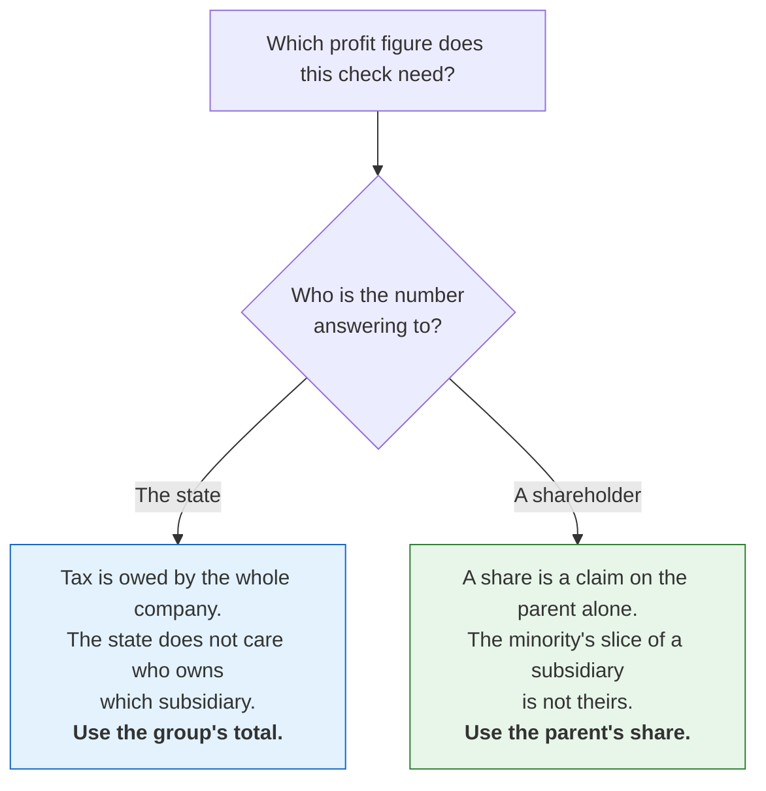

If you ask who the number is answering to, the right figure follows on its own, and that will still
work the next time we build a check of this shape. "Earnings per share is the reverse of the tax one"
would not have helped at all.

Nothing in the code changed as a result of this, because the checks were already taking the right
figure in both places. It was the comment above them and the document explaining them that were
wrong.

The reason I am confident this framing is better than mine is that it predicts something. We have not
built the retained-earnings roll-forward yet, and the rule already tells me which figure it takes:
retained earnings is what the parent's shareholders have accumulated, and the minority's interest
sits on its own line in equity, so the roll-forward takes net income attributable to the parent
rather than the consolidated total. If it took the consolidated figure it would fail by exactly the
minority's share on every company with a subsidiary, which is the same bug we have now fixed twice in
two different places. That is written into step 12 to be checked against real filings when we get
there, rather than believed on the strength of the argument.

---

# Part 2: what the product is

## It is called Disclosure (2026-09-13)

Everything that a person actually sees says Disclosure: the site itself, the page titles, the sign-in
emails, and the creator field inside a workbook that somebody exports.

The names inside the code are staying as they are, so the package is still `filings_hub`, the command
is still `filings-hub`, and the storage prefix and server names are unchanged. Renaming all of that
would mean moving live web addresses and passwords around for no benefit that anybody outside the
team could ever see. We can revisit it when the domain name is bought and the services get recreated
underneath it anyway.

## Foreign companies that file with the SEC are in (2026-09-14)

Companies based abroad that file a 20-F or a 40-F are not "international filers" and they are not a
question of scope. They file under US rules, they are listed in the US, and an investor can buy them,
so they are in.

We already hold 2,020 of them, of which 1,363 are listed and 1,208 are on NYSE or Nasdaq, going back
to 2009.

## Covering other countries properly means a new source for each one (2026-09-14)

All of our data comes from the SEC, so when we say "Europe" or "Canada" today what we actually mean is
the foreign companies that happen to file with the SEC. Covering those countries for real means
finding a new source for each one, not writing a longer list of companies.

The order surprised me when I worked through it:

| Region | How hard | Why |
|---|---|---|
| Europe | **Easiest** | Annual reports are filed as inline XBRL, which is the same format our filing reader already handles, so it is a question of getting hold of the files rather than of reading them. |
| Canada | Harder than it looks | Filings go through SEDAR+, and Canada never required XBRL widely, so it probably means working with documents rather than tagged data. |
| Australia and New Zealand | Like Canada | The same shape as Canada rather than the same shape as Europe. |

There is one thing worth doing now rather than later, which is that the company list should carry an
identifier that works across countries, such as ISIN or LEI. A ticker does not. We already store LEI
wherever the SEC gives it to us.

## The foreign companies we already have are thinner than they look (2026-09-15)

This came from Hicham noticing something I had not. A foreign company files a full annual report and
no quarterly one at all, and its interim figures turn up on a **6-K**, which is a press release. That
means it is a document rather than a set of labelled numbers. (It is 6-K rather than 8-K, which is
the domestic form, and I had that wrong at first.)

So this is not a problem about covering more companies. It is a problem about the companies we
already cover being thinner than they look, which puts it in the same family as late filers and
restatements. A gap is fine. A hidden gap is not.

It also breaks something we had already built, which is the reason I want it handled properly rather
than noted and forgotten. Our late-filer rule flags a company when more than five months go by
between quarterly reports, and since a foreign company never files one, every single one of them
would show up as permanently overdue. The rule has to know what kind of filer it is looking at before
it can say anything.

I have ordered the work so that the unknown gets resolved first. We count how many foreign filers we
hold and how stale each one is, then we put an honest label on the page, and only then do we decide
whether it is worth pulling numbers out of the press releases at all.

If we ever do that last part, one rule has to hold: a figure taken from a press release is never
presented as though it carried the weight of an audited annual report.

## Ownership is three different things and we never mix them (2026-09-13)

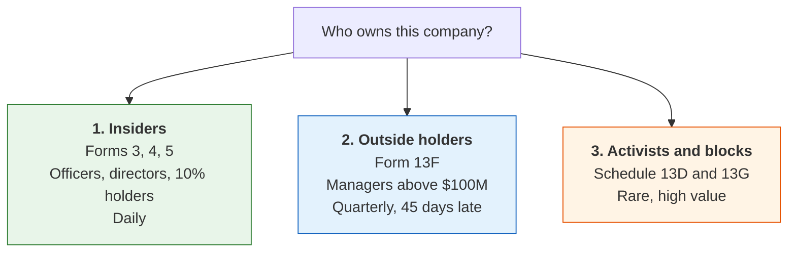

We keep these three apart everywhere it is possible to keep them apart, which means separate tables,
separate sections on the page, separate alerts and separate exports. Nothing ever shows a director's
Form 4 sitting next to a fund's 13F.

One detail that matters for honesty: only the large managers ever appear in 13F data at all, so the
page says "reported holders" rather than "owners".

On the order of the work, the live flow comes first, so that each new filing gets parsed on the day
it arrives. Presentation comes second, once there is real data moving through it. Backfill comes
last, because the value here is in watching the movement going forward rather than in knowing the
level on the first day we looked. When we do backfill, we collect all of the history rather than
picking a number of years, since somebody's behaviour over many years is the entire point.

### An insider row has to say who the person is and how big the move was

A name on its own is not information. Somebody looking at a company for the first time has no way of
telling whether John McGovern matters.

So every insider row carries a few things taken straight from the form itself: what the person's role
is, what kind of transaction it was, how big it was relative to what they already held, whether it
was a pre-arranged plan, and how many other insiders moved the same way at the same time. The kind of
transaction matters more than people expect, because a grant is not a purchase and exercising options
and selling them immediately is not conviction.

The row should read as a sentence:

> "John McGovern, Chief Financial Officer, sold 40,000 shares (12% of his holding) at $52.10 under a
> pre-arranged plan."

I want one card per person rather than a row in a table. The name goes on top, the job underneath it,
then the move written as a sentence, a small chart of that person's holding over time, and a few
little chips for context such as "3 insiders bought this month" or "director". Clicking the card
opens the filing underneath it.

The same shape works for the other two flows, with a card per manager and a card per event. One
enormous table with everything in it is exactly the thing this design exists to avoid.

## Segments keep the company's words, with a type tag underneath (2026-09-14)

Hicham settled this one, and not in the way I had framed the question. The page keeps the company's
own wording, because an analyst takes those words into a call with management and an invented
division name is worse than useless in that situation.

What gets standardised is not the name but the **kind** of split, and four kinds cover about 90% of
what we see: geography, product, sub-company and customer.

So Apple carries `Apple: geography` and `Apple: product`, because it reports revenue by region and
separately discloses units by product. That lets us offer those views without ever renaming anything
the company said.

The reason this is so much cheaper than the alternative is worth recording. Mapping the names would
have meant reviewing something like 14,000 invented names. Classifying the kind of split is one
decision per company per axis, and the SEC's own axis names hand us three of the four almost for
free.

Odd cases that fall outside the four kinds are deferred. Hicham's instruction was that we will
certainly meet them, there are not many of them, and we should not design for them now.

## Industry groups come from how analysts cover a name (2026-09-14)

The commercial schemes classify a company by what it sells, and we are turning that around. We start
from how analysts actually cover a name, we make those the groups, and we place companies into them
afterwards.

```
Industrials > Transportation > Trucking > Brokers
Industrials > Transportation > Trucking > LTL Carriers
Industrials > Transportation > Trucking > TL Carriers
Industrials > Transportation > Trucking > 3PL
```

The reason this is worth something is that an LTL carrier and a TL carrier both sell freight
movement, so any scheme based on products puts the two of them in the same bucket. But they have
different cost structures, different cycles, different questions and different analysts covering
them, and you cannot work any of that out from the financials. Nobody can rebuild it from public
data. It is judgement built up over time, and it is ours.

It also fixes our licensing position, which is a happy accident rather than the reason. GICS is
licensed so we cannot use it, SIC was never a research map in the first place, and something we write
ourselves is something we own.

Mbarek made two changes to this and I accepted both of them.

The first is that the depth has to vary. Four levels fits Transportation but it will not fit
everywhere, so we store a tree with a pointer to the parent rather than four fixed columns. Otherwise
every awkward case turns into a change to the table.

The second is that a company needs one main group plus other memberships. A diversified transport
company genuinely belongs in both trucking and brokerage, and an analyst needs to be able to tell a
focused operator apart from a big company with a small arm, so a membership records whether it is the
main one and how big the exposure is.

| Table | Holds |
|---|---|
| `classification` | node, its parent, level, name, a definition sentence, other names for search |
| `company_classification` | company to node, main or not, exposure, who assigned it and when |
| `companies` | unchanged, and SIC stays exactly as the SEC gives it |

The definition sentence is more important than it looks, because it is how somebody reviews an
assignment months later, and because it forces "3PL" to mean one specific thing rather than quietly
covering anything logistics-shaped.

We are doing Transportation first. Write the groups, write a definition for each one, and place a few
dozen companies we already know well. The obvious test is whether the peers you expect come back. The
better test, which I want us to actually do, is to write down the hard companies *before* placing
them and then see whether the structure handles them, because any scheme handles the easy ones.

Two warnings I want on the record. Do not merge this with the coverage tiers: tiers measure whether
our data is complete, this helps people navigate, and one field trying to do both would do neither
well. And the hard calls are human, so somebody has to keep reviewing them as companies change.

Hicham is doing the groups himself, which we settled on the evening of the same day. The method is
agreed, and the groups and the difficult placements are his. We can suggest placements from what the
filings tell us.

## The fourth statement waits, and five disclosures come first (2026-09-14)

Hicham's view is that the statement of changes in equity is a real statement but that it is "nowhere
close to" the importance of the balance sheet, the income statement and the cash flow. It should
exist eventually.

Ahead of it, in his order, are the things analysts actually reach for: segmentation, the debt
schedule, preferred equity and other hybrids, acquisitions, and KPIs.

## Debt gets its own page, and maturities become real years (2026-09-14)

Hicham wants debt structure as a page in its own right rather than a line on a statement.

Filings describe when debt is due in two different ways, either relative to the filing ("due within
one year", "year two") or as an absolute year ("2027"). Both mean the same thing, and we resolve both
of them to the actual year. For a filing ending on 2025-12-31, "within 12 months" becomes 2026, "year
two" becomes 2027 and "year three" becomes 2028.

There are two reasons and both of them are his. An analyst thinks in years rather than offsets. And a
time series only works on absolute years, because debt due in 2028 tracked across successive filings
is a useful thing to watch, where rising is bad and falling is good, and that comparison is
impossible if every filing's "year three" means a different year.

The trap here is one I want flagged loudly, because it is silent when you get it wrong. The year is
relative to the company's own financial year end rather than the calendar, so a June year end means
"year two" is financial year 2027, running from the middle of 2026 to the middle of 2027. Labelling
it 2027 without saying "financial year" would be wrong, and it is the same class of mistake as
reading a table as thousands when it is actually millions: nothing looks broken, and the number is
useless.

## KPIs get left alone for now (2026-09-14)

There are 59,755 company-invented tags in a single quarter, turning up in nearly every filing. The
work here is not mapping names, it is understanding definitions, and that is a project in its own
right.

I am deferring it deliberately rather than forgetting about it. It becomes important the moment we go
beyond the US, because that is when the same idea starts arriving in different words depending on the
country.

---

# Part 3: what we keep

## Nothing the SEC publishes gets dropped (2026-09-14)

The loader used to keep a fixed list of columns and used to throw away any row that carried a
breakdown, whether by segment, by geography or by investment, on the reasoning that statements only
ever use totals.

What that actually did was quietly lose all the breakdowns the SEC publishes, along with eleven
address columns nobody had noticed were missing.

So the rule now is that nothing the SEC publishes gets dropped. The important columns stay properly
typed, and every other column passes through as text, which means that a column the SEC adds next
year will land without anybody having to change any code.

Keeping everything roughly doubles the size of the numbers table, and it is worth it.

## Lines the SEC broke by accident get repaired rather than thrown away (2026-09-14)

The SEC's data files separate their fields with tabs and do not normally quote anything, so we read
them with quoting turned off and record anything we cannot place as a reject rather than guessing at
what it was supposed to be.

Four quarters had 152 lines like that, and when I looked at them they were all the same thing: rows
describing an investment where the *name of the investment* contained a tab, and the SEC's own writer
had wrapped that one value in quotes to cope. Read with quoting off, the line simply had one field
too many.

The loader now does a check before it decides anything. If a line is too wide, and the extra fields
are exactly explained by a single quoted run, it gets re-joined and counted as repaired. Anything
else still goes to the rejects. We repair what we can prove and we never guess.

## Every field of the company header is kept (2026-09-14)

We used to keep seventeen fields out of the SEC's company document and drop the rest, which meant
losing both addresses, the owning organisation, the LEI, the description, the investor website, the
flags and the dates attached to former names.

The raw files only exist on the machine that ran the backfill, so as far as anybody reading our data
was concerned those fields did not exist at all.

Now every top-level field is kept, along with a catch-all field that holds anything we have no column
for, so that a field the SEC adds later arrives on the next refresh without a code change. The
database change is migration `0018`, and the reused-ticker column further down is `0020`.

Rows we had already stored read back with the new columns empty until the next refresh. There is one
thing we log rather than store, which is a per-filing field we have no column for, and that is
deliberate: the filings table has 27 million rows in it, so adding a column to that one is a decision
rather than a default.

## Five separate problems turned out to have the same answer (2026-09-14)

We verified something uncomfortable. The SEC's summary files lag by a quarter or two, so the newest
filing for any company gets built a different and thinner way. Triumph Financial's April filing has
its fee breakdown in it and its July filing does not, purely because of that lag.

That gap cannot be closed with anything we currently download, and neither can four other things:

| The problem | Why the summary files cannot solve it |
|---|---|
| The newest quarter has no breakdown lines | The SEC has not published it yet |
| Correct labels for a broken-out line | The summary names the tag once, with one label, and never mentions the parts |
| Proving that a statement adds up | The filing's own arithmetic is dropped from the summary, and our guess is based on position, which is unreliable |
| The debt maturity schedule | Two filings out of 4,802 tag it, and the rest of it is a table in the notes |
| Holding the source of every number | The trust rule: if we took the data, we take the source |

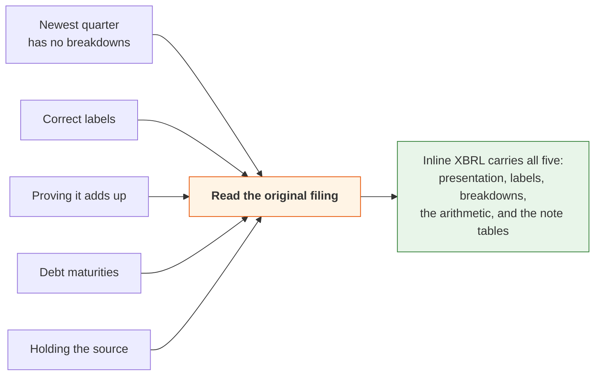

Which means this is one project rather than five, and that changes how I think about the priority of
it. It also moves the SEC's summary files from being our only source to being a second opinion, and
that is a strengthening rather than a downgrade, because two sources built independently that agree
with each other is real evidence in a way that one source agreeing with itself never was.

In the meantime the gap is shown rather than hidden. Periods built the thin way carry a label on the
page, and the Excel export says "provisional (built from XBRL facts; the SEC summary is not published
yet)".

## For history before 2009, use each company's own dictionary backwards (2026-09-14)

There is no tagged data before about 2009, only HTML tables with English labels in them. Parsing
those generically would mean guessing across thousands of variations in wording, which is exactly the
kind of guessing we spent a day taking out of the system.

The approach I want instead comes from the observation that a company's statement barely changes from
one year to the next. So for any company that filed with tags in 2009 or later, we already know its
own wording, and we can apply that company's own dictionary backwards to its own older filings. There
is no cross-company guessing anywhere in this, because a company is only ever matched against itself.

It only works for companies that were still filing after 2009. Hicham's response to that was that it
is fine, because nobody analyses Blockbuster, and the dead companies can become a separate project
later on.

The scope is listed companies, annual reports, 2001 onwards. Before 2001 it is plain text rather than
tables and it stops being worth the effort. That comes to roughly 75,000 documents and under a day of
fetching.

Anything read this way has to be labelled as read rather than filed, wherever it appears. These
values come out of a table rather than off a tag, and a reader should always know which numbers are
reproductions and which ones are readings.

The parts I expect to be genuinely hard are getting the "in thousands / in millions" header right,
negative numbers written in brackets, and companies that changed their layout in the middle of a
period.

---

# Part 4: making it fast enough to use

## Never list the whole storage folder (2026-09-13)

The first real upload to cloud storage, with 27 million filings, 125 million facts and statements for
46,000 companies, showed us what the layout was going to cost. Listing a folder takes about a second
per thousand files, the statements folder on its own holds millions of files, and the site was
listing it at startup, then every ten minutes, and then again on every single request.

Startup never finished, and the live site showed no data at all.

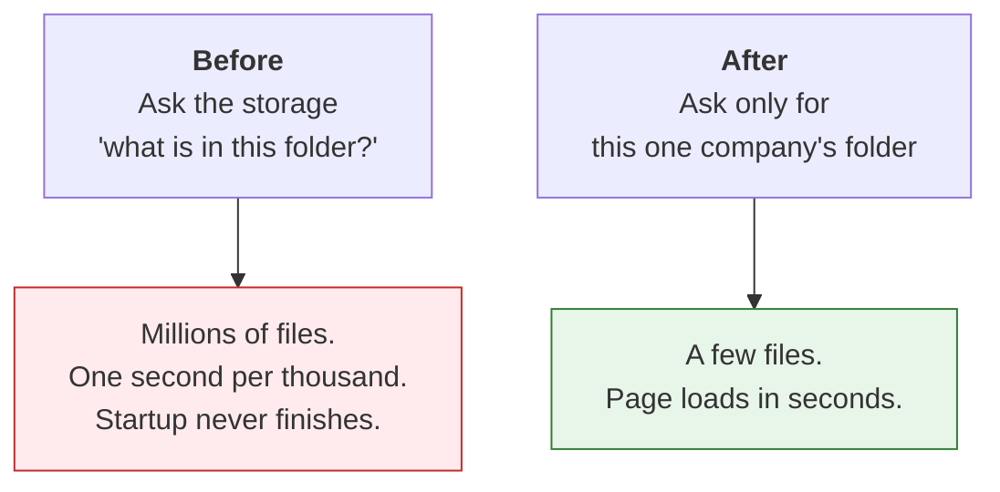

The rule that came out of it is that we never list a per-company folder as a whole. Checking whether
something exists is a single request, a company's data gets read out of that company's own folder,
and the small tables that cover everybody are copied locally. Summaries of the whole collection
answer from those local copies, and they say so rather than pretending otherwise.

Measured against the live site afterwards: startup takes about two minutes, search comes back in 0.3
seconds, a company page takes 4 to 8 seconds the first time and under 0.1 seconds on a repeat visit.

## The site has to answer "are you alive?" before it reads any data (2026-09-13)

The next deploy still never came up, for two reasons.

Opening a table reads the footer of every file in it, at about a second each over cloud storage, and
startup was opening 126 files plus another 278 before it would accept a single request. Then it
counted some rows while holding the only lock there is, so the platform's own "are you alive?" check
queued up behind that and eventually gave up.

The rules now are that the site opens no large table at startup at all, warm-up happens in the
background on its own connection, and until that finishes the table simply reads as empty. The "are
you alive?" check never waits on data: it gives the lock one second and otherwise answers "busy".

The other half of the cost was per file rather than per table, and it took a while to spot. Our
database asks the storage for a file's size and date about seven times for every file it reads, and
each one of those was going out as a separate request, so a company's seventy files took 84 seconds.
We now remember folder listings for a minute, which answers all of those from information we had
already fetched, and the same seventy files came back in 7.8 seconds cold and 1 second warm.

## Next.js 15 was silently swallowing one navigation in four (2026-09-13)

Measured against a real production build, clicking a link that had not been prefetched did nothing at
all 20 to 30% of the time. Pressing Enter on a link, or a touch, or a click that landed before the
hover prefetch did. The request completed and the page loaded, and then the screen never changed and
no error appeared anywhere. Hovering first always worked, which is what made it so confusing.

It turned out to be a known bug in the framework, and the code path that causes it does not exist in
the next major version.

It was also making our automated browser tests fail at random, which is the kind of thing that
quietly destroys your trust in your own test suite, and it was affecting real keyboard and touch
users. So we upgraded rather than loosening the tests to make the red go away.

We did it the same day, and the site now runs Next 16.3.5 on React 19.3. Two things the upgrade
forced, which are worth knowing before somebody goes looking for them: `middleware.ts` is now
`proxy.ts`, because the framework requires that, and `next lint` no longer exists. Thirty scripted
clicks with no prefetch stalled zero times, where the old version stalled about one in four.

---

# Part 5: how a statement gets built

## A line is a concept plus its breakdown (2026-09-14)

The builder was only taking values that had no breakdown attached to them, which meant that if a
company reported something *only* broken out, and never as a total, that line vanished from the
statement completely.

When I measured it, it came to 46,672 lines in a single quarter, which is 6.5% of all lines, spread
across 91% of filings. On NYSE and Nasdaq, 32% of filings were losing income statement or cash flow
lines, and Berkshire Hathaway was one of them.

The rule now is that a line takes the total wherever the filing reports one, and where the filing
reports only the parts, each part becomes its own line. Two parts under one tag are two ordered lines
rather than one.

The company's own label is left exactly as it is, and the breakdown sits in its own column, so the
decision about how to display it stays with the page and nothing gets renamed in the data.

One guard that matters: the checks compare totals only. Without it, Erie Indemnity's Class A earnings
per share of 3.23 could end up divided by Class B's 2,542 shares, which is the same failure as the
Citigroup one, a check that does not know what it is comparing.

## A reused ticker resolves to whoever owns it now (2026-09-14, evening)

Seven symbols were each being claimed by two different companies, which meant a lookup could land on
a dead one.

We fixed it when the data gets built rather than on every search. One owner per symbol is marked as
current, ranked by whether they are still filing, then by how recently, then by how many filings they
have. A symbol with only one owner is current even when that owner is defunct, because we never drop
the history.

The reason for doing it at build time is that the tie-break is the same everywhere a symbol turns
into a company, so deciding it once keeps every one of those places a plain filter that reads the
same and cannot drift apart from the others over time.

## The line grouping is a guess, and now it says so (2026-09-14, evening)

The columns that say which line rolls up into which total are a guess based on position, because the
SEC's summary files drop the filing's own arithmetic and we have to assume that each line rolls into
the next subtotal below it.

Two things were true here and both of them mattered.

The first is that there was no check to turn off. A check built on this guess had never actually been
switched on, and it would have flagged 98.3% of filings if it had been. The guessed columns only feed
the display. So the job was not "stop running the check", it was "stop presenting a guess as a fact".

The second is that the guess only reaches a person in two places, which are the data we hand to the
API and the Excel workbook. Both of them now carry a plain note saying that the grouping is worked
out from the order the lines appear in rather than from the filing's own arithmetic, and that it is
provisional.

I deliberately did not add a stored column marking which groupings are guesses, because every single
one of them is a guess today and the marker would say the same thing on every row. It becomes worth
adding when real arithmetic from the filing starts mixing in with the guesses.

## One statement, one currency (2026-09-15)

We found this one by accident, and it is the only bug in this entire document that a reader could
actually have seen.

A foreign company prints its statements in its home currency with a US dollar translation sitting
beside them, and the SEC's files carry both. So a single line could have two values at the same date,
in two different currencies.

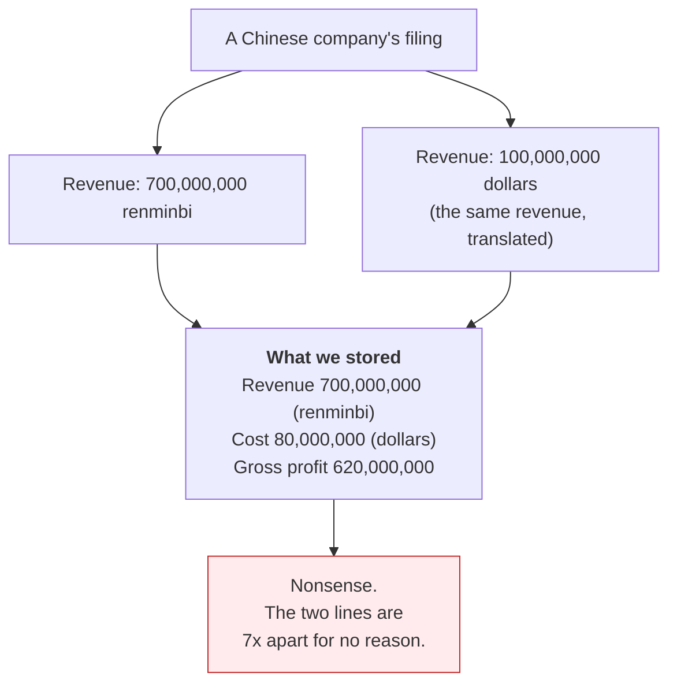

In one quarter, 3,502 values had this problem, and when I checked, all 3,502 of them differed by
currency and none of them differed by anything else. Renminbi against dollars was 2,222 of those, and
then Hong Kong, Singapore, Taiwan, Malaysia, yen, peso and rupee. It came to 167 filings, which is
about 2% of that quarter's filers.

Three things went wrong because of it, in increasing order of how much they bothered me. The company
page showed whichever row happened to get read first, line by line, so a renminbi revenue could sit
directly above a dollar cost. A check compared a renminbi revenue against a dollar cost and failed
for no real reason. And the build produced a different answer each time it ran, which is how we found
it in the first place.

The rule we settled on is that a statement is kept in one currency, the one that most of its lines
use, with the dollar breaking a tie and then alphabetical order if it is still tied. Share counts and
percentages are left alone, and a per-share figure follows its currency.

A line that only exists in the translation now shows nothing at all rather than showing the wrong
currency. The translation itself is not lost, because we still hold every value we were given, it
just no longer competes for the line.

I thought about keeping both rows and letting the page choose between them, and rejected it, because
the page identifies a line by its name, so the second row silently replaced the first. That was the
bug.

## The currency fix was checked on a real page layout, not just counted (2026-09-15)

Everything that had verified the currency fix up to that point was counting rows or counting failing
checks. The code that actually lays out what a reader sees had never been run against a two-currency
filing at all, which struck me as exactly the kind of gap that lets a bug through.

So we now build the page twice, before and after a company adds a translated copy of every line, and
the two have to come out identical.

Both directions were rendered and read rather than only asserted. With the dollar winning, the
statement is unchanged line for line. With the home currency winning, which is the dangerous
direction because the dollar rows are the ones being dropped, the statement reads in that currency
from top to bottom, every figure is exactly the translated one, no line is left empty, and the
statement still adds up inside itself (980 − 525 = 455, 455 − 112 = 343, 343 − 56 = 287).

What this does not prove is that any particular real company's page is right, because the test filing
is one we wrote ourselves. It shows that the code lays the page out correctly, which is a different
claim. The honest status is "fixed, rebuilt, page layout proven, real page not yet opened".

One thing I noticed while reading it and deliberately left alone: a per-share line still carries the
company's own printed label, "in dollars per share", next to a renminbi unit. That is the company's
wording and our rule is that the page shows the company's words. The unit beside it is ours, and it
is correct.

---

# Part 6: the arithmetic checks

This part covers two days of work. We started with 9.2% of checks failing and ended at 1.7%, and the
thing I want remembered about it is that almost none of that original 9.2% was real. It was our own
maths being wrong rather than the filings being wrong.

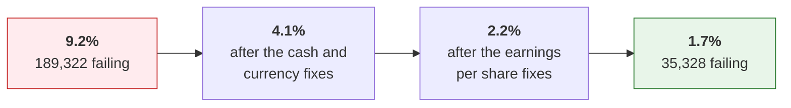

## First, find out whether the tolerance is hiding anything (2026-09-14, evening)

Before changing how close two numbers have to be before we call it a pass, I wanted to know whether
the setting we already had was letting real breaks through.

Three choices in how we measured it are worth recording. The measurement imports the real tolerance
rather than copying the number, so it can never quietly drift away from the thing it is supposed to
be measuring. Checks on tiny numbers pass under a different rule, so they get reported separately
rather than being folded in to flatter the result. And earnings per share gets measured on its own
line rather than mixed in with everything else.

The answer came back the same evening, and it was that the tolerance is fine. Out of 1,502,846 passes
that it governs, 99.48% are exact and 711 are near misses. So the plan to give every line its own
tolerance is deferred, because it is low value now and it needs the filing download anyway.

The real signal was somewhere else entirely. About 9% of checks were *failing*, and most of them were
failing by more than ten times the limit, which is not a tolerance question at all. That is something
genuinely not adding up.

## Know which companies we never check at all (2026-09-14, evening)

We built a tool to answer "what should we hold, and where does that differ from what we actually
hold".

A few choices in it are worth writing down. It is tiered, because a gap means completely different
things in different places: NYSE and Nasdaq, then other listed companies, then companies that file
but are not listed, then everything else. A gap in the first tier is a bug, while a gap in the last
one is usually a shell company that never filed accounts, and the report never counts an expected
absence as a failure.

The headline number is companies getting zero checks, because a company whose filings never trip any
check at all is unverified and nothing in the system said so before.

Every gap carries a reason with it, whether that is foreign filer, gone dark, blank-cheque company,
or "unexplained, investigate". The unexplained ones in the top two tiers are the list we actually
work.

## The reader gets twenty real filings to prove itself on (2026-09-15)

Every test of our filing reader was using a filing we had written ourselves, which is a comfortable
way to test something and not a very honest one. So we took 26 awkward real filings and made them
permanent tests.

For which filings, we used the set we already watch plus the cases it was missing: a bank with fee
breakdowns, a company with discontinued operations, a foreign filer, a filing from the first year of
tagged data, and some small companies with invented labels. Each row says why it is in there.

They get fetched once and then everything is offline forever after. The build machine cannot reach
sec.gov, so the files get fetched on the Mac and committed, compressed. I rejected fetching inside
the test, because a test that needs the SEC is a test that fails whenever the SEC is slow.

The checker reports everything and stops at nothing. It runs every stage and records each failure
against its stage rather than stopping at the first one it hits, which is how twenty filings turn
into a list of things to fix rather than a single error message.

And nothing is allowed to be silent. There is one test per filing plus one test that fails if any
filing in the set has no fixture at all. I rejected skipping when the files are missing, because that
is precisely the silent failure this whole exercise exists to prevent.

## Four big companies hide their structure inside another file (2026-09-15)

The first run over real filings read 20 out of 24 cleanly. The four that failed were Microsoft,
Prologis, Royal Bank of Canada and Toyota, and they turned out to share one filing agent and one
shape. The SEC holds only two files for them, and the descriptions of labels, layout and arithmetic
are embedded inside one of those two rather than sitting in separate files of their own. Microsoft's
carries 1,103 layout instructions in it.

So there was no separate file to fetch. The fetch was right and the reader was blind.

We fixed it in the reader rather than in the fetch. The reader now asks every document what it
carries and merges whatever it finds, and for the twenty filings that do keep separate files nothing
changes at all.

I rejected treating a two-file filing as incomplete and skipping it, because that would have silently
dropped Microsoft, and a pipeline that silently drops Microsoft is a pipeline you cannot trust with
anything.

## The two causes of the 9.2%, one right and one wrong (2026-09-14 evening, corrected 2026-09-15)

We found two causes. One of the fixes was right and the other was wrong and had to be reverted the
next day.

**The first cause was that the cash check compared the wrong two numbers, and that fix was right.**

Cash appears twice on a cash flow statement, once at the start of the year and once at the end, and
our check was grabbing whichever one it happened to find first.

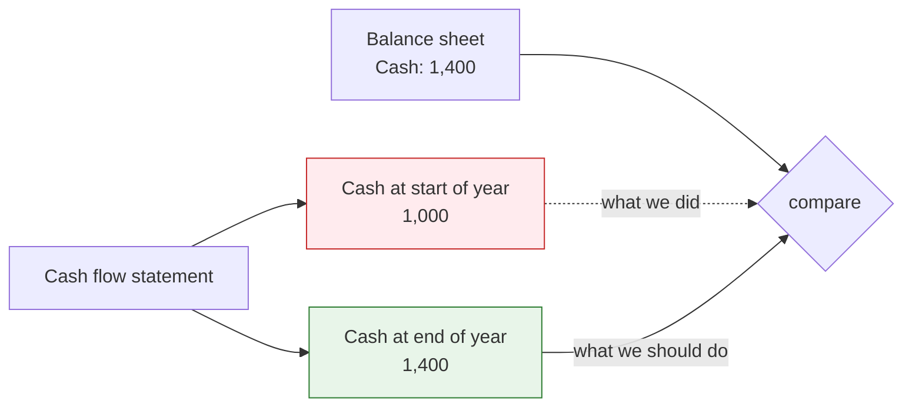

Taking the later-dated figure removed the problem almost entirely, and 99,102 failures fell to zero.

**The second cause was the sign, and that fix was wrong.**

Companies sometimes record a cost as a negative number, and the filing carries a flag saying "show
this one flipped". The page was already using the flipped version and the checks were using the raw
one, so making the checks use the flipped version as well looked obviously right.

It was backwards. Our checks are *written* for the raw value, with costs positive and cash flow items
signed, so feeding them the display version inverted every line that a company shows in brackets. A
cost shown as (cost) became a negative cost, which meant that revenue *minus* cost started *adding*.

| Check | Before the wrong fix | After it |
|---|---|---|
| Income after tax | 13,480 | **72,443** |
| Gross profit | 4,802 | **17,058** |
| Net income agrees across statements | 806 | **2,585** |

That is about 60,000 new failures created in order to cure roughly 800 real oddities, and we reverted
it the same day.

Those 800 are companies that tagged a line with the wrong sign. Texas Pacific Land Trust filed its
total assets as −24,284,031 and shows it as +24,284,031, and its parts add up exactly
(6,623,235 + 17,660,796 = 24,284,031), so the page balanced and only the check failed. They are
genuine anomalies in the filings and our check is right to flag them, so they stay flagged, and they
are 0.04% of all checks.

The lesson is the important part of this entry and I want it kept. The diagnosis came from the list
of worst offenders, where sign flips dominate *because a flip is the largest error that is possible,
not the most common one*. The query that measured the pattern across all the failures came second and
contradicted it. It should have come first, and from now on it does.

## Changing a check no longer costs a full rebuild (2026-09-15)

We did three full rebuilds in two days, at 46 minutes each, all of them for changes to the checks
alone.

The checks are worked out from the same rows that the statements table already holds, which means
they can be recomputed from what we have already stored without rebuilding anything at all. That
turns 46 minutes into 6.

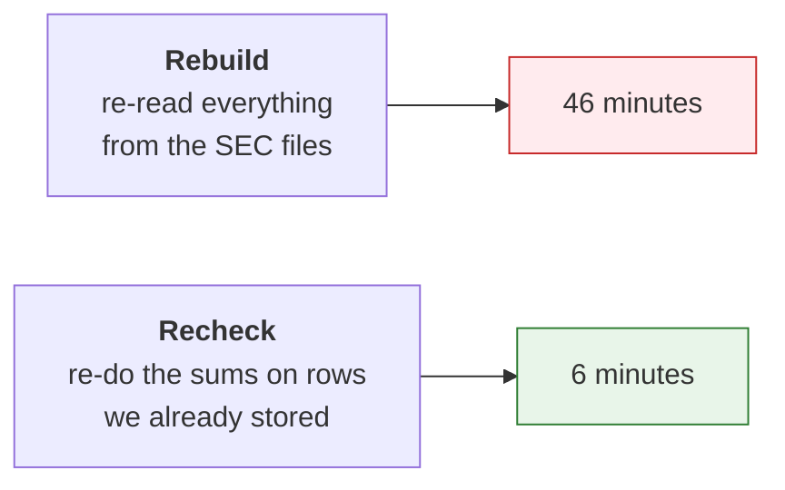

Two tests hold it in place. One runs it on a built collection and requires the checks to come out
identical, row for row. The other changes the pass rule and requires every verdict to move while
every number stays the same. Together they prove that it recomputes rather than copying.

One thing it deliberately does not refresh is the pass or fail flag stored on each statement row,
because refreshing that means rewriting the statements table, which is the expensive part we are
trying to avoid. It catches up on the next real build and the command says so rather than leaving you
to find out.

We proved it on the real data afterwards: after the currency fix, rebuilding one quarter the slow way
gave an identical result, to the row.

## After the cash and currency fixes: 4.1% (2026-09-15)

| Check | Before | After |
|---|---|---|
| Ending cash agrees, cash flow to balance sheet | 434 | **0** |
| Net income agrees, income statement to cash flow | 807 | **1** |
| Balance sheet balances | 1,403 | 322 |
| Net change in cash | 7,048 | 5,585 |
| Income after tax | 13,347 | 12,134 |
| Gross profit | 4,787 | 3,900 |
| Operating income | 3,425 | 2,854 |
| Earnings per share | 59,666 | 58,926 |

Every single remaining ending-cash failure was currency mixing, and so was all but one of the
net-income ones and three-quarters of the balance sheet ones. What was left after that was earnings
per share, which was 70% of the remainder.

## Earnings per share was using the wrong profit (2026-09-15)

I measured this across all 58,926 failures before changing anything, and 41,549 of them, which is
70%, were using the group's total profit as the top number. That top number was failing 41.8% of the
time, where every other choice was failing 5 to 7%.

The group's total includes the minority shareholders' slice of the subsidiaries, and earnings per
share is per share of the *parent's* shareholders.

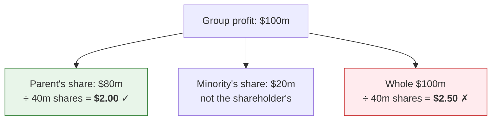

Fixing it cleared 33,212 failures, with diluted falling from 30,750 to 15,010 and basic from 28,176
to 10,704.

The method note matters as much as the result, because this is the one that went right. It was
diagnosed from the pattern across every failure first, and no fix was written until the pattern had
been measured.

## When we have to guess the top number, the check says "approximate" (2026-09-15)

After that, 25,700 failures remained and 70% of them had no obvious pattern at all, with our figure
sitting somewhere between 1 and 20% away from theirs.

Measured across all of them, only 21% showed anything on the income statement that could account for
the gap. Reading fifteen filings in full is what settled it.

Profitable companies were coming out 1 to 6% *above* the reported figure, and loss-making small
companies were coming out *below*. Those are two different and completely legitimate adjustments:

| Who | What they take out first | Where it is disclosed |
|---|---|---|
| Profitable companies | Earnings promised to unvested shares that earn dividends, routinely 1 to 4% | The notes at the back |
| Loss-making small companies | Preferred dividends, added to the loss | The notes at the back |

Both of them live in the notes rather than on the face of the income statement, which means a check
that reads the statement cannot possibly see them. Neither one is a bug in our check and neither one
is an error by the company.

So the rule is that when the company has tagged its own top number, the check is exact, at 1% or one
cent, and a failure there is real. When it has not, net income stands in for it and the check becomes
approximate, with a 5% tolerance and the word "approximate" attached to it everywhere it appears.

I rejected simply loosening the tolerance for everybody, because that would hide real errors on the
filings where we *do* have the company's own number. And I rejected skipping the check whenever we
have to guess, because there are 317,000 of those checks, 94% of them pass, they are real evidence of
consistency, and they are the only coverage most small companies get from us at all.

## The tax check had the same problem in the opposite direction (2026-09-15)

Income after tax was now the biggest bucket at 12,134 failures.

Measured by which line the check was comparing against, one line ran 23,159 times and failed 26%,
where every other line was failing between 1.6 and 6.7%. Half of all the failures were coming from
that single line.

It was continuing income *attributable to the parent*, which is after the minority's slice comes out,
whereas profit before tax minus tax is the consolidated figure with the minority still in it. Three
of the fifteen filings I sampled proved it to the dollar.

Preferring the consolidated line took 12,134 failures down to 8,682.

## A tag's name is not evidence of how a company used it (2026-09-15)

Digging into what was left corrected the previous entry on two counts, and this is the most useful
thing we learned all week.

The first is that the minority bridge was wrong 69% of the time. Adding the minority's share to the
parent's line ran 1,538 times and failed 1,067 of them. QVC showed me why: *their* version of that tag
is already the consolidated figure, equal to the group total to the dollar, so adding the minority's
share on top broke it. Other companies use the exact same tag for the parent's portion. One tag, both
meanings.

The second is that a tag can be used against its own name. Six of the eight filings I sampled that
use a tag whose name says "excluding income from equity-method investments" closed exactly *without*
that adjustment. CHS does it to the dollar, with 419,878 + 4,091 = 423,969, which is the group total,
and so do United Security, Susser, Donegal, City National and QVC. The name says the subtotal excludes
it, and most companies tag a subtotal that includes it.

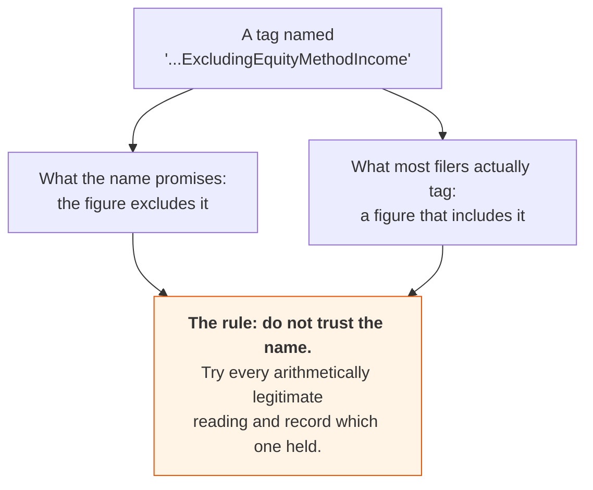

So the rule now is that the check asks whether profit before tax minus tax equals *any* legitimate
after-tax line the filing offers, in a stated order of preference, and records which one held. A wrong
tax figure or a wrong bottom line still matches none of them, so the only thing being absorbed here is
the ambiguity of the tags.

I rejected picking one meaning per tag, because the data says there is no such thing.

## The exchange-rate effect sits outside the total rather than inside it (2026-09-15)

A tag whose name says the exchange-rate effect is included in it was failing 19.2% of the time, where
its sibling tag was failing 0.6%.

Seven of the fifteen filings I sampled were one single pattern, exact to the dollar: the three
activities add up to the stated total, and adding the exchange-rate effect on top misses by exactly
that effect. Companies show it on its own line underneath the subtotal, in both US and international
accounting.

Both readings are now tried, with the one the tag's name promises going first. A company that does
include it still passes on its own reading, and a total that matches neither still fails.

That cleared 2,252 failures, against an estimate of about 2,200 from the sample.

## Three smaller gaps in the tax check (2026-09-15)

The domestic line turned out not to be the total. A tag for domestic pretax income was failing 6.6%,
three times any other, because it is only the domestic half and the foreign half is its own tag, with
the two adding up to the whole. Both readings are now offered, because some companies do tag the
whole thing under the domestic name.

The bottom line needed to stand as a candidate on its own. China Jo-Jo's pretax figure already carries
the discontinued result inside it, so the plain bottom line closed to the dollar while "bottom line
minus discontinued" missed by 644,308.

And both bottom-line tags need offering. Texas Capital tagged one of them after preferred dividends
and the other as the consolidated total, and we were only ever trying the first one we found.

The trade-off here should be stated plainly, because it cuts the other way. Every candidate we add
makes the check more permissive, and the tax check now has up to eight possible right-hand readings.
That is deliberate. Every one of those candidates is an arithmetically legitimate reading of the
filing, a wrong tax figure or a wrong bottom line still matches none of them, and the alternative,
which is one fixed reading, produced thousands of failures that were our misreading rather than the
company's error. There is a test holding the line: a filing whose tax figure is genuinely wrong still
fails.

One thing is known and deferred. Two of the fifteen filings close to the dollar once equity-method
income is added, but they tag it only on the cash flow statement, and the income statement check only
sees income statement values. It is worth perhaps 500 failures, and it needs the check to read across
statements, which both build paths would have to pass through, so it waits rather than getting bolted
on.

## All four fixes measured: 1.7% (2026-09-15)

We went from 9.2% to 1.7%, and from 71.6% of companies carrying at least one failing check down to
33.0%.

| Bug | Failures cleared | Did a reader ever see it? |
|---|---|---|
| Cash compared the start of the year to the end of it | 99,102, to zero | No |
| Home currency and dollar translation both kept | about 2% of filers | **Yes** |
| Earnings per share used the group's profit | 41,549 | No |
| The exchange-rate effect counted twice | 2,252 | No |

Of the 35,328 that remain:

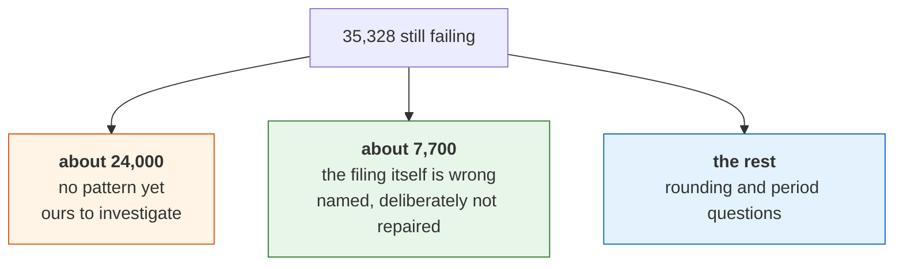

Two checks have never moved through any of this, which are gross profit at 3,900 and operating income
at 2,854, and the reason is simply that nothing we have fixed so far touches them. They are next, and
they may well need the filing's own declared arithmetic rather than another round of tuning.

## Where the remaining gaps sit in the plan (2026-09-15)

Four gaps came out of those two days, and each of them already has a home:

| The gap | Where it belongs |
|---|---|
| Our formula guesses how a company adds up its statement | **Step 8.** Each round of tuning returns less than the one before it, and step 8 replaces the guess with the filing's own arithmetic, at which point these failures disappear by construction. |
| Everything still comes from the summary files | **Steps 6 and 7.** The currency bug was invisible precisely because nothing independent could contradict them. |
| Nobody has looked at a page since the data changed | **A new step 8b**, because the plan had no rule for it at all. Tests and counts are both necessary and neither of them shows you what a user sees. |
| What "100% correct" actually means | Already written down, and now sharper: no failure caused by us, every other one named with a reason, and "unexplained" the only count that should be shrinking. |

---

# Part 7: what we are waiting on

## Market data is parked until a lawyer answers (2026-09-14)

Hicham asked for end-of-day prices and market value, and the data side of that is nearly solved
already. Share counts are in our data from the filings, including the split by class that market value
needs for companies with more than one of them, so for Alphabet we have Class A at 5,824m, Class B at
836m and Class C at 5,456m, adding up to the 12,116m they report. The only thing missing is the price
itself, and a price feed costs about 20 euros a month for the whole world.

None of that is the deciding factor, though. The deciding factor is whether the seller's agreement
lets us show their price to a paying subscriber, and that is a question for a lawyer rather than for
us.

So the whole workstream is parked. No seller is engaged, no key is obtained, and no price data enters
our storage until the legal question is answered.

Two things got settled on the way there, and they stand whatever the lawyer eventually says.

The first is that we buy prices only and never financial statements. The sellers compile statements
by scraping announcements, news feeds and company websites, which makes their version a copy of a
copy, and it is the same reason we turned down a FactSet login. If a seller's number and the filing
disagree then the filing is right, and we would have no way of showing anybody which was which.
Filings we own end to end, and prices we rent, because there is nothing we can add to a closing
price.

The second is that building a price feed ourselves would be a licensing project rather than an
engineering one. The code is about a file a day. The hard parts are the exchange agreements, which are
what the seller is actually selling you, and adjusting for splits and dividends, which is where all
the bugs live. At 20 euros a month the arithmetic is not close.

One thing worth passing to the lawyer: the UK still has the EU database right and the US has no
equivalent, so extracting data from somebody else's compilation is a *bigger* risk here than it would
be in the US. That makes scraping worse for a UK company rather than better, which is the opposite of
what I assumed going in.

## Business-email-only sign-up is built and switched off

The sign-up form can reject Gmail, Outlook, Yahoo and the rest with "please enter a valid business
email address", the way AlphaSense does. It is built and tested, and it is off by default, because my
own address is a Gmail one and I need it for testing.

We revisit it once the domain name is bought, at which point it gets turned on in the server's
settings and the form starts refusing free-mail addresses.

## Also waiting on the domain name

Sign-up and sign-in emails need an email relay and a public web address before they can work at all,
and until then the pages say that email is not configured and visitors keep their choices in their
own browser.

Accounts also need a read-write storage key, because the read-only one we are using cannot store
users.
