# The steps left, for the data — the whole map on one page

One diagram for everything in [steps.md](steps.md): all 36 steps, the nine parts they sit in, what
blocks what, and what is already done, decided, waiting on a person, or parked. Read that document
for the detail of each step; read this one to see how they fit together.

**How to read it.**

- Blue solid arrows mean *must come first*. Orange dotted arrows mean *feeds into* or *changes the
  priority of*.
- Green is done or decided. Blue is the main path. Amber is waiting on something outside the code
  (a person, a lawyer, a scope decision). Grey with a dashed border is parked or "only when it bites".
- Steps inside one box belong to the same part of the plan. A box is not a sequence unless arrows
  say so: the four quick fixes can all start today, in any order.

```mermaid
%%{init: {"flowchart": {"curve": "basis", "nodeSpacing": 30, "rankSpacing": 70}}}%%
flowchart TD
    START([Now])
    IDEA["The one idea underneath everything<br/>The filing is the original.<br/>Summary files are late, thinner,<br/>and drop the company's own maths"]
    START --- IDEA

    subgraph P1["Part 1 · Four quick fixes — nothing blocks these"]
        direction TB
        S1["1. Find out how much the<br/>error margin is hiding<br/>✅ tool built · ▢ run on full lake"]
        S2["2. Fix the seven tickers<br/>that point at two companies"]
        S3["3. Stop showing the<br/>subtotal guess as fact"]
        S4["4. Count what we are missing<br/>one line per company, by tier"]
    end

    subgraph P2["Part 2 · Read the filings themselves — the main project"]
        direction TB
        S5["5. Test the reader on<br/>about 20 awkward real filings"]
        S6["6. Download and keep every filing<br/>1.3 TB · about 20 dollars a month"]
        S7["7. Build the statements<br/>from the filing<br/>summary files become the second opinion"]
        S8["8. Prove the numbers add up<br/>the company's own map of<br/>what adds into what"]
        S9["9. Use the company's<br/>own precision"]
        S10["10. Rebuild the history,<br/>and keep the daily job<br/>fetching documents"]
        S11["11. Tidy up the storage<br/>393,920 files to a few thousand<br/>publish drops from hours to minutes"]
    end

    subgraph P3["Part 3 · Finish the checks, then tell users what changed"]
        direction TB
        S12["12. The last two checks<br/>retained earnings roll forward<br/>quarters add to the year"]
        S13["13. Late filers and<br/>companies that went quiet"]
        S14["14. Spot restatements<br/>and say so — information, never a failure"]
        S15["15. The scorecard<br/>re-run on every refresh<br/>top line: companies with no checks at all"]
    end

    subgraph P4["Part 4 · Organise the universe"]
        direction TB
        LIST["The company list<br/>being gathered now"]
        S16["16. Group companies the way<br/>analysts actually think<br/>Transportation first"]
        S17["17. The dictionary<br/>sits underneath, never renames<br/>a company's own words"]
    end

    subgraph P5["Part 5 · The notes, and the five disclosures — in the order an analyst needs them"]
        direction TB
        S18["18. Add the SEC's<br/>notes data sets"]
        S19["19. Segmentation<br/>158,080 figures already tagged<br/>left: tag the kind of split"]
        S20["20. The debt schedule<br/>2 of 4,802 filings tag it<br/>the rest is a table in the notes"]
        S21["21. Preferred shares<br/>and hybrids"]
        S22["22. Acquisitions"]
        S23["23. KPIs<br/>59,755 company-invented labels<br/>left as stated, on purpose"]
        S24["24. The statement of<br/>changes in equity"]
        S25["25. The story in the notes<br/>written English, a separate project"]
    end

    subgraph P6["Part 6 · What an analyst walks away with"]
        direction TB
        S26["26. Every exhibit, not just<br/>the main document<br/>✅ decided: store everything<br/>▢ size the storage first"]
        S27["27. A document someone<br/>can actually save<br/>the SEC gives web pages, not PDFs"]
    end

    subgraph P7["Part 7 · Ownership — built already, not switched on"]
        direction TB
        OWN["Insiders · Institutions · Major stakes<br/>parsing, pages, filters, export,<br/>watchlists and alerts all exist"]
        S28["28. Switch it on and<br/>keep it running"]
        S29["29. Fill in the past<br/>✅ decided: collect all of it"]
        S30["30. The older filings<br/>we cannot read yet<br/>unsupported stays visible, never a zero"]
        S31["31. Match holdings to<br/>the right company<br/>no guessing by name, ever"]
        S32["32. Ownership outside the US"]
    end

    subgraph P8["Part 8 · Go wider"]
        direction TB
        S33["33. Filings from before 2009<br/>each company matched only<br/>against itself · about 75,000 documents"]
        S34["34. Canada, Europe, then<br/>Australia and New Zealand<br/>Europe is easier than Canada"]
        ISIN["Do now, while the list is gathered:<br/>record an identifier that travels<br/>ISIN or LEI"]
    end

    subgraph P9["Part 9 · Plumbing — only when it bites"]
        direction TB
        S35["35. Handling more<br/>people at once<br/>several connections, not a redesign"]
        S36["36. Publishing without<br/>a half-finished moment<br/>load fresh tables, switch in one move"]
    end

    subgraph TRAPS["Two traps, not steps"]
        direction TB
        T1["Uploading to R2:<br/>never aws s3 sync<br/>use rclone or s5cmd"]
        T2["Ad-hoc queries on the remote lake:<br/>pass the read-only flag<br/>or use a local copy"]
    end

    PARK["Parked · share prices<br/>data side nearly solved<br/>waiting on a lawyer<br/>we rent prices, never statements"]

    %% Solid arrows: must come first
    START --> S1
    START --> S2
    START --> S3
    START --> S4
    START --> S11
    START --> S5
    S5 --> S6
    S6 --> S7
    S7 --> S8
    S7 --> S9
    S8 --> S10
    S9 --> S10
    S8 --> S12
    S8 --> S14
    START --> S13
    S4 --> S15
    S12 --> S15
    S13 --> S15
    S14 --> S15
    LIST --> S16
    S16 --> S17
    S10 --> S18
    S15 --> S18
    S18 --> S19
    S19 --> S20
    S20 --> S21
    S21 --> S22
    S22 --> S23
    S23 --> S24
    S24 --> S25
    S6 --> S26
    S6 --> S27
    START --> OWN
    OWN --> S28
    S28 --> S29
    S28 --> S31
    S29 --> S30
    S10 --> S33
    S10 --> S34
    ISIN --> S34

    %% Dotted arrows: feeds into, or changes the priority of
    S1 -.->|"the verdict sets<br/>step 9's priority"| S9
    S3 -.->|"the guess is replaced<br/>by the company's map"| S8
    S11 -.->|"makes the full-table<br/>read quick"| S4
    S8 -.->|"layer one: the maths<br/>each filing declares"| S17
    S12 -.->|"the retained earnings check<br/>tests the same movements"| S24
    S26 -.->|"debt agreements first,<br/>because step 20 needs them"| S20
    S6 -.->|"the written notes exist<br/>only in the document"| S25
    S31 -.->|"unmatched share goes<br/>on the scorecard"| S15
    S34 -.->|"not worth scoping until<br/>other countries' statements are decided"| S32
    LIST -.-> ISIN
    S34 -.->|"KPIs turn urgent<br/>outside the US"| S23
    START -.->|"pages slow down<br/>as more people use them"| S35
    START -.->|"a page that did not add up<br/>at the time of a publish"| S36

    %% Notes, kept out of the flow
    P9 ~~~ TRAPS
    P9 ~~~ PARK

    %% Styles
    linkStyle default stroke:#1565c0,stroke-width:2px
    linkStyle 41,42,43,44,45,46,47,48,49,50,51,52,53 stroke:#e65100,stroke-width:2px
    classDef main fill:#e3f2fd,stroke:#1565c0,color:#0d47a1
    classDef done fill:#e8f5e9,stroke:#2e7d32,color:#1b5e20
    classDef waiting fill:#fff4e5,stroke:#e65100,color:#bf360c
    classDef parked fill:#eeeeee,stroke:#999999,color:#555555,stroke-dasharray: 5 5
    classDef note fill:#fafafa,stroke:#bdbdbd,color:#424242
    classDef built fill:#e8f5e9,stroke:#2e7d32,color:#1b5e20,stroke-dasharray: 3 3

    class S5,S6,S7,S8,S9,S10 main
    class S1,S26,S29 done
    class OWN built
    class S16,LIST,S32 waiting
    class PARK,S35,S36,S30 parked
    class IDEA,T1,T2,ISIN note
```

## The same thing as a table

| Part | Steps | Blocked by | Where it stands |
|---|---|---|---|
| 1. Quick fixes | 1 to 4 | Nothing | Step 1's tool is built; the verdict still needs the full lake. Step 11 is pulled forward because publishing already costs hours. |
| 2. Read the filings | 5 to 11 | Step 5 first | The main project. Steps 7 to 9 change how a statement is built; step 10 applies that to history and to the daily job. |
| 3. Checks and reporting | 12 to 15 | The real subtotal check, step 8 | Step 13 uses data we already hold. The scorecard collects parts 1 and 3, plus the unmatched share from step 31. |
| 4. Organise the universe | 16 to 17 | The company list, and Hicham's group definitions | Transportation first. The dictionary's first layer is the maths from step 8. |
| 5. Notes and disclosures | 18 to 25 | Statements right, then step 18 | Five disclosures in the order an analyst needs them, then the equity statement, then the written story. |
| 6. The documents | 26 to 27 | Step 6 | Scope decided on 2026-09-14: store every exhibit. Size the storage before the download starts. |
| 7. Ownership | 28 to 32 | Nothing. Built, not switched on | Decided on 2026-09-14: collect the full history. Step 32 waits on step 34. |
| 8. Go wider | 33 to 34 | Part 2 finished | Record ISIN or LEI now, while the list is being gathered. |
| 9. Plumbing | 35 to 36 | Nothing. Only when they bite | Two known limits with known fixes. |
| Parked | Share prices | A lawyer | Prices only, never statements. |
