# The steps left, for the data

Everything still to do on the data side, in order, in plain words. Written for someone who does not
work on the code. Each step says what it is, why it matters, how it works, and how we will know it is
finished.

## What this covers, and what it does not

This is the plan for **the data**: the numbers on a company page, where they come from, and how we
prove they are exactly what the company filed. That is the foundation the whole product sits on, and
it is what this document tracks from start to finish.

It is **not** the whole-company plan. The wider product — search, screening, the Excel connection,
the public API, collaboration features, reliability and going to market — is real work, but it lives
in the platform backlog, not here. When this document says "everything left", it means everything
left on the data. Follow this for the data workstream; look elsewhere for the rest.

## First, the one idea everything else depends on

A company sends its accounts to the SEC. That is **the filing**. It is the original, and it is the
only thing we can point at and say "this is what the company said".

The SEC also publishes **summary files**: spreadsheets that pull the numbers out of thousands of
filings and stack them together. They are convenient. We have been building almost everything from
them.

The problem is that a summary is not the original. Three things get lost:

- **Time.** The summaries come out one to two quarters late. The newest filing is never in them.
- **Detail.** When a company splits a line into parts, the summary often keeps the parts but not the
  words the company used to describe them.
- **The company's own maths.** A filing says "these five lines add up to this total". The summary
  throws that away. So today we *guess* which lines add into which, and the guess is bad.

Almost everything below follows from this one point: **stop reading the summary, read the filing.**

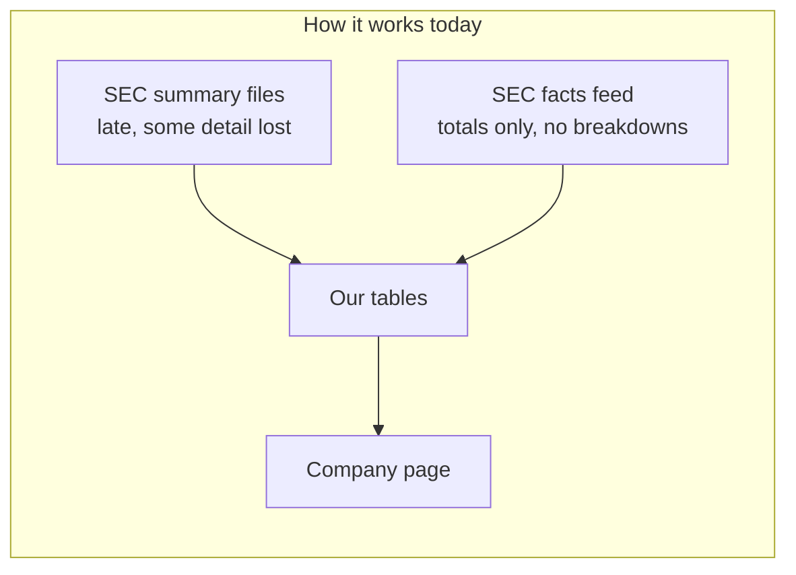
```mermaid
flowchart LR
    subgraph TODAY["How it works today"]
        A1["SEC summary files<br/>late, some detail lost"] --> A3["Our tables"]
        A2["SEC facts feed<br/>totals only, no breakdowns"] --> A3
        A3 --> A4["Company page"]
    end
```

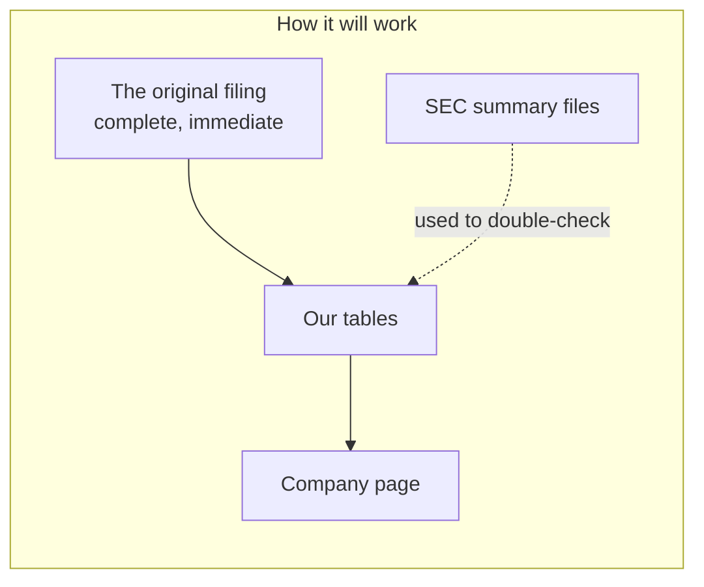
```mermaid
flowchart LR
    subgraph AFTER["How it will work"]
        B1["The original filing<br/>complete, immediate"] --> B3["Our tables"]
        B2["SEC summary files"] -.->|used to double-check| B3
        B3 --> B4["Company page"]
    end
```

Note what happens to the summary files. We do not throw them away. They become a **second opinion**.
Two sources built separately that agree is real proof. That is stronger than what we have now.

## The order of work

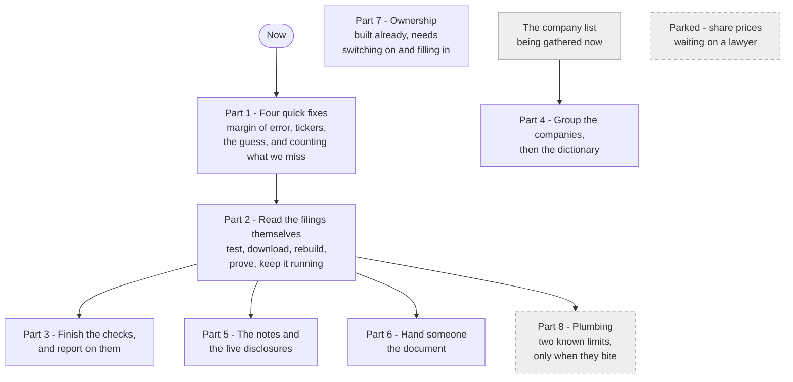
```mermaid
flowchart TD
    START([Now]) --> P1["Part 1 - Four quick fixes<br/>margin of error, tickers,<br/>the guess, and counting what we miss"]
    P1 --> P2["Part 2 - Read the filings themselves<br/>test, download, rebuild,<br/>prove, keep it running"]
    P2 --> P3["Part 3 - Finish the checks,<br/>and report on them"]
    P2 --> P5["Part 5 - The notes and<br/>the five disclosures"]
    P2 --> P6["Part 6 - Hand someone<br/>the document"]
    P2 --> P8["Part 8 - Older filings,<br/>then other countries"]
    OWN["Part 7 - Ownership<br/>built already, needs<br/>switching on and filling in"]
    LIST["The company list<br/>being gathered now"] --> P4["Part 4 - Group the companies,<br/>then the dictionary"]
    P8["Part 8 - Plumbing<br/>two known limits,<br/>only when they bite"]
    PARK["Parked - share prices<br/>waiting on a lawyer"]
    style PARK fill:#eeeeee,stroke:#999999,stroke-dasharray: 5 5
    style LIST fill:#eeeeee,stroke:#999999
    style P8 fill:#eeeeee,stroke:#999999,stroke-dasharray: 5 5
```

| Part | Steps | What it is | Blocked by |
|---|---|---|---|
| 1. Quick fixes | 1 to 4 | Cheap things worth doing today | Nothing |
| 2. Read the filings | 5 to 11 | The main project | Step 5 first |
| 3. Checks and reporting | 12 to 15 | Knowing we are right, and saying so | The real subtotal check, step 8 |
| 4. Organise the universe | 16 to 17 | Grouping and translating | The company list |
| 5. Notes and disclosures | 18 to 25 | What analysts actually read | Part 2, for the note tables |
| 6. The documents | 26 to 27 | Handing someone the filing | Part 2, and a scope decision |
| 7. Ownership | 28 to 32 | Who holds the shares, who is trading | Nothing. Built, not switched on |
| 8. Go wider | 33 to 34 | Older filings, other countries | Part 2 finished |
| 9. Plumbing | 35 to 36 | Two known limits, neither urgent | Nothing. Only when they bite |
| Parked | Share prices | Waiting | A lawyer |

---

# Part 1. Four quick fixes

Nothing blocks these. They can start today.

## Step 1. Find out how much our error checking is missing

**What it is.** We check every filing's arithmetic: does the total match the sum of its parts. But we
allow a margin of error of half a percent. On a very large company, half a percent is billions. A
real mistake could sit inside that margin and we would never see it.

**Why it matters.** A check that never complains is as useless as one that always complains. We do
not currently know which one we have.

**How it works.** Every time we run a check we already save both numbers and the gap between them. So
we look back at all of them and ask: how close were the ones that passed? If almost all were exact,
our margin is harmless. If lots of them were sitting just inside the line, we have been waving
through real errors.

**What we are looking for.**

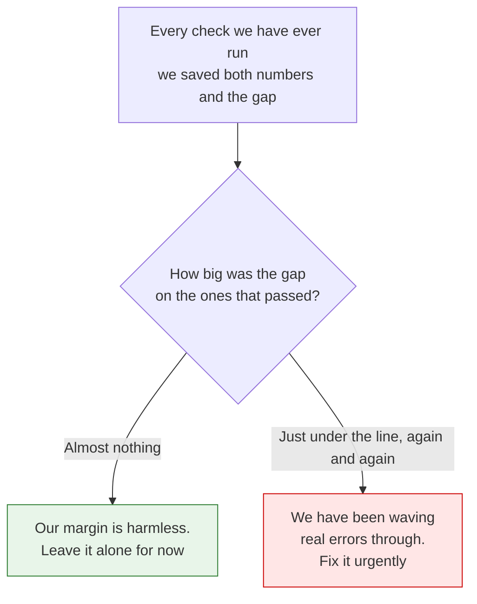
```mermaid
flowchart TD
    C["Every check we have ever run<br/>we saved both numbers and the gap"] --> G{"How big was the gap<br/>on the ones that passed?"}
    G -->|"Almost nothing"| OK["Our margin is harmless.<br/>Leave it alone for now"]
    G -->|"Just under the line, again and again"| BAD["We have been waving<br/>real errors through.<br/>Fix it urgently"]
    style BAD fill:#ffe6e6,stroke:#cc0000
    style OK fill:#e8f5e9,stroke:#2e7d32
```

### Progress

**✅ Built and tested (2026-09-14).** The tool is `filings-hub check-tolerance`
(`filings_hub/ingest/check_tolerance.py`). It reads every check, separates the passes the 0.5 %
tolerance actually governs from the ones that only passed because the numbers were tiny (those pass
on a fixed 1.0 floor, where the percentage is meaningless), and reports how many sit *just* under the
line — the "near misses" where a real break can hide. Earnings-per-share checks are measured on their
own 1 % line, kept apart from the rest. It ends on a plain verdict. It is read-only; it writes
nothing.

Two things make it trustworthy: the band edges are imported from the real tolerance constants in
`checks.py`, so the measurement can never drift from the thing it measures; and it is tested against
controlled rows with known gaps (each lands in a named band) plus the real built lake. The full test
suite is green.

### What is left to do

The tool is done; the **answer** is not, because it needs the real data.

1. **Run it against the full lake**, once the current rebuild has finished uploading to R2. Run it
   locally (or against a local copy), not against the remote lake, or it scans the whole thing over
   the network — see the traps note in Part 9. One command:

   ```
   filings-hub check-tolerance
   ```

2. **Read the verdict.** It prints the near-miss share across all ~70 quarters and says, in one line,
   whether the flat tolerance is hiding real breaks.

3. **Decide step 9's priority from that number.** This is the whole point of step 1. If near misses
   are rare, the flat 0.5 % is harmless in practice and **step 9** (a per-line tolerance from the
   filing's own `decimals`) can wait its turn. If they are common, step 9 moves up the order, because
   we are letting real breaks through today.

4. **Record the number** back here, so the decision has its evidence attached rather than a memory of
   a verdict.

**Done when.** ✅ Tool built and tested. ▢ Run against the full lake, verdict read, step 9's priority
set from the result.

**Size.** Built in under an hour. Running it and reading the verdict is a minute.

## Step 2. Fix the seven tickers that point at two companies

**What it is.** Seven stock symbols each match two different companies in our data.

**Why it matters.** Someone searches a symbol and can land on the wrong company. That is the most
visible kind of wrong.

**How it works.** This happens when a company closes and another one later takes its symbol. Both
keep a claim on it in our data. The fix is a rule: when two companies claim one symbol, search goes
to the one still filing. The old one stays in our records as history.

**What goes wrong, and the rule that fixes it.**

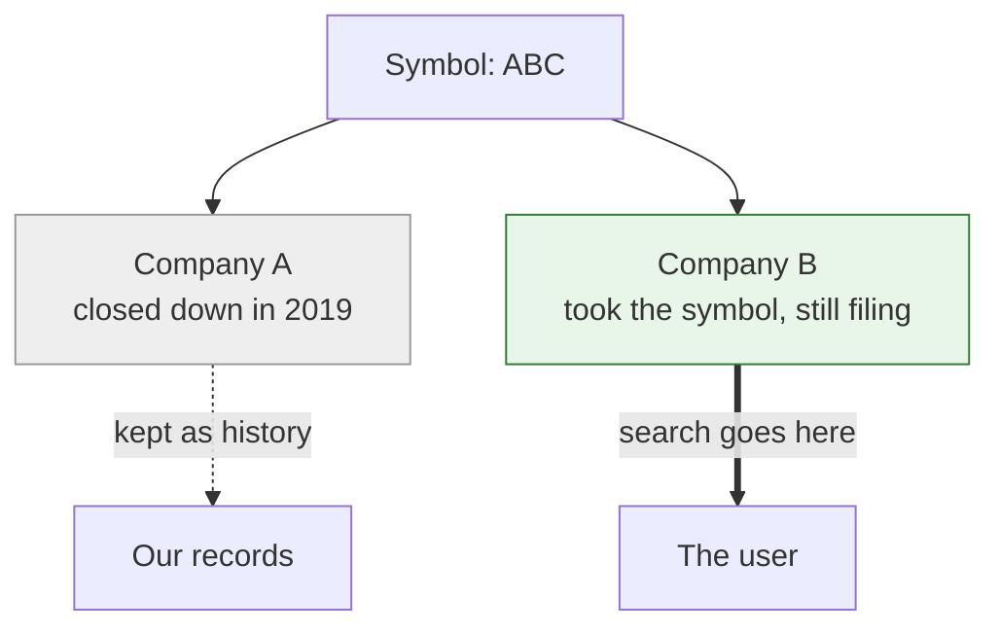
```mermaid
flowchart TD
    T["Symbol: ABC"] --> C1["Company A<br/>closed down in 2019"]
    T --> C2["Company B<br/>took the symbol, still filing"]
    C1 -.->|kept as history| H["Our records"]
    C2 ==>|search goes here| U["The user"]
    style C2 fill:#e8f5e9,stroke:#2e7d32
    style C1 fill:#eeeeee,stroke:#999999
```

### Progress

**✅ Built and tested (2026-09-14).** The universe build now settles, once, which company currently
owns each symbol (`mark_current_owner` in `sync_universe.py`, a new `is_current` flag on the tickers
table). The winner is the company still filing, most recently; a symbol with a single owner is
current even if that owner is defunct. Every place that turns a symbol into a company — the exact
ticker redirect, search, the CLI, and verify — now prefers the current owner, so a reused symbol can
no longer land on the dead company, and search no longer shows the dead one for that symbol (it stays
findable by name). Covered by tests on the ranking, the exact queries the API runs, and the Postgres
load path; a migration (`0020`) adds the column.

### What is left to do

The code is done. What is left is to make the live site use it. This does **not** need a full rebuild
of the data, and it has nothing to do with the big statements upload running tonight.

"Rebuilding the universe" just means remaking two small files — the company list and the
symbol-to-company map (where the new flag lives). It reads files we already have and takes a couple of
minutes, not hours.

Three small things, in order:

1. **Rebuild the universe.** Run `filings-hub refresh`. It remakes those two small files with the
   new flag filled in. This also happens on its own on the next daily refresh, so if that is
   scheduled, there is nothing to do.
2. **Publish the two small files.** Upload the company list and the symbol map (if the site reads from
   R2), or let the loader replace those two tables (if the site reads from Postgres). Seconds, because
   it is two files.
3. **Postgres only:** apply migration `0020` once, to add the new column. The loader does this.

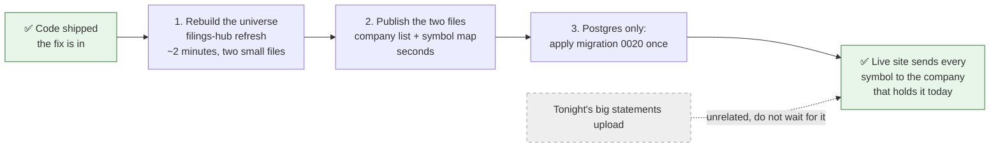
```mermaid
flowchart LR
    CODE["✅ Code shipped<br/>the fix is in"] --> R["1. Rebuild the universe<br/>filings-hub refresh<br/>~2 minutes, two small files"]
    R --> PUB["2. Publish the two files<br/>company list + symbol map<br/>seconds"]
    PUB --> PG["3. Postgres only:<br/>apply migration 0020 once"]
    PG --> LIVE["✅ Live site sends every<br/>symbol to the company<br/>that holds it today"]
    BIG["Tonight's big statements upload"] -.->|"unrelated, do not wait for it"| LIVE
    style CODE fill:#e8f5e9,stroke:#2e7d32
    style LIVE fill:#e8f5e9,stroke:#2e7d32
    style BIG fill:#eeeeee,stroke:#999999,stroke-dasharray: 5 5
```

**Done when.** ✅ Built, tested, migration written. ▢ A universe rebuild has run and been published,
and the seven real cases each resolve to the live company. No full backfill needed.

**Size.** Small, as expected. The remaining work is minutes, not hours.

## Step 3. Stop showing a guess as if it were fact

**What it is.** We publish a column saying which line adds into which total. We are guessing it, by
assuming a line belongs to the next subtotal underneath it. It is not based on anything the company
said.

**Why it matters.** The guess is wrong often enough that the check built on it complained about 98 %
of all filings. Nobody can use a warning that fires almost every time. Worse, the column looks
authoritative to anyone reading our data.

**How it works.** Two parts. Now: stop running the check, and clearly label the column as our guess.
Later, in step 8, replace it with what the company actually declared.

Worth saying: the Excel export already protects itself here. It only writes a live formula when the
guessed lines genuinely add up, and plain numbers otherwise. So customer spreadsheets were never
wrong. The damage is to our own checks.

**How the guess works, and why it breaks.**

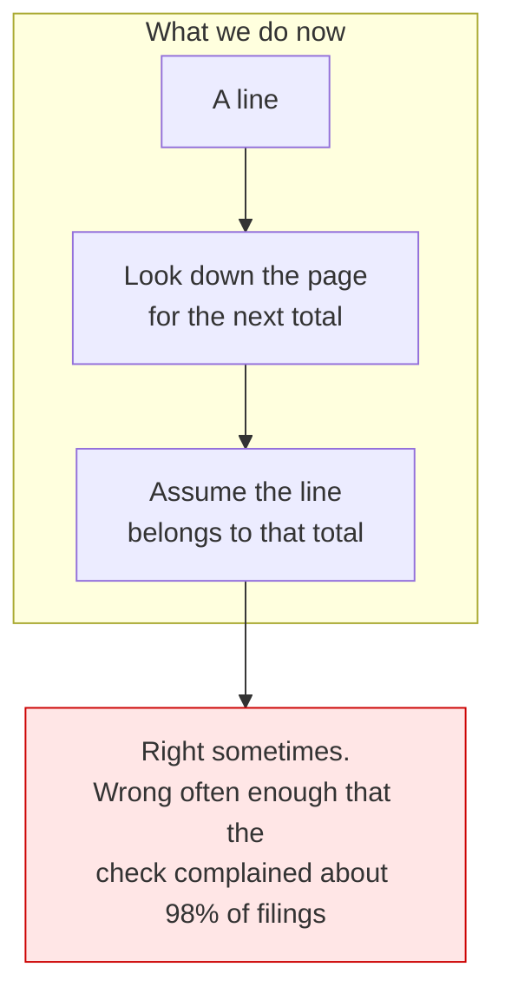
```mermaid
flowchart TD
    subgraph GUESS["What we do now"]
        L1["A line"] --> L2["Look down the page<br/>for the next total"] --> L3["Assume the line<br/>belongs to that total"]
    end
    L3 --> W["Right sometimes.<br/>Wrong often enough that the<br/>check complained about 98% of filings"]
    style W fill:#ffe6e6,stroke:#cc0000
```

The company already stated the real answer in its filing. We just have not been reading it. That is
step 8.

### Progress

**✅ Built and tested (2026-09-14).** Two findings shaped the fix. First, there is no subtotal *check*
running on the guess — nothing to switch off — because the guessed columns only fill in display hints,
they do not pass or fail anything. Second, the guess reaches a person in exactly two places: the data
the export sends out, and the Excel file itself. Both now say, in plain words, that the grouping
(which line adds into which total) is **inferred from the order lines are printed in, not the
company's own arithmetic, and is provisional**. A guard comment sits on the code that makes the guess,
so nobody later builds a pass/fail check on it before the real calculation tree arrives (step 8).
Tested; the whole suite is green.

**Done when.** ✅ Nothing presents the guess as knowledge: the export payload and the spreadsheet both
label the grouping as inferred, and the code is guarded against a check being built on it. The real
fix — the company's own arithmetic — is step 8.

**Size.** Small, as expected.

## Step 4. Count what we are missing

**What it is.** A report with one line per company: how many filings we hold versus how many the SEC
says exist, how many years of statements we built, which checks ran, which passed, and which never
applied.

**Why it matters.** Right now we can say what we have. We cannot say what we *should* have. A company
could be getting no verification at all and we would never know. Everything else on our problem list
is something we happened to notice — this is how we stop relying on luck.

**How it works.** Companies are grouped into tiers: the big exchanges first, then smaller listings,
then companies that file but are not listed, then everything else. A gap in the first tier is a bug.
A gap in the last is usually a shell company that never filed accounts, which is normal and gets
reported as a reason, not a failure.

Some gaps have honest explanations — a company that just listed, a foreign filer, a company that shut
down. Those are named, not counted as errors.

**How the report is built.**

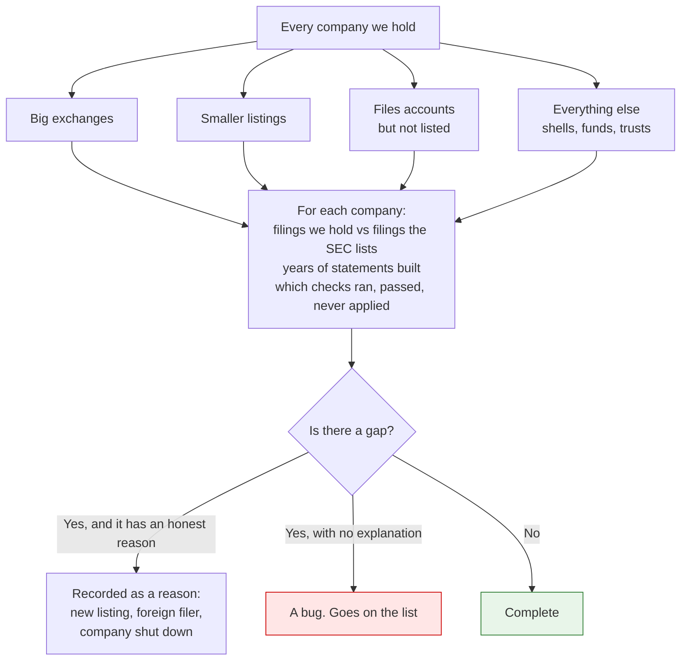
```mermaid
flowchart TD
    ALL["Every company we hold"] --> T1["Big exchanges"]
    ALL --> T2["Smaller listings"]
    ALL --> T3["Files accounts<br/>but not listed"]
    ALL --> T4["Everything else<br/>shells, funds, trusts"]
    T1 --> ROW["For each company:<br/>filings we hold vs filings the SEC lists<br/>years of statements built<br/>which checks ran, passed, never applied"]
    T2 --> ROW
    T3 --> ROW
    T4 --> ROW
    ROW --> Q{"Is there a gap?"}
    Q -->|"Yes, and it has an honest reason"| R["Recorded as a reason:<br/>new listing, foreign filer,<br/>company shut down"]
    Q -->|"Yes, with no explanation"| B["A bug. Goes on the list"]
    Q -->|"No"| OK["Complete"]
    style B fill:#ffe6e6,stroke:#cc0000
    style OK fill:#e8f5e9,stroke:#2e7d32
```

A gap in the first group is a bug. A gap in the last group is usually normal.

### Progress

**✅ Built and tested (2026-09-14).** The tool is `filings-hub coverage-audit`
(`filings_hub/coverage_audit.py`). In one read over the lake it reports, per tier (NYSE/Nasdaq, other
listed, filing-but-unlisted, everything else): how many companies we hold, how many have statements,
and — the number that matters — how many have statements but **zero checks**, the silent failure. It
also names every company that filed a financial report yet has no statements built, each tagged with
a reason (foreign filer, gone dark, SPAC) or flagged "unexplained — investigate", and reports the
gross-profit check's applicability rate against Hicham's 70–80 % estimate. Read-only. Tested on a
controlled lake with known gaps (each lands in the right tier and reason) and on the real built lake.

**Done when.** ✅ The tool is built and tested. ▢ Run it against the full lake (locally, once the
rebuild has uploaded) and work the output: every unexplained gap in the top two tiers gets a reason
or a bug, and the "no checks at all" count is recorded. That is reading a report, not more building —
though the gaps it surfaces become their own small fixes.

**Size.** Medium, as expected — the biggest of the four quick wins. Running it is a minute.

---

# Part 2. Read the filings themselves

This is the main project. It fixes four problems at once.

## Step 5. Test our reader on about 20 real filings

**What it is.** We built the reader that opens a filing and pulls out the numbers, the labels and the
company's own maths. It works. But every test we ran it against was a filing *we wrote ourselves* to
look like a real one.

**Why it matters.** Real filings are messier than imagined ones. Before we download hundreds of
thousands of them, we should find out how the reader copes with a difficult one.

**How it works.** We pick about twenty on purpose, choosing awkward ones rather than easy ones: a
bank that splits its fee income into parts, a very large company, one with discontinued businesses, a
couple of foreign filers, an old one from before the current format, and a small company that invents
its own labels. We run the reader over them and write down everything that breaks.

**How we choose the twenty.**

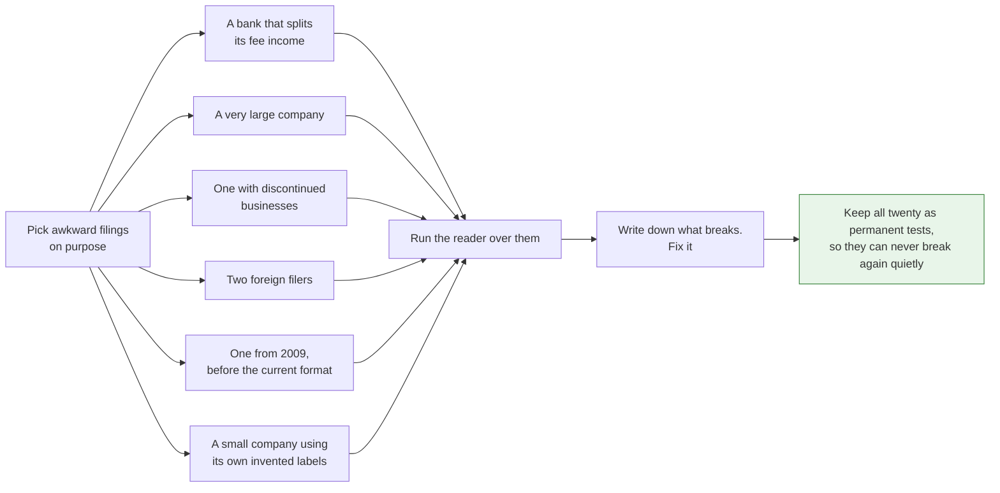
```mermaid
flowchart LR
    PICK["Pick awkward filings<br/>on purpose"] --> A["A bank that splits<br/>its fee income"]
    PICK --> B["A very large company"]
    PICK --> C["One with discontinued<br/>businesses"]
    PICK --> D["Two foreign filers"]
    PICK --> E["One from 2009,<br/>before the current format"]
    PICK --> F["A small company using<br/>its own invented labels"]
    A --> RUN["Run the reader over them"]
    B --> RUN
    C --> RUN
    D --> RUN
    E --> RUN
    F --> RUN
    RUN --> FIX["Write down what breaks.<br/>Fix it"]
    FIX --> KEEP["Keep all twenty as permanent tests,<br/>so they can never break again quietly"]
    style KEEP fill:#e8f5e9,stroke:#2e7d32
```

**Done when.** All twenty are read correctly, and they become permanent tests so they can never break
again silently.

**Size.** About a day. A few hundred downloads.

## Step 6. Download and keep every filing

**What it is.** Fetch the actual document for every filing we take numbers from, and store our own
copy.

**Why it matters.** Two reasons. First, we cannot read filings we do not have. Second, and more
important: we tell subscribers that a number is exactly what a company reported. If we cannot show
them the document, that is a promise we cannot keep. A link to the SEC's website is not good enough —
links break, sites get reorganised, and their availability is not ours to guarantee.

**How it works.** The SEC limits how fast anyone may download, so this runs steadily rather than all
at once. About 1.3 terabytes, roughly twenty dollars a month to store, about twelve hours of
downloading.

Attachments — exhibits, contracts, presentations — are a separate question. For now we record what
exists without downloading it, which is quick and costs nothing to store. We fetch the contents later
when something needs them, starting with debt agreements.

**What we take, and what we only note down.**

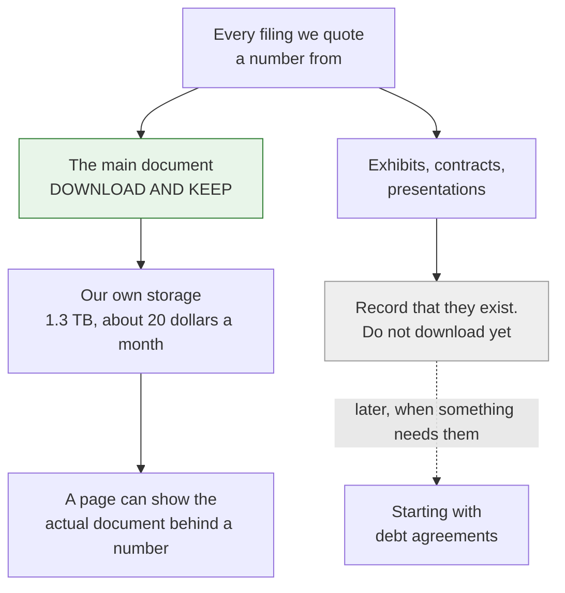
```mermaid
flowchart TD
    F["Every filing we quote<br/>a number from"] --> DOC["The main document<br/>DOWNLOAD AND KEEP"]
    F --> ATT["Exhibits, contracts,<br/>presentations"]
    ATT --> NOTE["Record that they exist.<br/>Do not download yet"]
    NOTE -.->|"later, when something needs them"| LATER["Starting with<br/>debt agreements"]
    DOC --> S["Our own storage<br/>1.3 TB, about 20 dollars a month"]
    S --> P["A page can show the<br/>actual document behind a number"]
    style DOC fill:#e8f5e9,stroke:#2e7d32
    style NOTE fill:#eeeeee,stroke:#999999
```

Why keep our own copy rather than link to the SEC: links break, websites get reorganised, and their
availability is not ours to promise.

**Done when.** Every filing we quote a number from is in our own storage, and the page can show it.

**Size.** Half a day of running, mostly waiting.

## Step 7. Build the statements from the filing

**What it is.** Rebuild each company's statements from the original document instead of the summary.

**Why it matters.** This is where the newest quarter stops being thinner than the one before it, and
where a broken-out line gets the words the company actually printed next to it.

**How it works.** The filing carries its own instructions: the order lines are printed in, the label
for each one, and how each number is split up. We follow those instead of reconstructing them.

The summary files stay in use as a cross-check. Where both sources produce the same number, that is
strong evidence. Where they disagree, that is a bug with a name, and we go and look.

**Two sources, one answer.**

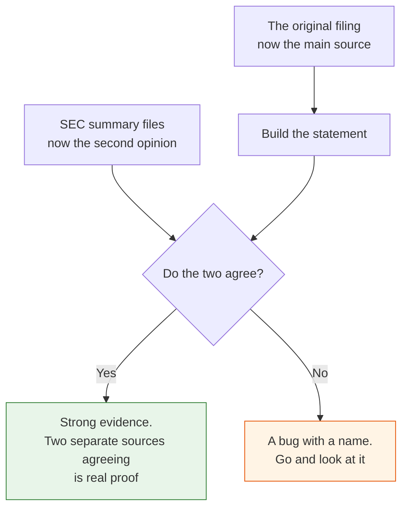
```mermaid
flowchart TD
    FILING["The original filing<br/>now the main source"] --> BUILD["Build the statement"]
    SUMMARY["SEC summary files<br/>now the second opinion"] --> COMPARE{"Do the two agree?"}
    BUILD --> COMPARE
    COMPARE -->|"Yes"| GOOD["Strong evidence.<br/>Two separate sources agreeing<br/>is real proof"]
    COMPARE -->|"No"| BUG["A bug with a name.<br/>Go and look at it"]
    style GOOD fill:#e8f5e9,stroke:#2e7d32
    style BUG fill:#fff4e5,stroke:#e65100
```

This is why we do not throw the summary files away. Before, they were our only source, so a mistake
in them was invisible to us. Now they are an independent witness.

**One more thing to settle here.** Some filings are submitted jointly by a parent company and a
subsidiary. We currently leave the subsidiary's lines out of the statement. Nothing is lost — the rows
are still in our raw data — but if a company printed those lines, leaving them out breaks our rule
about reproducing what was published. We count how many filings this affects first, then decide.

**Done when.** The newest filing is as detailed as the older ones, and the provisional label
disappears from the pages where we now hold the filing.

**Size.** Large.

## Step 8. Prove the numbers add up

**What it is.** Replace the guess from step 3 with what the company actually declared.

**Why it matters.** A filing states, in its own words, that these particular lines add into that
particular total. With that, "does this statement add up" becomes a real question with a real answer.
It catches a missing line, a duplicated line and a sign error all at once.

**How it works.** The filing includes a map of what adds into what, including whether each item is
added or subtracted. We read the map and follow it.

**What the company actually tells us.**

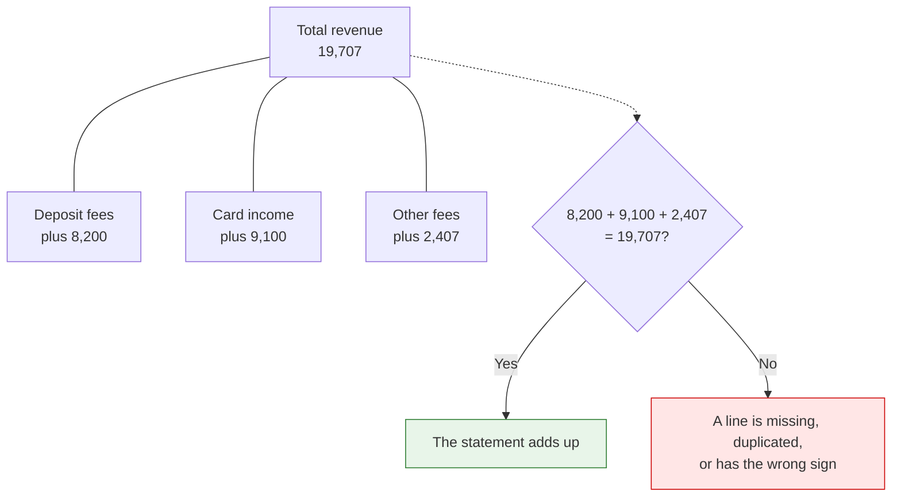
```mermaid
flowchart TD
    TOTAL["Total revenue<br/>19,707"] --- P1["Deposit fees<br/>plus 8,200"]
    TOTAL --- P2["Card income<br/>plus 9,100"]
    TOTAL --- P3["Other fees<br/>plus 2,407"]
    TOTAL -.-> CHECK{"8,200 + 9,100 + 2,407<br/>= 19,707?"}
    CHECK -->|"Yes"| OK["The statement adds up"]
    CHECK -->|"No"| CATCH["A line is missing, duplicated,<br/>or has the wrong sign"]
    style OK fill:#e8f5e9,stroke:#2e7d32
    style CATCH fill:#ffe6e6,stroke:#cc0000
```

The filing states these relationships itself, including whether each item is added or subtracted. We
are not working it out. We are reading it.

**Done when.** The check goes from complaining about 98 % of filings to complaining about few enough
that every complaint is worth reading. Note the target is not zero — a check that passes everything is
just as useless. The goal is that every remaining failure is worth opening.

**Size.** Medium, once step 7 is done.

## Step 9. Use the company's own precision

**What it is.** Stop using one fixed margin of error for every company.

**Why it matters.** Companies state how precise their own numbers are. Some round to the nearest
million; some report to the dollar. Judging both by the same half-percent rule is either far too
loose or far too strict.

**How it works.** Every number in a filing carries a note saying how far it was rounded. We read it
and set the margin from it. A company rounding to millions gets about half a million of slack. A
company reporting exact figures gets about a dollar.

This is only possible from the filing. The summary files do not include it, which is why it waits
until here.

**Same rule for everyone today. The company's own rule tomorrow.**

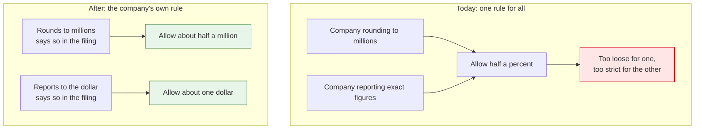
```mermaid
flowchart TD
    subgraph NOW["Today: one rule for all"]
        N1["Company rounding to millions"] --> NF["Allow half a percent"]
        N2["Company reporting exact figures"] --> NF
        NF --> NP["Too loose for one,<br/>too strict for the other"]
    end
    subgraph AFTER["After: the company's own rule"]
        A1["Rounds to millions<br/>says so in the filing"] --> AF1["Allow about half a million"]
        A2["Reports to the dollar<br/>says so in the filing"] --> AF2["Allow about one dollar"]
    end
    style NP fill:#ffe6e6,stroke:#cc0000
    style AF1 fill:#e8f5e9,stroke:#2e7d32
    style AF2 fill:#e8f5e9,stroke:#2e7d32
```

Only the filing carries this. The summary files leave it out, which is why this step waits.

**Done when.** Each check uses the precision the company declared rather than a number we chose.

**Size.** Small, once we hold the filings.

---

## Step 10. Rebuild the history, and keep it running

**What it is.** Two things that are easy to forget once the exciting part works.

**Rebuild the past.** Steps 7 to 9 change how a statement is built. That has to be applied to every
filing we already hold, not only to new ones, or the newest filings would be better than the old ones
and nobody could compare a company with itself over time.

**Then keep it that way.** New filings arrive every day. The daily job that picks them up has to
fetch each new filing's documents as it goes, or we quietly drift back to the old situation, where
the newest filing is the weakest one.

**How it works.**

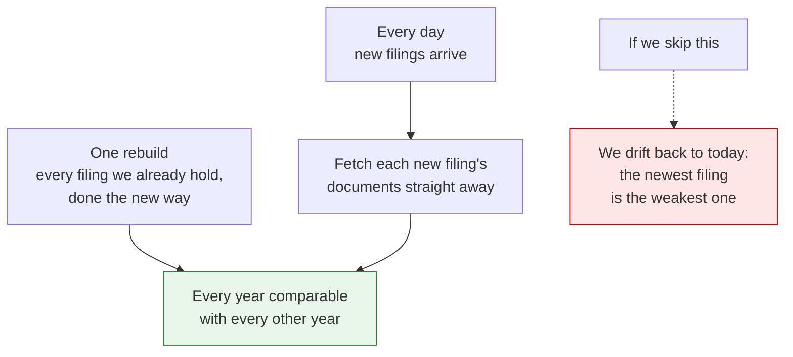
```mermaid
flowchart TD
    ONCE["One rebuild<br/>every filing we already hold,<br/>done the new way"] --> SAME["Every year comparable<br/>with every other year"]
    DAY["Every day<br/>new filings arrive"] --> FETCH["Fetch each new filing's<br/>documents straight away"]
    FETCH --> SAME
    NOFETCH["If we skip this"] -.-> DRIFT["We drift back to today:<br/>the newest filing<br/>is the weakest one"]
    style SAME fill:#e8f5e9,stroke:#2e7d32
    style DRIFT fill:#ffe6e6,stroke:#cc0000
```

**Done when.** A company's oldest year and newest year were built the same way, and a filing that
arrived this morning already has its documents.

**Size.** The rebuild is mostly machine time. The daily part is a small change.

## Step 11. Tidy up the storage

**What it is.** We keep statements in one small file per company per quarter. That is 393,920 files
today, and it grows every quarter.

**Why it matters.** Reading one company is fast, which is what matters for a company page and why we
organised it this way. The cost lands in two places, and one of them is already hurting.

- *Every publish to R2 is slow.* Getting the lake onto R2 uploads one file at a time. On 14 September
  a rebuild that took 44 minutes was followed by an upload of the 393,920 files that ran for over two
  and a half hours. That happens on every rebuild, not once.
- *Reading everything is slow.* The coverage report in step 4 reads the whole table. That is the
  second cost, and it grows as we add filings and years.

**How it works.** Merge each company's many small files into one, the same way we already do for the
filings list. Nothing changes about what the data says. The number of files drops from ~394,000 to a
few thousand, so both the upload and the full-table read become quick.

**When.** Soon, not "if it bites". It already bites: every publish costs hours. This is no longer
conditional on step 4.

**Done when.** A publish to R2 takes minutes, the coverage report runs in a sensible time, and the
file count stops climbing every quarter.

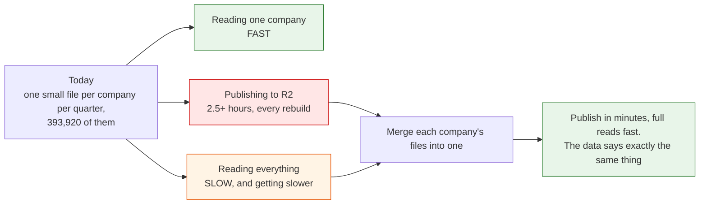
```mermaid
flowchart LR
    NOW["Today<br/>one small file per company per quarter,<br/>393,920 of them"] --> ONE["Reading one company<br/>FAST"]
    NOW --> PUB["Publishing to R2<br/>2.5+ hours, every rebuild"]
    NOW --> ALL["Reading everything<br/>SLOW, and getting slower"]
    PUB --> MERGE["Merge each company's files into one"]
    ALL --> MERGE
    MERGE --> BOTH["Publish in minutes, full reads fast.<br/>The data says exactly the same thing"]
    style ONE fill:#e8f5e9,stroke:#2e7d32
    style PUB fill:#ffe6e6,stroke:#cc0000
    style ALL fill:#fff4e5,stroke:#e65100
    style BOTH fill:#e8f5e9,stroke:#2e7d32
```

**Size.** Small. The payoff is immediate and repeats on every rebuild.

---

# Part 3. Finish the checks, then tell users what changed

## Step 12. The last two arithmetic checks

**What it is.** We planned five checks. Three are done: profit agreeing across statements, cash
agreeing between the cash flow statement and the balance sheet, and earnings per share recalculated
from the company's own share count. Two are not built yet.

**The two missing ones.**

*Retained earnings roll forward.* Profits a company keeps should behave like a bank account. Last
year's closing balance, plus this year's profit, minus dividends paid, minus shares bought back, plus
or minus anything else, should equal this year's closing balance. If it does not, a line is missing.

*Quarters add to the year.* Q1 plus Q2 plus Q3 plus Q4 should equal the full year, for anything that
accumulates like revenue or profit. Nine months plus the last quarter should do the same. If they do
not, we have either misread a period or mixed two up.

**Why it matters.** These two catch different mistakes from the others. The first catches a missing
movement in equity. The second catches us mislabelling which period a number belongs to, which is one
of the easiest errors to make and one of the hardest to notice.

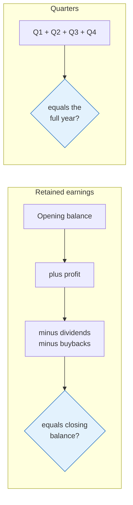
```mermaid
flowchart LR
    subgraph RE["Retained earnings"]
        O["Opening balance"] --> ADD["plus profit"] --> SUB["minus dividends<br/>minus buybacks"] --> CL{"equals closing<br/>balance?"}
    end
    subgraph QT["Quarters"]
        Q["Q1 + Q2 + Q3 + Q4"] --> YR{"equals the<br/>full year?"}
    end
    style CL fill:#e3f2fd,stroke:#1565c0
    style YR fill:#e3f2fd,stroke:#1565c0
```

**Worth remembering.** These are ours, not the reader's. They tell us where to look and they decide
what we are willing to publish. They never appear on a company page as a score or a badge.

**Done when.** Both run over every company, and we can say for each one how often it passed, failed,
or did not apply.

**Size.** Medium.

## Step 13. Late filers and companies that went quiet

**What it is.** Spot companies that have stopped filing on time, or stopped filing at all.

**Why it matters.** A gap in our data has two very different explanations. Either we failed to
collect something, which is our bug, or the company genuinely did not file, which is news about the
company. Today we cannot always tell those apart, and they need opposite responses.

**How it works.** The rule is simple and comes from dates we already hold: more than fifteen months
between annual reports, or more than five months between quarterly ones, is a flag. Sometimes a
company files two years at once to catch up, and we recognise that from the filing dates rather than
treating it as two anomalies.

We also know each company's official deadline, because the SEC records what size of filer it is.
Large companies have sixty days after year end, medium seventy-five, smaller ones ninety. So "late"
becomes a fact rather than a guess.

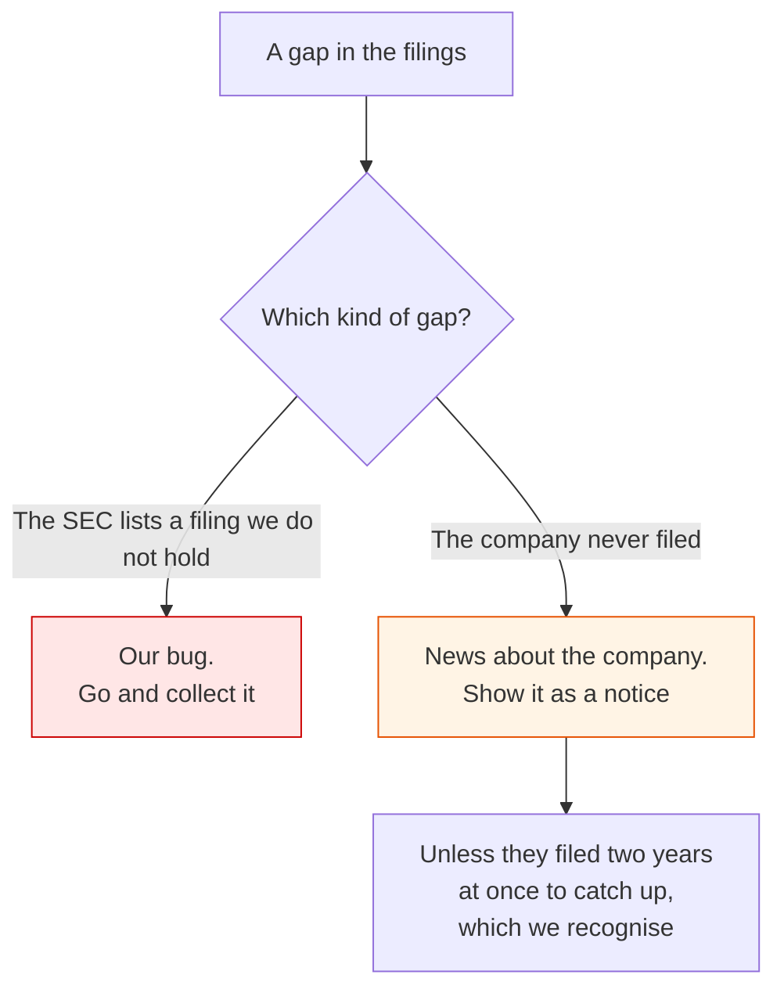
```mermaid
flowchart TD
    G["A gap in the filings"] --> W{"Which kind of gap?"}
    W -->|"The SEC lists a filing we do not hold"| US["Our bug.<br/>Go and collect it"]
    W -->|"The company never filed"| THEM["News about the company.<br/>Show it as a notice"]
    THEM --> CATCH["Unless they filed two years<br/>at once to catch up,<br/>which we recognise"]
    style US fill:#ffe6e6,stroke:#cc0000
    style THEM fill:#fff4e5,stroke:#e65100
```

**Done when.** The flagged list exists, and a company page can say that a company is behind or has
gone quiet.

**Size.** Small. It uses data we already hold.

## Step 14. Spot restatements and say so

**What it is.** Sometimes a company revises figures it already published. This year's report shows
last year's numbers differently from how last year's report showed them. That is a restatement.

**Why it matters.** Today the new numbers can quietly replace the old ones with nothing telling
anyone. A user sees a figure that no longer matches the report they read last year, and has no reason
to doubt it. That is the worst kind of wrong.

**How it works.** We compare each annual report against the comparison column in the following year's
report. If they differ, the company changed something. We record it and show a short notice on the
page, such as: *2022 and earlier are pre-restatement; restated in the 2025 annual report.*

**One thing to be careful about.** A difference might be *our* mistake, not the company's revision. So
we only trust the comparison where we hold both filings and both were read cleanly. Otherwise we
would announce a restatement that never happened.

**Also worth saying:** a restatement is not a failure and must never be shown as one. It is real
information about the company.

**How we spot one.**

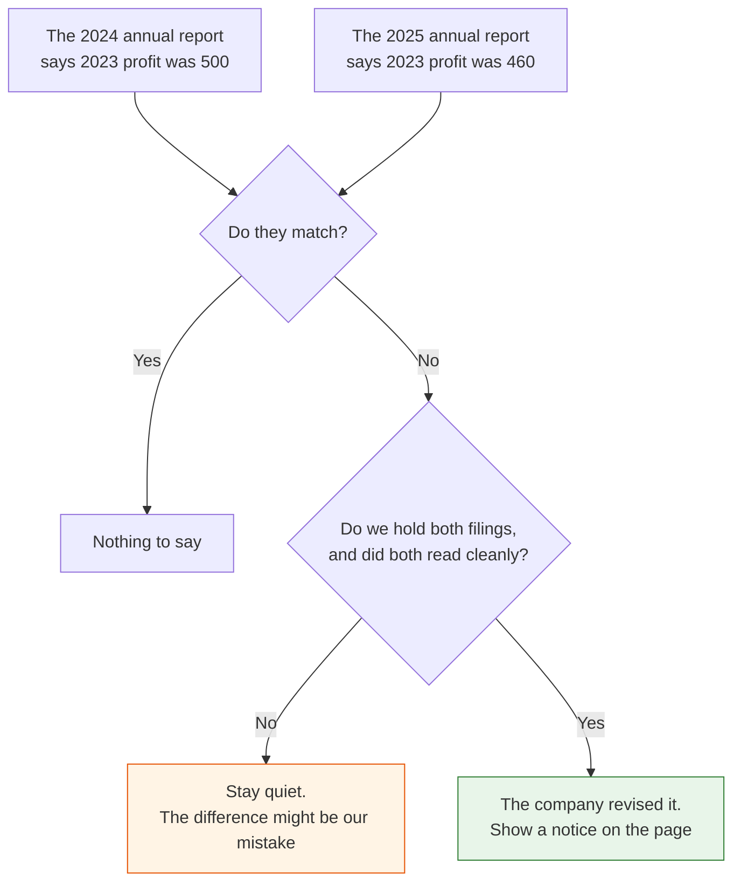
```mermaid
flowchart TD
    R24["The 2024 annual report<br/>says 2023 profit was 500"] --> CMP{"Do they match?"}
    R25["The 2025 annual report<br/>says 2023 profit was 460"] --> CMP
    CMP -->|"Yes"| NONE["Nothing to say"]
    CMP -->|"No"| GUARD{"Do we hold both filings,<br/>and did both read cleanly?"}
    GUARD -->|"No"| SKIP["Stay quiet.<br/>The difference might be our mistake"]
    GUARD -->|"Yes"| NOTE["The company revised it.<br/>Show a notice on the page"]
    style NOTE fill:#e8f5e9,stroke:#2e7d32
    style SKIP fill:#fff4e5,stroke:#e65100
```

The notice reads like this: *2022 and earlier are pre-restatement; restated in the 2025 annual
report.* It is information, never a failure.

**Done when.** A company we know restated shows the notice, and the numbers behind it can be looked
up.

**Size.** Small, after the comparison check exists.

## Step 15. The scorecard

**What it is.** One report that pulls together everything the checks and the coverage work produce,
re-run every time the data refreshes.

**Why it matters.** All the work in parts 1 and 3 produces numbers. Without somewhere to put them,
they get looked at once and forgotten, and we go back to fixing whatever we happen to notice. A
report that runs every time is the difference between measuring once and actually knowing.

**What is in it.** One section per piece of work: how many companies are complete, which checks ran,
which passed, which never applied, who is filing late, what got restated. Each section has counts, a
chart, the named list of exceptions, and a sentence in plain English saying what it means.

**The number that matters most.** How many companies are getting no checks at all. That is the silent
failure, and it belongs at the top.

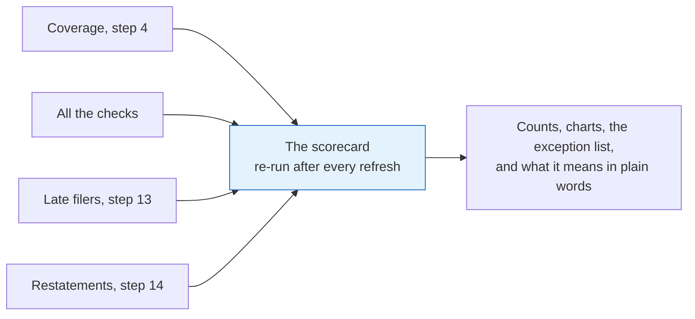
```mermaid
flowchart LR
    A["Coverage, step 4"] --> R["The scorecard<br/>re-run after every refresh"]
    B["All the checks"] --> R
    C["Late filers, step 13"] --> R
    D["Restatements, step 14"] --> R
    R --> E["Counts, charts, the exception list,<br/>and what it means in plain words"]
    style R fill:#e3f2fd,stroke:#1565c0
```

**Done when.** It runs automatically after a refresh and nobody has to assemble it by hand.

**Size.** Medium. Much of it exists already as a notebook.

---

# Part 4. Organise the universe

## Step 16. Group companies the way analysts actually think

**What it is.** A new way of grouping companies: not by what they sell, but by how the market
analyses them.

**Why it matters.** Standard classifications put an LTL trucking company and a truckload company
together, because both move freight. But they have different economics, different cycles and
different analysts. Grouping by how they are covered is more useful to an investor, and it cannot be
worked out from the financial numbers, which is what makes it valuable and ours.

**How it works.** We write the groups first, then place companies into them:

```text
Industrials > Transportation > Trucking > LTL Carriers
Industrials > Transportation > Trucking > TL Carriers
Industrials > Transportation > Trucking > Brokers
Industrials > Transportation > Trucking > 3PL
```

Two rules. Depth varies — some areas need two levels, some need five, and we do not force four
everywhere. And a company has one main home but can appear in other groups too, with a note about how
big that part of its business is, so a focused operator is not confused with a conglomerate that has
a small arm.

Each group gets a written sentence defining it. That sentence is what makes an assignment reviewable
later, and it forces a vague term like "3PL" to mean one specific thing.

**The shape of it.**

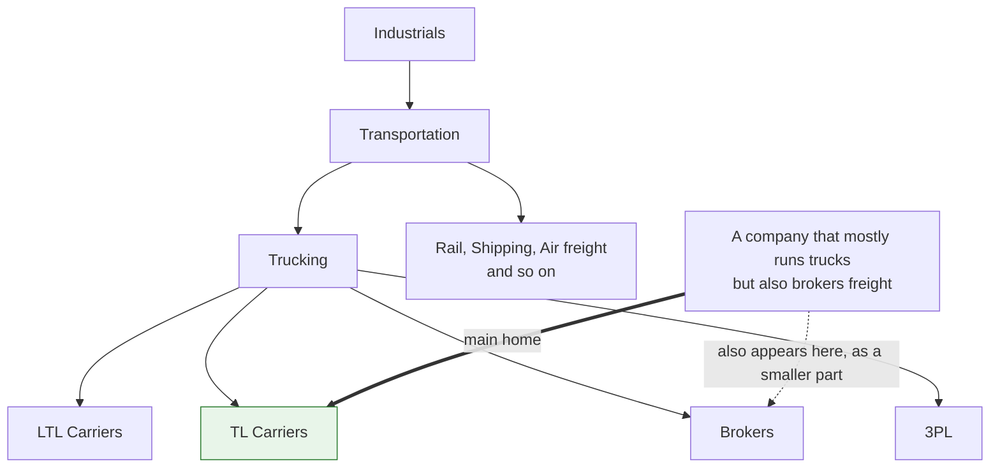
```mermaid
flowchart TD
    I["Industrials"] --> T["Transportation"]
    T --> TR["Trucking"]
    T --> OTHER["Rail, Shipping, Air freight<br/>and so on"]
    TR --> LTL["LTL Carriers"]
    TR --> TL["TL Carriers"]
    TR --> BR["Brokers"]
    TR --> PL["3PL"]
    CO["A company that mostly runs trucks<br/>but also brokers freight"] ==>|"main home"| TL
    CO -.->|"also appears here, as a smaller part"| BR
    style TL fill:#e8f5e9,stroke:#2e7d32
```

Depth is not fixed at four levels. Some areas need two, some need five. And every box gets a written
sentence defining it, so an assignment can be reviewed later and a vague term like 3PL is forced to
mean one specific thing.

**How we start.** Transportation only. Write the groups, define each one, put in a few dozen
companies we know. The test is not whether the obvious companies land correctly — any system manages
that. The test is to write down the hard-to-place companies *first*, then see whether the structure
copes.

**Done when.** Transportation works, and the awkward cases either fit or have told us what is
missing.

**Who is doing it.** Hicham is defining the groups and the placements now. We can suggest placements
from the filings, but the boundaries and the difficult calls are his, so this waits on his work
rather than on ours.

## Step 17. The dictionary

**What it is.** A translation table sitting underneath everything, recording that different companies
use different words for the same thing.

**Why it matters.** A restaurant chain's "same store sales" is another's "comparable sales" and a
British company's "like for like". Without a translation layer you cannot compare them or answer a
question that spans several companies.

**How it works.** Three layers, in order: the maths each filing declares about itself, the official
accounting dictionary for standard terms, and finally a human-maintained table for the rest.

The rule that makes it safe: **it never replaces the company's own words on the page.** It sits
underneath, for searching and comparing. A company's page always shows that company's language.

One important detail already settled: an entry is identified by the term *plus* how it is broken
down, never the term alone. Otherwise a bank's card fees, deposit fees and general fees all collapse
into one meaningless number.

**It sits underneath. It never replaces the company's words.**

```mermaid
flowchart TD
    C1["Company A says<br/>Same Store Sales"] --> DICT["The dictionary<br/>these are the same thing"]
    C2["Company B says<br/>Comparable Sales"] --> DICT
    C3["Company C says<br/>Like for Like"] --> DICT
    DICT --> ASK["Now one question can be asked<br/>across all three companies"]
    C1 ==> P1["A page still shows<br/>Same Store Sales"]
    C2 ==> P2["A page still shows<br/>Comparable Sales"]
    C3 ==> P3["A page still shows<br/>Like for Like"]
    style DICT fill:#e3f2fd,stroke:#1565c0
```

The thick arrows are what a user sees. The dictionary is for searching and comparing, never for
renaming anything on a company's own page.

**Done when.** We can measure how many different terms exist per category, which tells us how much
human work is really needed. Measure before deciding.

---

# Part 5. The notes, and the five disclosures

The statements on their own are not the product. Once they are right, these come next, in this
order, because it is the order an analyst needs them in.

Almost all of it lives in the **notes** to the accounts rather than in the statements. So it needs
both the filings from part 2 and one new source, which is why step 18 comes first here.

```mermaid
flowchart LR
    S["Statements are right<br/>parts 1 to 3 done"] --> N["Step 18<br/>the SEC's notes data sets"]
    N --> D1["1. Segmentation"]
    D1 --> D2["2. Debt schedule"]
    D2 --> D3["3. Preferred shares<br/>and hybrids"]
    D3 --> D4["4. Acquisitions"]
    D4 --> D5["5. KPIs"]
    D5 --> EQ["Then the equity statement"]
    EQ --> TXT["Last, and hardest:<br/>the written story in the notes"]
    style S fill:#e8f5e9,stroke:#2e7d32
    style TXT fill:#fff4e5,stroke:#e65100
```

## Step 18. Add the SEC's notes data sets

**What it is.** A second set of files the SEC publishes, which we do not use yet. The ones we use
today carry the statements. These carry the **notes** as well, in structured form.

**Why it matters.** The notes are where most of what follows actually lives: segment tables, the debt
maturity schedule, the detail behind almost every line. We can get some of it by reading filings
ourselves, but where the SEC has already structured it, taking it is far cheaper than extracting it.

**How it works.** Same shape as the loader we already have: download, keep every row and column,
record what loaded and what was rejected.

**Worth being clear.** This does not replace reading the original filings. It is a cheaper route to
some of the same tables, and a second opinion on them. The filing stays the source of truth.

**Done when.** The notes data sets load with the same counts and rejections reporting as everything
else, and the disclosures below can draw on them.

```mermaid
flowchart TD
    A["Files we use today<br/>the statements"] --> LAKE["Our data"]
    B["Files we do NOT use yet<br/>the notes as well"] --> LAKE
    C["The original filings<br/>part 2"] --> LAKE
    LAKE --> OUT["Segment tables, debt schedules,<br/>the detail behind the lines"]
    B -.->|"cheaper, already structured"| NOTE["But the filing<br/>stays the source of truth"]
    style B fill:#e3f2fd,stroke:#1565c0
    style C fill:#e8f5e9,stroke:#2e7d32
```

**Size.** Medium.

## Step 19. Segmentation

**What it is.** How a company splits itself up: by region, by product, by division, by customer type.

**Why it matters.** It is often the most useful table in a filing. Apple's quarter reads very
differently once you see the Americas at 45.09 bn, Europe at 28.06 bn and Greater China at 20.50 bn.

**Where we are.** Better than most of this list. These numbers are already tagged and already in our
data — 158,080 segment figures in a single quarter.

**What is left.** Two things. The page shows the company's own words, always, because an analyst
takes those words into a meeting with management. Underneath, we tag what *kind* of split it is —
geography, product, division, customer — so that a question can be asked across companies that use
different words for the same idea.

```mermaid
flowchart TD
    F["Apple, one quarter"] --> A1["Americas 45.09 bn"]
    F --> A2["Europe 28.06 bn"]
    F --> A3["Greater China 20.50 bn"]
    A1 --> PAGE["The page shows<br/>the company's own words"]
    A2 --> PAGE
    A3 --> PAGE
    A1 -.-> TAG["Underneath, we tag the KIND of split:<br/>geography, product, division, customer"]
    TAG --> ASK["So a question can be asked<br/>across companies that use<br/>different words"]
    style PAGE fill:#e8f5e9,stroke:#2e7d32
    style TAG fill:#e3f2fd,stroke:#1565c0
```

## Step 20. The debt schedule

**What it is.** When a company's borrowings fall due, year by year.

**Why it matters.** It is one of the first things anyone checks about a company under pressure, and
it deserves its own page rather than a line on a statement.

**The problem.** Almost nobody tags it. Two out of 4,802 annual filings. For everyone else it is a
table sitting in the notes, which is why this needs the filings themselves.

**The trap to avoid.** Filings say "year one, year two, year three". An analyst thinks in actual
years, and a chart only works with real ones. So we convert. But the conversion is against that
company's own financial year end, so a company whose year ends in June has a "year two" that is not
the same as a December company's. We say which we mean.

```mermaid
flowchart TD
    N["The filing says<br/>year one, year two, year three"] --> FYE{"When does this company's<br/>financial year end?"}
    FYE -->|"December 2025"| DEC["Year two means 2027"]
    FYE -->|"June 2025"| JUN["Year two means<br/>financial 2027,<br/>which is not the same thing"]
    DEC --> SAY["We convert to real years,<br/>and we say which we mean"]
    JUN --> SAY
    TAG["Only 2 of 4,802 annual filings<br/>tag this properly"] -.-> NOTES["For everyone else it is<br/>a table in the notes"]
    style SAY fill:#e8f5e9,stroke:#2e7d32
    style NOTES fill:#fff4e5,stroke:#e65100
```

## Step 21. Preferred shares and hybrids

**What it is.** Funding that is not quite debt and not quite ordinary shares.

**Why it matters.** It sits between lenders and shareholders, and it changes who gets paid what.
Ignoring it makes a company look better funded than it is, and it distorts earnings per share,
because preferred dividends come out before ordinary shareholders see anything.

```mermaid
flowchart TD
    C["What funds the company"] --> D["Lenders<br/>paid first"]
    C --> P["Preferred shares and hybrids<br/>paid next"]
    C --> E["Ordinary shareholders<br/>paid last"]
    P -.->|"if we ignore it"| W1["The company looks<br/>better funded than it is"]
    P -.->|"if we ignore it"| W2["Earnings per share is wrong,<br/>because preferred dividends<br/>come out first"]
    style P fill:#e3f2fd,stroke:#1565c0
    style W1 fill:#ffe6e6,stroke:#cc0000
    style W2 fill:#ffe6e6,stroke:#cc0000
```

## Step 22. Acquisitions

**What it is.** What a company bought, when, for how much, and what it recorded as a result.

**Why it matters.** Without it, growth is ambiguous. A company that grew 20 % by buying a competitor
is a different business from one that grew 20 % by selling more, and the statements alone do not
always separate the two.

```mermaid
flowchart LR
    G["Revenue grew 20 percent"] --> Q{"How?"}
    Q --> A["Sold more<br/>to the same market"]
    Q --> B["Bought a competitor"]
    A --> DIFF["Two completely<br/>different businesses"]
    B --> DIFF
    DIFF --> NEED["The statements alone<br/>do not always separate them.<br/>The acquisition detail does"]
    style NEED fill:#e8f5e9,stroke:#2e7d32
```

## Step 23. KPIs

**What it is.** The measures a company chooses for itself: subscribers, same store sales, occupancy,
load factor, whatever its industry cares about.

**Where we are.** We leave them exactly as companies state them, on purpose.

**Why we are not rushing.** There were 59,755 company-invented labels in a single quarter, in almost
every filing. The hard part is not matching up names, it is understanding what each one actually
measures, and two companies using the same word can mean different things. That is its own project.

This becomes urgent when we go beyond the US, because that is when the same idea starts appearing
under different words from country to country.

```mermaid
flowchart TD
    K["59,755 company-invented labels<br/>in a single quarter"] --> EASY["Matching up names<br/>the easy part"]
    K --> HARD["Understanding what each one<br/>actually measures<br/>THE HARD PART"]
    HARD --> WHY["Two companies can use the same word<br/>and mean different things"]
    WHY --> LEAVE["So for now we leave them<br/>exactly as each company states them"]
    LEAVE -.->|"becomes urgent"| INTL["When we go beyond the US,<br/>where the same idea appears<br/>under different words"]
    style HARD fill:#fff4e5,stroke:#e65100
    style LEAVE fill:#e8f5e9,stroke:#2e7d32
```

## Step 24. The statement of changes in equity

**What it is.** The fourth statement, showing how shareholders' stake moved over the year.

**Why it is last.** Deliberately placed after the five disclosures above. It is worth having, and it
is worth less than any of them.

It also becomes easier once step 12 is done, because the retained earnings check is really a test of
the same movements this statement describes.

```mermaid
flowchart LR
    S1["Income statement"] --> P["The four statements"]
    S2["Balance sheet"] --> P
    S3["Cash flow"] --> P
    S4["Changes in equity<br/>the one we do not have yet"] --> P
    S4 -.->|"same movements"| RE["Step 12's retained earnings check<br/>already tests most of this"]
    style S4 fill:#e3f2fd,stroke:#1565c0
```

## Step 25. The story in the notes

**What it is.** The written part of the notes, not the tables. A company does not only report that
revenue grew 10 %. It says the growth was 4 % more volume and 6 % higher prices.

**Why it matters.** That sentence is often worth more than the number it explains. It is the
difference between knowing what happened and knowing why.

**Why it is last.** It exists only as text in the document, so it needs the filings from part 2, and
pulling meaning out of written English is a different kind of problem from everything above it. It is
a separate project, listed here so it is not forgotten rather than because it is next.

```mermaid
flowchart LR
    NUM["Revenue grew 10 percent<br/>a number, already have it"] --> BOTH["What an analyst wants"]
    TXT["4 percent was volume,<br/>6 percent was price<br/>a sentence, only in the document"] --> BOTH
    BOTH --> W["Knowing what happened<br/>AND why"]
    TXT -.-> HARD["Written English.<br/>A different kind of problem<br/>from everything above"]
    style TXT fill:#fff4e5,stroke:#e65100
    style W fill:#e8f5e9,stroke:#2e7d32
```

**Size.** Large, and least defined.

---

# Part 6. What an analyst walks away with

Two things that are not about numbers at all. They are about handing someone the document.

## Step 26. Every exhibit, not just the main document

**What it is.** A filing is a bundle. The main document is one part; the rest are exhibits — press
releases, contracts, presentations, debt agreements.

**Where we are.** We hold a demo set: 229 documents across 20 filings, for one company. That is not
coverage. Step 6 records what exists for everything without downloading it.

**Decided (2026-09-14): store everything.** Every exhibit, every form, all the way back. Same reason
as the primary documents — if we point at a filing as evidence, we hold the whole filing, not the
part we happened to want. Debt agreements come first because step 20 needs them, but that is
sequencing, not scope.

**The one thing to size before running it.** "Everything" is a lot more than the primary documents.
Those were about 1.3 TB. Every exhibit across 433,717 filings — contracts, presentations, graphics —
is several times that. It is still cheap storage, but it should be measured and budgeted before the
download starts, not discovered halfway through. That is a number to produce, not a decision to make.

**Size.** Large to fetch, mostly waiting. Storage is the thing to size first.

```mermaid
flowchart TD
    F["One filing<br/>a bundle, not a single file"] --> M["The main document<br/>step 6 stores this"]
    F --> E1["Press release"]
    F --> E2["Presentation"]
    F --> E3["Debt agreements"]
    F --> E4["Other contracts"]
    E1 --> ALL["Store everything<br/>every exhibit, every form,<br/>all the way back"]
    E2 --> ALL
    E3 --> ALL
    E4 --> ALL
    ALL --> SIZE["Measure the storage first:<br/>several times the 1.3 TB<br/>the primary documents took"]
    E3 ==>|"first, step 20 needs it"| FIRST["Debt agreements<br/>start here"]
    style M fill:#e8f5e9,stroke:#2e7d32
    style ALL fill:#e8f5e9,stroke:#2e7d32
    style SIZE fill:#fff4e5,stroke:#e65100
```

## Step 27. A document someone can actually save

**What it is.** A version of a filing a person can download, print and read on a plane.

**The catch.** The SEC publishes filings as web pages, not PDFs. So "download the PDF" is not us
passing on a file. We have to produce it.

**Why it matters.** It is what an analyst does with a filing: save it, mark it up, read the parts
that matter. Storing the document, in step 6, is what makes it possible.

```mermaid
flowchart LR
    SEC["The SEC publishes<br/>web pages, not PDFs"] --> US["So we have to make one"]
    STORE["Our stored copy<br/>from step 6"] --> US
    US --> OUT["Something an analyst can save,<br/>print, mark up and read on a plane"]
    style OUT fill:#e8f5e9,stroke:#2e7d32
```

**Size.** Medium, and mostly a presentation problem rather than a data one.

---

# Part 7. Ownership: who holds the shares, and who is trading

A separate stream from everything above. Not the company's accounts, but who owns the company and
what they are doing with their stake.

Three different disclosures, three different meanings, and they must never be mixed together:

| Flow | Who files it | What it tells you |
|---|---|---|
| **Insiders** | Directors and officers, on Forms 3, 4 and 5 | A named person bought, sold, or was granted shares |
| **Institutions** | Fund managers, on Form 13F | What a manager held at the end of a quarter |
| **Major stakes** | Anyone crossing 5 %, on Schedules 13D and 13G | A large holder, and what they say their purpose is |

**Where we are.** More built than most of this document: parsing, storage, company pages, filters,
CSV export, watchlists and email alerts all exist for all three flows, with careful rules about what
we will and will not claim. What is missing is everything to do with *running* it and *filling it in*.

```mermaid
flowchart TD
    I["Forms 3, 4, 5<br/>a named person"] --> LAKE["Stored separately<br/>by flow"]
    F["Form 13F<br/>a fund manager"] --> LAKE
    D["13D and 13G<br/>a holder above 5 percent"] --> LAKE
    LAKE --> PAGE["Company pages, filters,<br/>exports, alerts"]
    LAKE -.->|"never merged into one number"| WHY["None of these is a full<br/>share register, and adding<br/>them up would invent one"]
    style WHY fill:#fff4e5,stroke:#e65100
```

## Step 28. Switch it on and keep it running

**What it is.** The ownership collector is built but not running in production.

**Why it matters.** Everything below assumes a steady flow of new filings. Until the collector runs
on a schedule, the pages exist but the data behind them does not grow.

**How it works.** It reads the SEC's daily index, queues what it finds, and works through it in
bounded batches. It runs on its own schedule, separate from the financial statements refresh, and a
single collector at a time so two do not fight over the same place in the queue.

If a day's index is genuinely missing, a person records why, and that record is kept. We never skip a
day because the SEC had a bad morning.

**One known rough edge.** Sending an email and recording that we sent it cannot be made into one
single action. If we crash between the two, someone gets the same alert twice. Duplicate beats
missing, so this is accepted rather than solved.

```mermaid
flowchart LR
    IDX["The SEC's daily list"] --> Q["Queue everything<br/>for that day"]
    Q --> B["Work through it<br/>in bounded batches"]
    B --> FAIL{"A filing failed?"}
    FAIL -->|"Yes"| KEEP["Keep it for retry.<br/>Do not drop the others"]
    FAIL -->|"No"| DONE["Day complete"]
    KEEP --> B
    style DONE fill:#e8f5e9,stroke:#2e7d32
```

**Done when.** It runs on a schedule, the queue drains, and the coverage report says the data is
current. Not before — a half-drained queue looks exactly like a company nobody trades.

**Size.** Small. It is mostly a decision to turn it on and watch it.

## Step 29. Fill in the past

**What it is.** A first run starts from yesterday. It does not go back and collect history.

**Why it matters.** This is the difference between "this director sold last week" and "this director
has sold every quarter for three years". The second is worth far more, and only history gives it.

**How it works.** The same collector, pointed at older dates, with its own separate place-marker so a
catch-up run never disturbs the daily one.

**Decided (2026-09-14): collect all of it.** The full history for all three flows, not a chosen
number of years. A director's or a fund's behaviour over many years is exactly what makes ownership
worth having, so we take the lot rather than draw a line and regret it.

```mermaid
flowchart LR
    T["Today<br/>collection starts from yesterday"] --> ONE["This director sold last week"]
    H["Collect all of it"] --> MANY["This director has sold<br/>every quarter for a decade"]
    MANY --> W["The whole point of ownership.<br/>Only full history gives it"]
    style ONE fill:#fff4e5,stroke:#e65100
    style W fill:#e8f5e9,stroke:#2e7d32
```

**Done when.** The full history is collected for all three flows, and the pages show how far back
each reaches.

**Size.** Medium. Mostly the collector running for a while against older dates.

## Step 30. The older filings we cannot read yet

**What it is.** Older ownership filings were submitted in a format we do not parse. We record them as
unsupported.

**Why this is the right behaviour today.** We never turn a filing we cannot read into a zero. A
company showing no insider activity because we could not parse the form would be a lie by omission.
Unsupported stays visible and can be retried.

**What is left.** Decide whether to teach the parser the old format. That depends on step 29 — if we
only go back a few years, this may never matter.

```mermaid
flowchart TD
    OLD["An older filing<br/>in a format we cannot read"] --> C{"What do we do?"}
    C -->|"What we do"| U["Mark it unsupported.<br/>Keep it visible. Allow a retry"]
    C -->|"What we must never do"| Z["Treat it as zero activity"]
    Z --> LIE["The page would say<br/>this person did nothing,<br/>when we simply cannot read it"]
    style U fill:#e8f5e9,stroke:#2e7d32
    style LIE fill:#ffe6e6,stroke:#cc0000
```

**Size.** Unknown until step 29 sets the depth.

## Step 31. Match holdings to the right company

**What it is.** A fund manager's 13F lists securities by a code, not by the company identifier we use
everywhere else. Until the two are connected, a position is real but unattached.

**Why it matters.** An unmatched position is invisible on the company's page even though we hold it.
And a wrong match is worse than none: it would show a holding in a company nobody actually holds.

**How it works.** Two routes, both deliberate. A major-stake filing sometimes states both the code and
the company, which establishes the link from the filer's own words. Otherwise a person registers the
mapping with a source document that evidences it.

**The rule that keeps this safe.** No guessing by company name. Ever. Conflicting mappings are
rejected rather than resolved. Unmatched positions stay in storage and stay counted, so the gap is
visible rather than silently zero.

```mermaid
flowchart TD
    POS["A reported position<br/>identified by a security code"] --> M{"Do we know which<br/>company that is?"}
    M -->|"The filing itself says so"| OK1["Linked"]
    M -->|"A person registered it, with evidence"| OK2["Linked"]
    M -->|"Not yet"| PEND["Stays in storage.<br/>Stays in the coverage count.<br/>Visible as a gap"]
    NEVER["Matching on company name"] -.->|"never"| X["Too easy to get wrong"]
    style OK1 fill:#e8f5e9,stroke:#2e7d32
    style OK2 fill:#e8f5e9,stroke:#2e7d32
    style X fill:#ffe6e6,stroke:#cc0000
```

**Done when.** The share of unmatched positions is on the scorecard from step 15 and is falling.

**Size.** Ongoing rather than a one-off. It needs a person.

## Step 32. Ownership outside the US

**What it is.** Every flow above is SEC-only. Other countries disclose ownership through their own
systems, with different thresholds, different forms and different timing.

**Why it is last here.** It has the same shape as step 34: a separate source per country, and a
country's rules decide what is even disclosable. A 5 % threshold is a US rule, not a universal one.

```mermaid
flowchart TD
    US["United States<br/>5 percent threshold,<br/>SEC forms, known timing"] --> OURS["Everything in this part"]
    OTHER["Every other country"] --> DIFF["Its own system,<br/>its own threshold,<br/>its own timing"]
    DIFF --> NOTE["A 5 percent rule is a US rule.<br/>What is even disclosable<br/>changes by country"]
    style OURS fill:#e8f5e9,stroke:#2e7d32
    style NOTE fill:#fff4e5,stroke:#e65100
```

**Size.** Large, and not worth scoping until the statements side of other countries is decided.

---

# Part 8. Go wider

## Step 33. Filings from before 2009

**What it is.** Tagged data only exists from about 2009. Older filings are documents, not data.

**How it works.** We do not try to write one system that reads every company's old filings. Instead we
learn each company's own vocabulary from its tagged filings, then apply that vocabulary backwards to
that same company's older ones. A company is only ever matched against itself.

Anything produced this way is labelled as derived, everywhere it appears.

**Each company is only ever matched against itself.**

```mermaid
flowchart LR
    NEW["The same company's<br/>filings from 2009 onwards<br/>labelled by computer"] --> LEARN["Learn how THIS company<br/>words and lays out its accounts"]
    LEARN --> APPLY["Apply that backwards to<br/>THIS company's older filings"]
    OLD["Its own filings<br/>2001 to 2008<br/>documents, not data"] --> APPLY
    APPLY --> OUT["Numbers recovered,<br/>and labelled as derived<br/>wherever they appear"]
    style OUT fill:#fff4e5,stroke:#e65100
```

We never build one system that guesses across thousands of companies' wording. A company is only ever
compared with itself, which is what makes it trustworthy.

**Scope.** Listed companies, annual reports, 2001 onwards, roughly 75,000 documents.

## Step 34. Canada, Europe, and later Australia and New Zealand

**What it is.** Coverage outside the US.

**Why Europe is easier than Canada.**

```mermaid
flowchart TD
    EU["Europe"] --> EUF["Annual reports filed<br/>in the same labelled format<br/>our reader already handles"]
    EUF --> EUW["Only question: getting the files"]
    CA["Canada"] --> CAF["Never required that format widely.<br/>Mostly documents, not data"]
    CAF --> CAW["Have to learn to read them first"]
    AU["Australia and New Zealand"] --> CAF
    style EUW fill:#e8f5e9,stroke:#2e7d32
    style CAW fill:#fff4e5,stroke:#e65100
```

**The thing most people get backwards:** Europe is easier than Canada.

- **Europe.** European annual reports are filed in the same tagged format our reader already handles.
  So Europe is a question of getting the files, not of learning to read them.
- **Canada.** Canada never required that format widely, so it means working with documents rather
  than data. Harder, despite feeling closer.
- **Australia and New Zealand.** Like Canada. A natural commercial extension, not a technical one.

Right now, "Europe" and "Canada" in our data means only the 2,020 foreign companies that file with
the SEC. Real coverage means a new source for each region.

**One thing to do now, while the list is being gathered:** record an identifier that works across
countries, such as ISIN or LEI. A ticker symbol does not travel.

---

# Part 9. Plumbing

Nobody asks for these. They are the two places where the machinery itself, rather than the data, is
the weak point. Neither is urgent, and both are written down so they are a decision rather than a
surprise.

## Step 35. Handling more people at once

**What it is.** Our query engine currently answers one question at a time.

**Why it is that way.** It has to be: asking two questions at once on the same connection can mix one
question's columns with another's answers, which would show a user numbers from the wrong company.
One at a time is the safe choice and it was the right one.

**Why it may need changing.** It puts a ceiling on how many people can use the site at the same
moment. Today that is fine.

**The fix, when needed.** Use several connections instead of one. Not a redesign.

**How we will know it is time.** Pages get slower as more people use them at once, rather than
because a query is slow.

```mermaid
flowchart TD
    NOW["One question at a time"] --> SAFE["Safe: two at once could mix<br/>one question's columns<br/>with another's answers"]
    SAFE --> RISK["Which would show someone<br/>numbers from the wrong company"]
    NOW --> CAP["But it caps how many people<br/>can use the site at once"]
    CAP --> FIX["Fix when needed:<br/>several connections, not one.<br/>Not a redesign"]
    style RISK fill:#ffe6e6,stroke:#cc0000
    style SAFE fill:#e8f5e9,stroke:#2e7d32
```

## Step 36. Publishing without a half-finished moment

**What it is.** When we publish fresh data, tables are replaced one after another rather than all at
once.

**What could happen.** Someone loading a page during those seconds could see one table updated and
another not. The numbers would not be wrong, but they could be inconsistent with each other.

**Where we already are.** Two publishing jobs can never run at once, and an incomplete load refuses
to publish at all. So this is a narrow window, not an open hole.

**The fix, if it ever bites.** Load into a fresh set of tables and switch to them in one movement.

**How we will know it is time.** Someone reports a page that did not add up, at a time that matches a
publish.

```mermaid
flowchart LR
    P["Publishing fresh data"] --> T1["Table 1 replaced"]
    T1 --> T2["Table 2 replaced"]
    T2 --> T3["Table 3 replaced"]
    T1 -.->|"a reader arriving here"| MIX["Sees one table new,<br/>another still old.<br/>Not wrong, but inconsistent"]
    T3 --> FIX["Fix if it bites:<br/>load a fresh set,<br/>switch in one movement"]
    style MIX fill:#fff4e5,stroke:#e65100
```

## Two traps to know about while working

Not steps, and not bugs. Two places where the obvious way to do something is the slow way, both hit
in real use. Written down so the next person does not lose an evening to them.

**Uploading to R2: do not use `aws s3 sync` for the statements.** It moves one file at a time, and
there are ~394,000 of them (see step 11), so a publish runs for hours — over two and a half on 14
September. `rclone` or `s5cmd`, told to move many files at once, do the same job far faster. The real
fix is step 11, which cuts the file count; until then, use the faster tool.

**Ad-hoc queries against the remote lake: pass the read-only flag.** Opening the data for a quick
question the plain way makes the query engine open the entire lake before it answers anything, which
can take hours over the network. The serving site avoids this with a setting that reads each company
on demand instead. Anyone poking at the lake by hand should use the same setting, or point at a local
copy. Not known to have bitten yet, but the default is a trap waiting to happen.

---

# Parked: share prices

Not a step, and deliberately not scheduled.

We were asked for a closing share price and a market value. The data side is nearly solved already —
share counts are in our data, including the split between share classes, which is what a market value
calculation needs for a company with more than one class.

Only the price itself is missing, and the blocker is not technical or financial. A price feed costs
about twenty euros a month. The question is whether the seller's contract allows us to show their
prices to paying subscribers. That is a question for a lawyer, and until it is answered no price data
enters our system.

One decision already made, whatever the answer: we buy prices only, never financial statements.
Sellers compile financial data by scraping news and company websites — a copy of a copy. If their
number and the filing disagree, the filing is right. We own filings end to end. A closing price we
would rent, because there is nothing we can add to it.

---

# A short glossary

| Word | What it means here |
|---|---|
| **Filing** | The accounts a company sends the SEC. The original document. |
| **Summary files** | Spreadsheets the SEC publishes that pull numbers out of many filings. Late, and less detailed. |
| **Tagged data** | A filing where each number is labelled by computer, so it can be read without a human. |
| **Statement** | An income statement, balance sheet or cash flow statement. |
| **Restatement** | When a company revises figures it already published. |
| **Provisional** | Our label for a number built the weaker way, because the filing has not been read yet. |
| **Check** | An arithmetic test we run on a filing. Internal only — never shown to users as a score. |
