# The steps left, for the data

Everything still to do on the data side, in order, in plain words. Written for someone who does not
work on the code. Each step says what it is, why it matters, how it works, and how we will know it is
finished.

## First, the one idea everything else depends on

A company sends its accounts to the SEC. That is **the filing**. It is the original, and it is the
only thing we can point at and say "this is what the company said".

The SEC also publishes **summary files**: spreadsheets that pull the numbers out of thousands of
filings and stack them together. They are convenient. We have been building almost everything from
them.

The problem is that a summary is not the original. Three things get lost:

- **Time.** The summaries come out one to two quarters late. The newest filing is never in them.
- **Detail.** When a company splits a line into parts, the summary often keeps the parts but not the
  words the company used to describe them.
- **The company's own maths.** A filing says "these five lines add up to this total". The summary
  throws that away. So today we *guess* which lines add into which, and the guess is bad.

Almost everything below follows from this one point: **stop reading the summary, read the filing.**

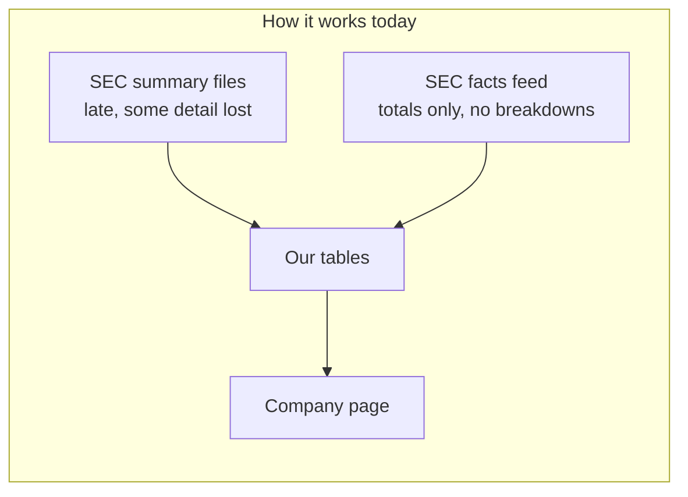

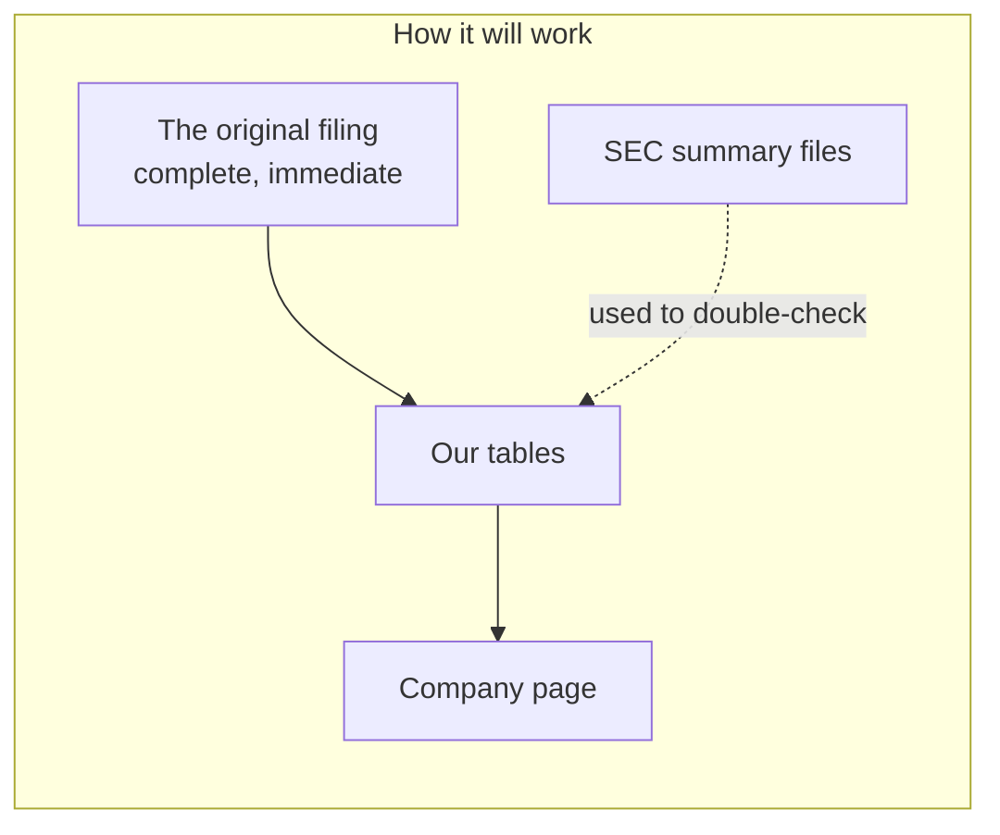

Note what happens to the summary files. We do not throw them away. They become a **second opinion**.
Two sources built separately that agree is real proof. That is stronger than what we have now.

## The order of work

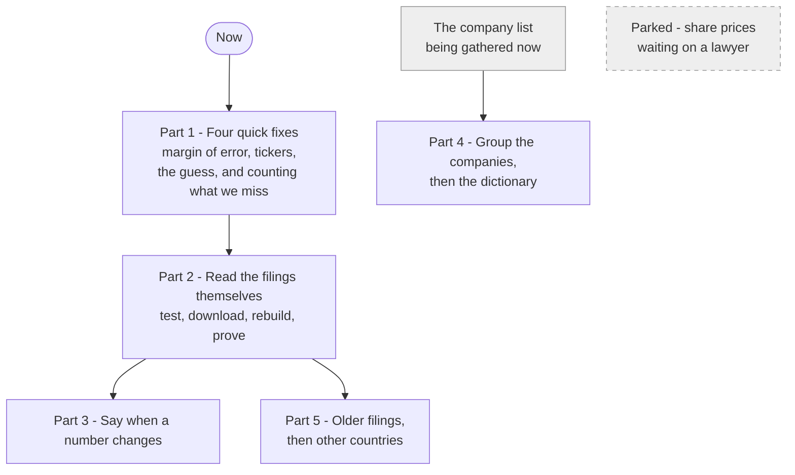

| Part | Steps | Blocked by |
|---|---|---|
| 1. Quick fixes | 1 to 4 | Nothing |
| 2. Read the filings | 5 to 9 | Step 5 must come first |
| 3. Restatements | 10 | Needs the checks from part 2 |
| 4. Organise the universe | 11 to 12 | Needs the company list |
| 5. Go wider | 13 to 14 | Needs part 2 finished |
| Parked | Share prices | A lawyer |

---

# Part 1. Four quick fixes

Nothing blocks these. They can start today.

## Step 1. Find out how much our error checking is missing

**What it is.** We check every filing's arithmetic: does the total match the sum of its parts. But we
allow a margin of error of half a percent. On a very large company, half a percent is billions. A
real mistake could sit inside that margin and we would never see it.

**Why it matters.** A check that never complains is as useless as one that always complains. We do
not currently know which one we have.

**How it works.** Every time we run a check we already save both numbers and the gap between them. So
we look back at all of them and ask: how close were the ones that passed? If almost all were exact,
our margin is harmless. If lots of them were sitting just inside the line, we have been waving
through real errors.

**What we are looking for.**

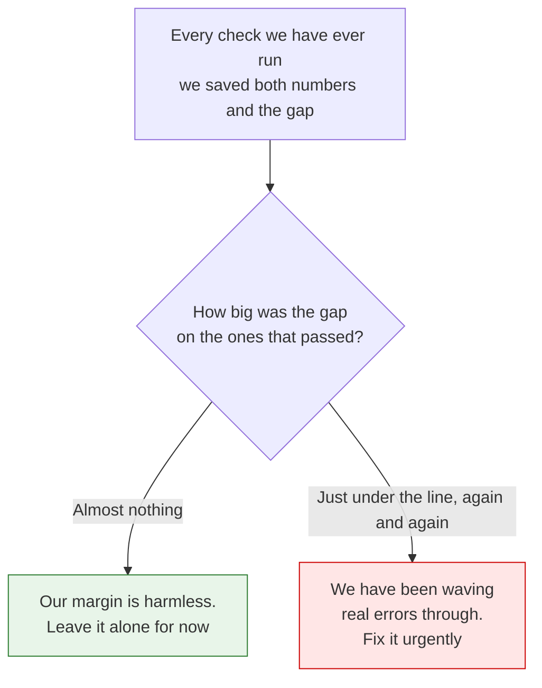

**Done when.** We have the answer, and we know whether this is urgent.

**Size.** About an hour. It may change the order of everything else, which is why it goes first.

## Step 2. Fix the seven tickers that point at two companies

**What it is.** Seven stock symbols each match two different companies in our data.

**Why it matters.** Someone searches a symbol and can land on the wrong company. That is the most
visible kind of wrong.

**How it works.** This happens when a company closes and another one later takes its symbol. Both
keep a claim on it in our data. The fix is a rule: when two companies claim one symbol, search goes
to the one still filing. The old one stays in our records as history.

**What goes wrong, and the rule that fixes it.**

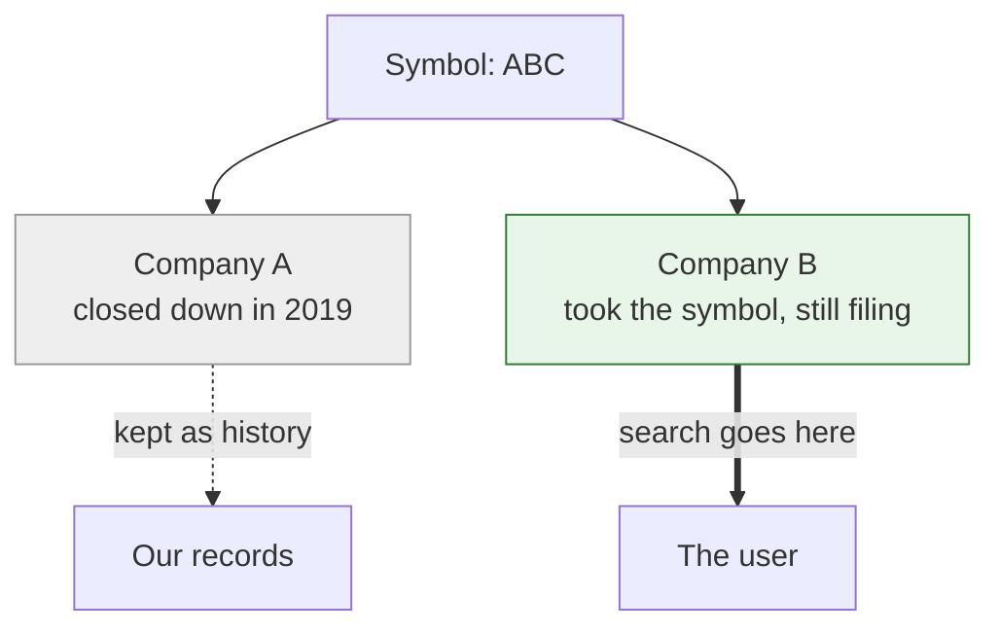

**Done when.** All seven go to the right company, and search never offers two.

**Size.** Small.

## Step 3. Stop showing a guess as if it were fact

**What it is.** We publish a column saying which line adds into which total. We are guessing it, by
assuming a line belongs to the next subtotal underneath it. It is not based on anything the company
said.

**Why it matters.** The guess is wrong often enough that the check built on it complained about 98 %
of all filings. Nobody can use a warning that fires almost every time. Worse, the column looks
authoritative to anyone reading our data.

**How it works.** Two parts. Now: stop running the check, and clearly label the column as our guess.
Later, in step 8, replace it with what the company actually declared.

Worth saying: the Excel export already protects itself here. It only writes a live formula when the
guessed lines genuinely add up, and plain numbers otherwise. So customer spreadsheets were never
wrong. The damage is to our own checks.

**How the guess works, and why it breaks.**

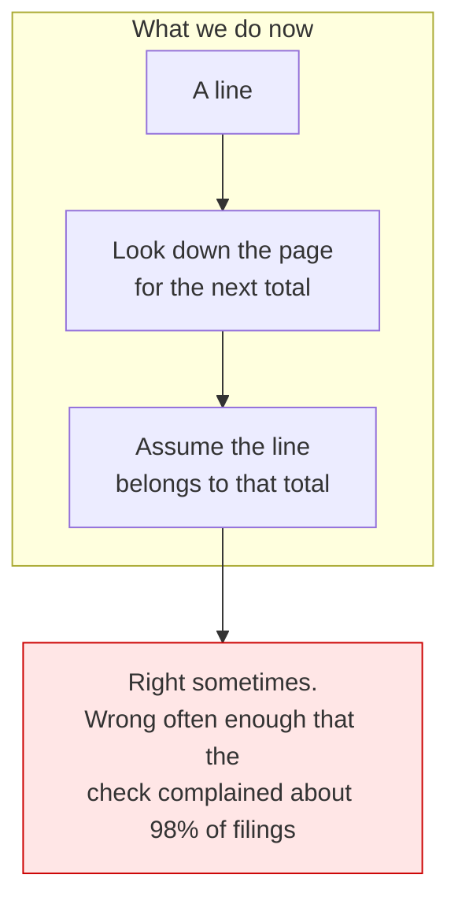

The company already stated the real answer in its filing. We just have not been reading it. That is
step 8.

**Done when.** Nothing presents the guess as knowledge.

**Size.** Small.

## Step 4. Count what we are missing

**What it is.** A report with one line per company: how many filings we hold versus how many the SEC
says exist, how many years of statements we built, which checks ran, which passed, and which never
applied.

**Why it matters.** Right now we can say what we have. We cannot say what we *should* have. A company
could be getting no verification at all and we would never know. Everything else on our problem list
is something we happened to notice — this is how we stop relying on luck.

**How it works.** Companies are grouped into tiers: the big exchanges first, then smaller listings,
then companies that file but are not listed, then everything else. A gap in the first tier is a bug.
A gap in the last is usually a shell company that never filed accounts, which is normal and gets
reported as a reason, not a failure.

Some gaps have honest explanations — a company that just listed, a foreign filer, a company that shut
down. Those are named, not counted as errors.

**How the report is built.**

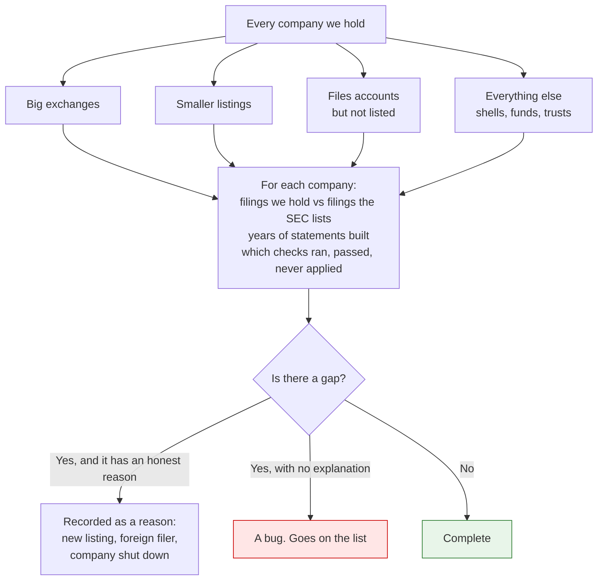

A gap in the first group is a bug. A gap in the last group is usually normal.

**Done when.** Every gap in the top tier has either a reason or a bug number against it. And we can
say how many companies are getting no checks at all.

**Size.** Medium. It is the biggest of the four but nothing blocks it.

---

# Part 2. Read the filings themselves

This is the main project. It fixes four problems at once.

## Step 5. Test our reader on about 20 real filings

**What it is.** We built the reader that opens a filing and pulls out the numbers, the labels and the
company's own maths. It works. But every test we ran it against was a filing *we wrote ourselves* to
look like a real one.

**Why it matters.** Real filings are messier than imagined ones. Before we download hundreds of
thousands of them, we should find out how the reader copes with a difficult one.

**How it works.** We pick about twenty on purpose, choosing awkward ones rather than easy ones: a
bank that splits its fee income into parts, a very large company, one with discontinued businesses, a
couple of foreign filers, an old one from before the current format, and a small company that invents
its own labels. We run the reader over them and write down everything that breaks.

**How we choose the twenty.**

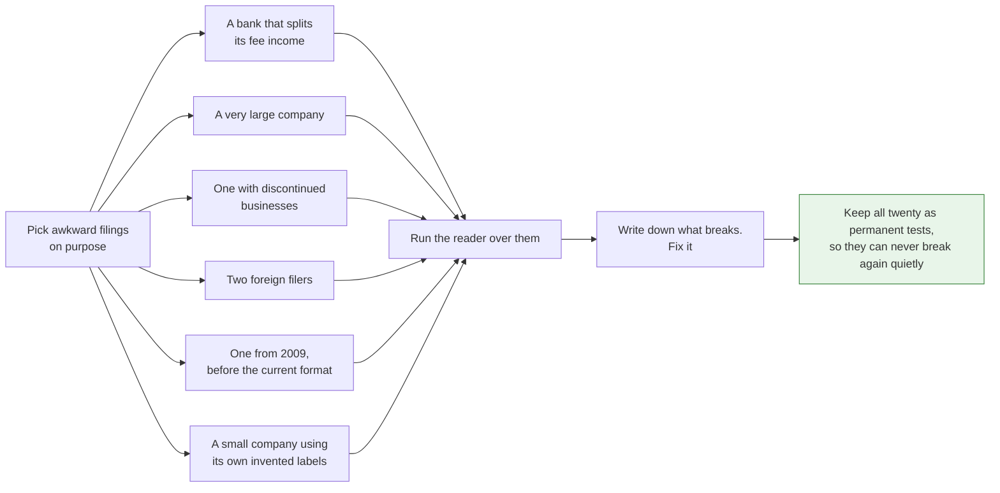

**Done when.** All twenty are read correctly, and they become permanent tests so they can never break
again silently.

**Size.** About a day. A few hundred downloads.

## Step 6. Download and keep every filing

**What it is.** Fetch the actual document for every filing we take numbers from, and store our own
copy.

**Why it matters.** Two reasons. First, we cannot read filings we do not have. Second, and more
important: we tell subscribers that a number is exactly what a company reported. If we cannot show
them the document, that is a promise we cannot keep. A link to the SEC's website is not good enough —
links break, sites get reorganised, and their availability is not ours to guarantee.

**How it works.** The SEC limits how fast anyone may download, so this runs steadily rather than all
at once. About 1.3 terabytes, roughly twenty dollars a month to store, about twelve hours of
downloading.

Attachments — exhibits, contracts, presentations — are a separate question. For now we record what
exists without downloading it, which is quick and costs nothing to store. We fetch the contents later
when something needs them, starting with debt agreements.

**What we take, and what we only note down.**

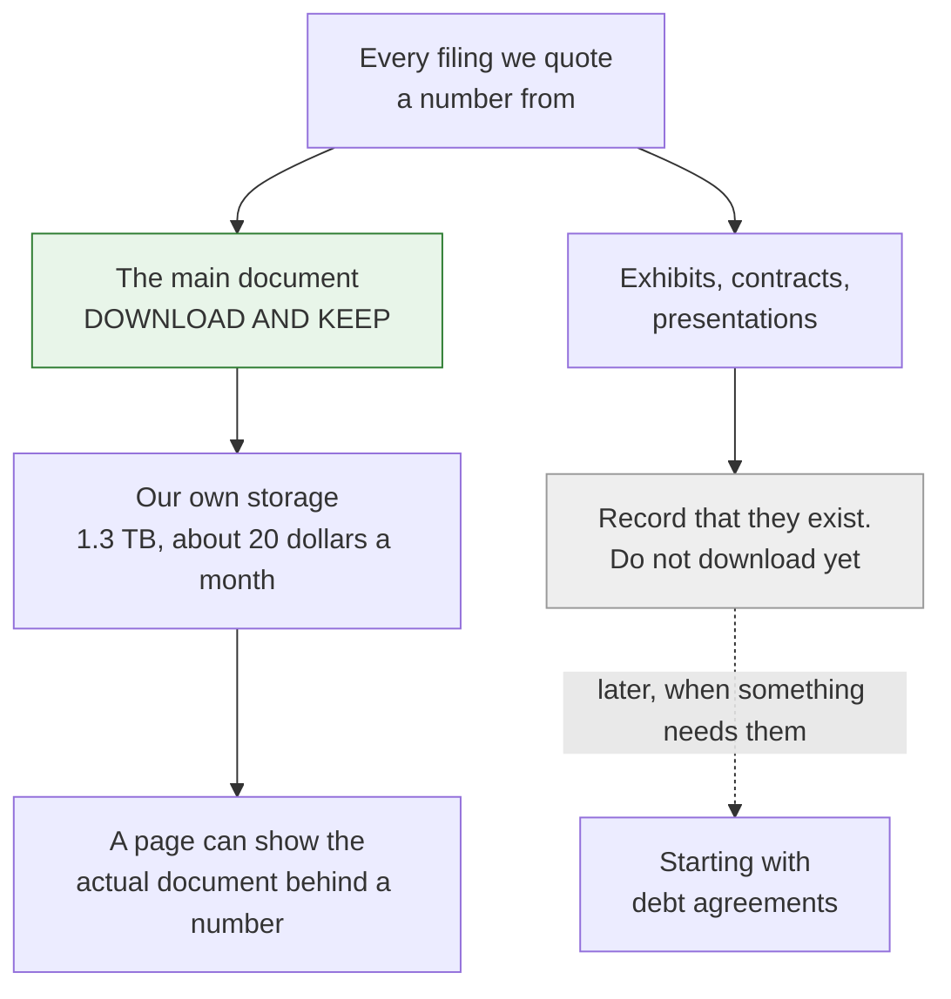

Why keep our own copy rather than link to the SEC: links break, websites get reorganised, and their
availability is not ours to promise.

**Done when.** Every filing we quote a number from is in our own storage, and the page can show it.

**Size.** Half a day of running, mostly waiting.

## Step 7. Build the statements from the filing

**What it is.** Rebuild each company's statements from the original document instead of the summary.

**Why it matters.** This is where the newest quarter stops being thinner than the one before it, and
where a broken-out line gets the words the company actually printed next to it.

**How it works.** The filing carries its own instructions: the order lines are printed in, the label
for each one, and how each number is split up. We follow those instead of reconstructing them.

The summary files stay in use as a cross-check. Where both sources produce the same number, that is
strong evidence. Where they disagree, that is a bug with a name, and we go and look.

**Two sources, one answer.**

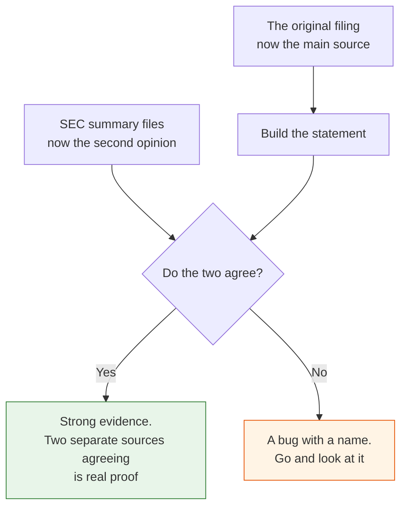

This is why we do not throw the summary files away. Before, they were our only source, so a mistake
in them was invisible to us. Now they are an independent witness.

**Done when.** The newest filing is as detailed as the older ones, and the provisional label
disappears from the pages where we now hold the filing.

**Size.** Large.

## Step 8. Prove the numbers add up

**What it is.** Replace the guess from step 3 with what the company actually declared.

**Why it matters.** A filing states, in its own words, that these particular lines add into that
particular total. With that, "does this statement add up" becomes a real question with a real answer.
It catches a missing line, a duplicated line and a sign error all at once.

**How it works.** The filing includes a map of what adds into what, including whether each item is
added or subtracted. We read the map and follow it.

**What the company actually tells us.**

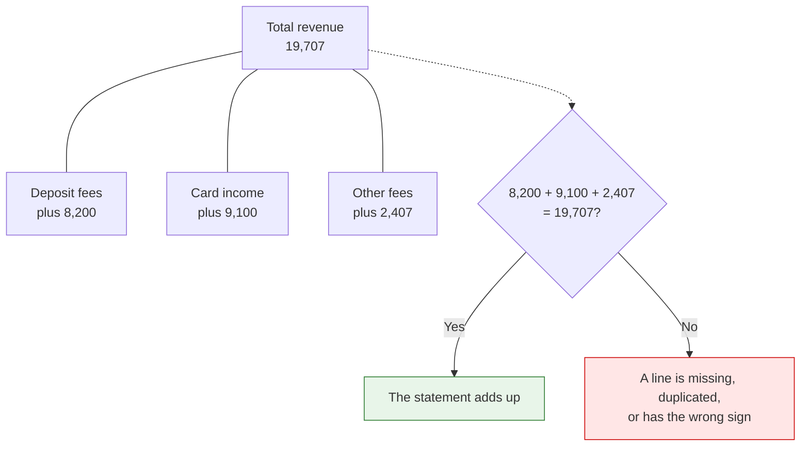

The filing states these relationships itself, including whether each item is added or subtracted. We
are not working it out. We are reading it.

**Done when.** The check goes from complaining about 98 % of filings to complaining about few enough
that every complaint is worth reading. Note the target is not zero — a check that passes everything is
just as useless. The goal is that every remaining failure is worth opening.

**Size.** Medium, once step 7 is done.

## Step 9. Use the company's own precision

**What it is.** Stop using one fixed margin of error for every company.

**Why it matters.** Companies state how precise their own numbers are. Some round to the nearest
million; some report to the dollar. Judging both by the same half-percent rule is either far too
loose or far too strict.

**How it works.** Every number in a filing carries a note saying how far it was rounded. We read it
and set the margin from it. A company rounding to millions gets about half a million of slack. A
company reporting exact figures gets about a dollar.

This is only possible from the filing. The summary files do not include it, which is why it waits
until here.

**Same rule for everyone today. The company's own rule tomorrow.**

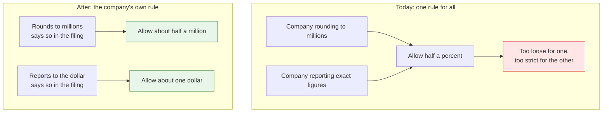

Only the filing carries this. The summary files leave it out, which is why this step waits.

**Done when.** Each check uses the precision the company declared rather than a number we chose.

**Size.** Small, once we hold the filings.

**Housekeeping, the same time.** We store statements in one small file per company per quarter, which
is now around half a million files. Reading one company is fast, but reading everything at once is
slow. If the report in step 4 turns out slow, we merge them. If it is fine, we leave it alone.

---

# Part 3. Tell users when a number changes

## Step 10. Spot restatements and say so

**What it is.** Sometimes a company revises figures it already published. This year's report shows
last year's numbers differently from how last year's report showed them. That is a restatement.

**Why it matters.** Today the new numbers can quietly replace the old ones with nothing telling
anyone. A user sees a figure that no longer matches the report they read last year, and has no reason
to doubt it. That is the worst kind of wrong.

**How it works.** We compare each annual report against the comparison column in the following year's
report. If they differ, the company changed something. We record it and show a short notice on the
page, such as: *2022 and earlier are pre-restatement; restated in the 2025 annual report.*

**One thing to be careful about.** A difference might be *our* mistake, not the company's revision. So
we only trust the comparison where we hold both filings and both were read cleanly. Otherwise we
would announce a restatement that never happened.

**Also worth saying:** a restatement is not a failure and must never be shown as one. It is real
information about the company.

**How we spot one.**

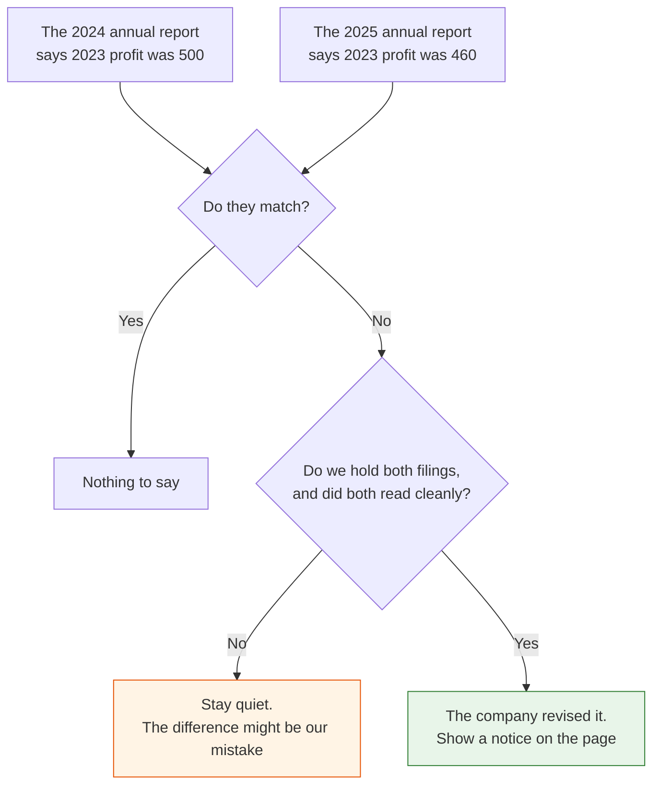

The notice reads like this: *2022 and earlier are pre-restatement; restated in the 2025 annual
report.* It is information, never a failure.

**Done when.** A company we know restated shows the notice, and the numbers behind it can be looked
up.

**Size.** Small, after the comparison check exists.

---

# Part 4. Organise the universe

## Step 11. Group companies the way analysts actually think

**What it is.** A new way of grouping companies: not by what they sell, but by how the market
analyses them.

**Why it matters.** Standard classifications put an LTL trucking company and a truckload company
together, because both move freight. But they have different economics, different cycles and
different analysts. Grouping by how they are covered is more useful to an investor, and it cannot be
worked out from the financial numbers, which is what makes it valuable and ours.

**How it works.** We write the groups first, then place companies into them:

```text
Industrials > Transportation > Trucking > LTL Carriers
Industrials > Transportation > Trucking > TL Carriers
Industrials > Transportation > Trucking > Brokers
Industrials > Transportation > Trucking > 3PL
```

Two rules. Depth varies — some areas need two levels, some need five, and we do not force four
everywhere. And a company has one main home but can appear in other groups too, with a note about how
big that part of its business is, so a focused operator is not confused with a conglomerate that has
a small arm.

Each group gets a written sentence defining it. That sentence is what makes an assignment reviewable
later, and it forces a vague term like "3PL" to mean one specific thing.

**The shape of it.**

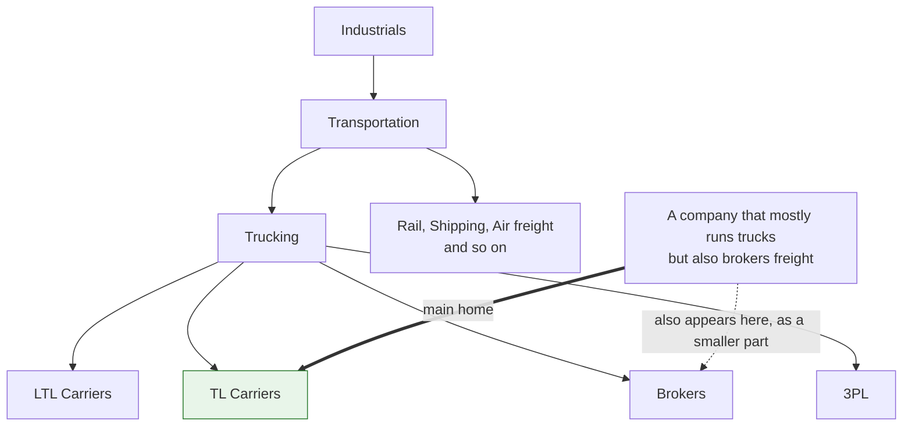

Depth is not fixed at four levels. Some areas need two, some need five. And every box gets a written
sentence defining it, so an assignment can be reviewed later and a vague term like 3PL is forced to
mean one specific thing.

**How we start.** Transportation only. Write the groups, define each one, put in a few dozen
companies we know. The test is not whether the obvious companies land correctly — any system manages
that. The test is to write down the hard-to-place companies *first*, then see whether the structure
copes.

**Done when.** Transportation works, and the awkward cases either fit or have told us what is
missing.

**What it needs.** The company list, being gathered now. And human judgement — we can suggest
placements, but the groups and the difficult calls are not something to automate.

## Step 12. The dictionary

**What it is.** A translation table sitting underneath everything, recording that different companies
use different words for the same thing.

**Why it matters.** A restaurant chain's "same store sales" is another's "comparable sales" and a
British company's "like for like". Without a translation layer you cannot compare them or answer a
question that spans several companies.

**How it works.** Three layers, in order: the maths each filing declares about itself, the official
accounting dictionary for standard terms, and finally a human-maintained table for the rest.

The rule that makes it safe: **it never replaces the company's own words on the page.** It sits
underneath, for searching and comparing. A company's page always shows that company's language.

One important detail already settled: an entry is identified by the term *plus* how it is broken
down, never the term alone. Otherwise a bank's card fees, deposit fees and general fees all collapse
into one meaningless number.

**It sits underneath. It never replaces the company's words.**

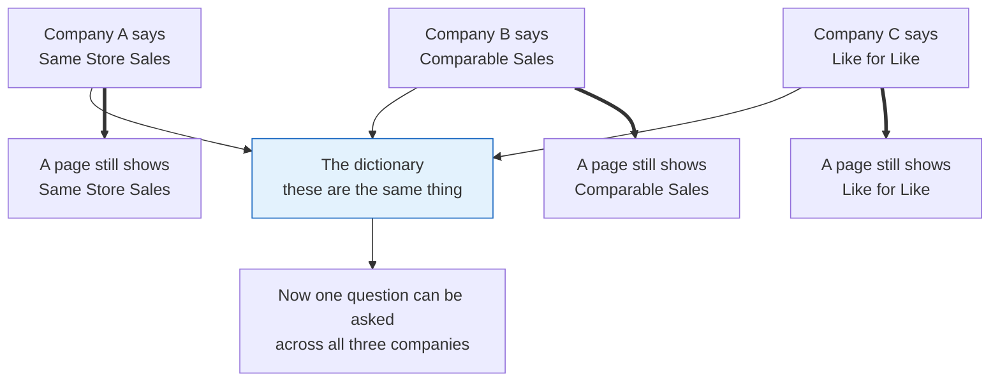

The thick arrows are what a user sees. The dictionary is for searching and comparing, never for
renaming anything on a company's own page.

**Done when.** We can measure how many different terms exist per category, which tells us how much
human work is really needed. Measure before deciding.

---

# Part 5. Go wider

## Step 13. Filings from before 2009

**What it is.** Tagged data only exists from about 2009. Older filings are documents, not data.

**How it works.** We do not try to write one system that reads every company's old filings. Instead we
learn each company's own vocabulary from its tagged filings, then apply that vocabulary backwards to
that same company's older ones. A company is only ever matched against itself.

Anything produced this way is labelled as derived, everywhere it appears.

**Each company is only ever matched against itself.**

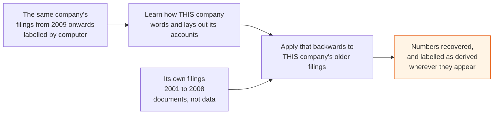

We never build one system that guesses across thousands of companies' wording. A company is only ever
compared with itself, which is what makes it trustworthy.

**Scope.** Listed companies, annual reports, 2001 onwards, roughly 75,000 documents.

## Step 14. Canada, Europe, and later Australia and New Zealand

**What it is.** Coverage outside the US.

**Why Europe is easier than Canada.**

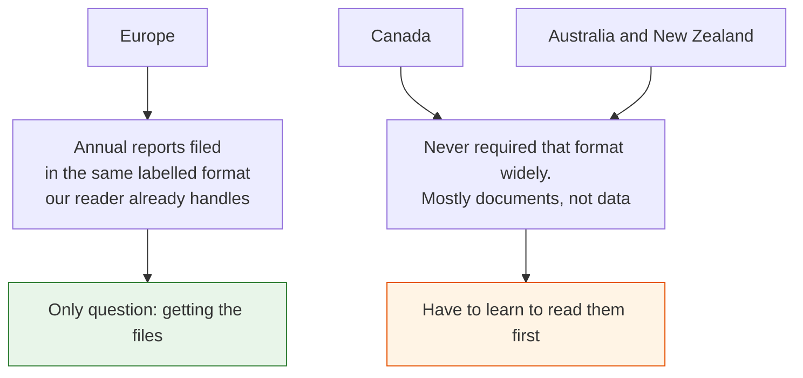

**The thing most people get backwards:** Europe is easier than Canada.

- **Europe.** European annual reports are filed in the same tagged format our reader already handles.
  So Europe is a question of getting the files, not of learning to read them.
- **Canada.** Canada never required that format widely, so it means working with documents rather
  than data. Harder, despite feeling closer.
- **Australia and New Zealand.** Like Canada. A natural commercial extension, not a technical one.

Right now, "Europe" and "Canada" in our data means only the 2,020 foreign companies that file with
the SEC. Real coverage means a new source for each region.

**One thing to do now, while the list is being gathered:** record an identifier that works across
countries, such as ISIN or LEI. A ticker symbol does not travel.

---

# Parked: share prices

Not a step, and deliberately not scheduled.

We were asked for a closing share price and a market value. The data side is nearly solved already —
share counts are in our data, including the split between share classes, which is what a market value
calculation needs for a company with more than one class.

Only the price itself is missing, and the blocker is not technical or financial. A price feed costs
about twenty euros a month. The question is whether the seller's contract allows us to show their
prices to paying subscribers. That is a question for a lawyer, and until it is answered no price data
enters our system.

One decision already made, whatever the answer: we buy prices only, never financial statements.
Sellers compile financial data by scraping news and company websites — a copy of a copy. If their
number and the filing disagree, the filing is right. We own filings end to end. A closing price we
would rent, because there is nothing we can add to it.

---

# A short glossary

| Word | What it means here |
|---|---|
| **Filing** | The accounts a company sends the SEC. The original document. |
| **Summary files** | Spreadsheets the SEC publishes that pull numbers out of many filings. Late, and less detailed. |
| **Tagged data** | A filing where each number is labelled by computer, so it can be read without a human. |
| **Statement** | An income statement, balance sheet or cash flow statement. |
| **Restatement** | When a company revises figures it already published. |
| **Provisional** | Our label for a number built the weaker way, because the filing has not been read yet. |
| **Check** | An arithmetic test we run on a filing. Internal only — never shown to users as a score. |
