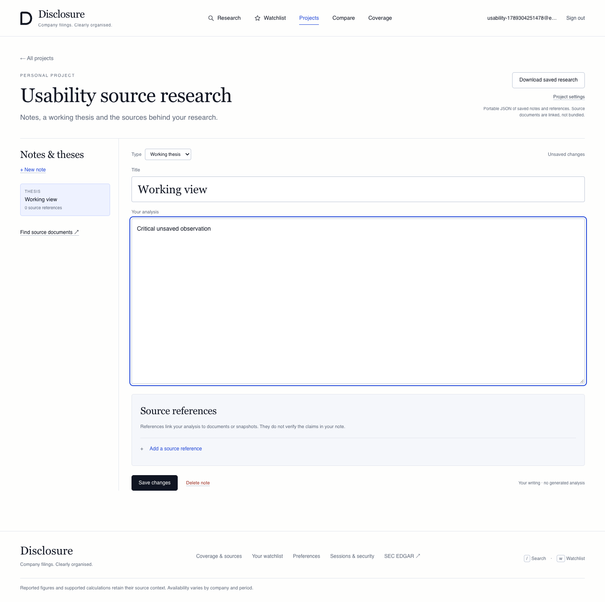
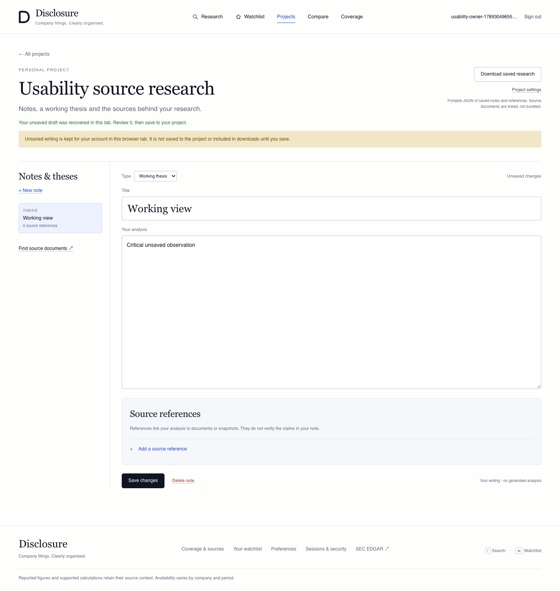
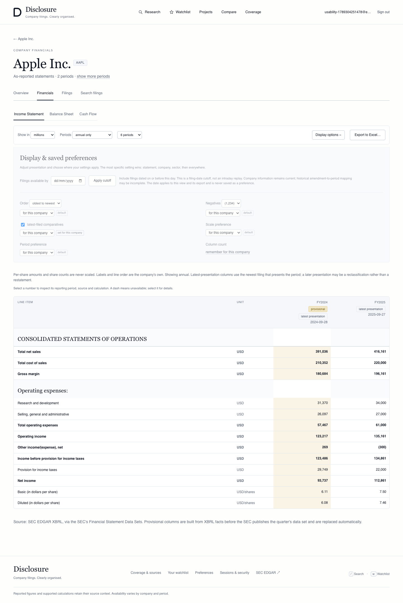
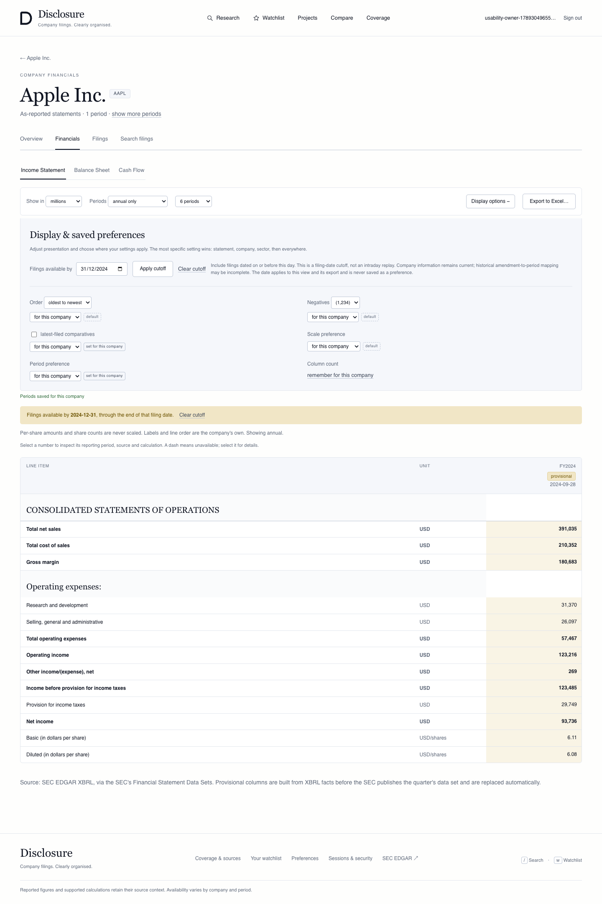
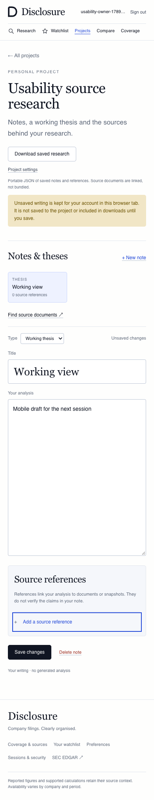

# Disclosure logic and usability audit

Baseline: merged PR18, `e94baf28f734555a1ab07cd3c7c107bbd7edacc6`. This is a simulated user-perspective audit of working browser journeys, not customer interviews or evidence of production readiness. Tests used a separate synthetic lake, seeded accounts and a mocked SEC transport. No live backfill, production account, provider contract or deployment was changed.

## Findings and fixes

| ID / severity | User task and reproduction | Observed → expected | Root cause and implemented fix | Verification |
|---|---|---|---|---|
| U01 · P1, writing lost | Edit a saved thesis without saving, click the main Research link, then browser Back; also reload the editor. | Original saved text returned, with no navigation warning. The unsaved contribution disappeared. → Recover unsaved writing while preserving the distinction from saved research. | `beforeunload` does not cover Next client navigation. Added account-and-project-scoped browser-tab recovery, mounted only after server account/project access checks. Recovered notes keep their original revision and require comparison if another editor saved meanwhile. Local source references lose cached availability claims and are checked again when saved. | Navigation, Back, reload, competing revision and failed-save browser checks pass. Export still contains the prior saved text. Unit checks cover account/project isolation, malformed records, storage failure and source metadata removal. |
| U02 · P1, newer writing overwritten | Delay a note PATCH response; type more while the save is pending; let the response complete. | The earlier request body replaced the newer writing and displayed success. → Save the submitted snapshot and keep later edits visibly unsaved. | Save completion unconditionally replaced the editor draft. Track edit generation across each request, update the persisted revision, and replace the draft only if no newer edits exist. | Actual delayed-request browser check verifies the first server body, retained newer editor text, and correct final persisted body after a second save/reload. |
| U03 · P2, research context lost | Search `repurchase` with Apple, 8-K and date filters; inspect a source and captured versions; follow the reader’s return link. | Return link kept only the company CIK, discarding query/form/dates/page. → Return to the same search. | Reader links carried no search context. Added an allowlisted local `/research` return target through source, history, comparison and clear links. Search result selection resets when the query changes. | Browser checks query/company/form/date preservation, capture comparison, clear, actual multi-page search and return. Unit checks reject external/traversal destinations. |
| U04 · P2, count controls misrepresent the view | Open `statements?limit=1&mode=annual`, or open one explicitly selected fiscal period. | A one-column grid showed “4 periods”; explicit selections offered a count control that could not change the selected range. → Display the actual count and provide a usable route to a full range. | Fixed option list omitted valid custom counts; an explicit period list supersedes limit. Include custom counts, show selected-period count, disable its inapplicable control and provide “All periods” while retaining mode/comparative/cutoff state. | Browser checks one-column/custom count, selected-period control, full-view exit, mode changes and mobile layout. |
| U05 · P1, presentation silently changes | Save comparatives-on as a preference; open a URL with `restated=0`; change period count. | The new URL omitted `restated`, so the saved true preference silently took effect. → Preserve the explicit false choice. | Navigation serialized true only. Always serialize both true and false for view reloads and “show more.” | Reproduced on baseline: count change re-enabled the toggle. Fixed browser test preserves `restated=0` through count/mode/cutoff changes and confirms the export dialog remains off. |

P1 denotes risk of losing user work or silently changing the financial presentation being reviewed. P2 denotes reproducible task friction or misleading controls. These are software defects, not missing licensed-content capabilities.

## Before and after

The baseline editor showed an unsaved state but main-navigation/Back discarded its contents:

The same journey now restores the draft, says what is retained in the tab, and keeps the server’s saved revision separate:

Financial presentation before/after the explicit-comparative and count fixes:

Mobile keyboard editing retains a visible unsaved state and fits the viewport:

## Journeys exercised

- First-time visitor: exact ticker, ambiguous company with keyboard selection, source preview, filing reader, empty/error/partial-index explanations, public coverage and administrator denial.
- Repeat analyst: query change/clear and real pagination; exact source/captured-version comparison and return; annual, quarterly and LTM modes; scale/order/preference persistence; filing cutoff and Excel export; source-linked cross-company comparison and unavailable concepts. Zero versus missing and per-share scaling retain focused numerical unit coverage; the synthetic browser corpus is not a real financial reconciliation benchmark.
- Project researcher: blank project and template, note/thesis editing, source reference attachment, saved JSON download, main navigation/Back/reload, two concurrent revisions, delayed and failed saves, mobile keyboard use and reduced motion.
- Team member: create a synthetic organization and membership through the existing API, edit its template project in the browser, inspect the owner’s persisted export, confirm deletion controls are absent for a member, revoke membership, then confirm project/editor/export access is denied. Team provisioning is an API fixture here, not an implemented end-user invitation interface.
- Account operations: magic-link sign-in, preference persistence and failed writes, watchlist state, verified-email alert controls, sign-out and server-enforced device revocation. The synthetic deployment honestly reports email delivery unavailable; it sends no customer email.

## Recovery contract and limits

Unsaved note text is retained only in the current browser tab/session, keyed by authenticated account and project. It is not a cloud autosave, a shared draft, an exported saved note or a guarantee after closing the tab or clearing browser data. Explicitly switching notes still asks before discarding the current draft. The editor checks server project access before restoring anything; local cached citation status is not a grant to a source.

If browser storage fails, the open tab retains an in-memory fallback and warns that reload-safe recovery is unavailable. The existing native unload warning remains. A recovered draft does not silently overwrite a newer server revision or recreate a deleted note under its old ID. Keeping local browser drafts is a deliberate user-visible recovery behavior, not a production data-retention policy.

## Validation

- 26 frontend unit tests passed; TypeScript and the production build passed.
- 26 combined production-server browser journeys passed, including eight new usability scenarios; no browser runtime exceptions were recorded.
- 83 focused Python tests passed, zero skips, covering projects, account security, captured-version comparison, statements and historical snapshots with local/disposable PostgreSQL parity where applicable.
- Frozen dependency lock, Ruff, formatting and diff-whitespace checks passed. Frontend dependency audit reports zero vulnerabilities.
- Browser evidence uses synthetic accounts/data. Green checks do not establish comprehensive SEC coverage, source completeness, production delivery or institutional service reliability. The first web CI attempt exposed a pagination-fixture assumption; the suite seeds a fixed 25-document synthetic cohort and retains hidden browser artifacts. A separate push run exposed an immediate DOM assertion racing the streamed loading boundary: reproduced locally with zero Next links before results and one afterward. The browser journey now waits for visible results and the correct page, checks 20 then five rows, verifies 25 distinct documents, and checks keyboard return. Exact-head acceptance must include both push and pull-request CI runs.

Run the existing synthetic preview described in `platform-delivery.md`, then `npm run test:browser` from `web`. Custom preview locations use `SMOKE_BASE_URL` and `SMOKE_API_BASE_URL`; the additional suite defaults to web3100/API8100 for CI. Screenshots and JSON acceptance results are retained in `web/.browser-results/usability`.

## Still outside this release

Incomplete indexing, unsupported/scanned documents, historic capture limits, sector-specific accounting alignment, licensed broker/expert/news content, invitations, SSO/SCIM, production mail and provider-backed generated research remain separately scoped capabilities. Their absence is explained rather than filled with pretend data or inactive buttons. The parallel research and admin releases keep their own contracts and acceptance gates.
