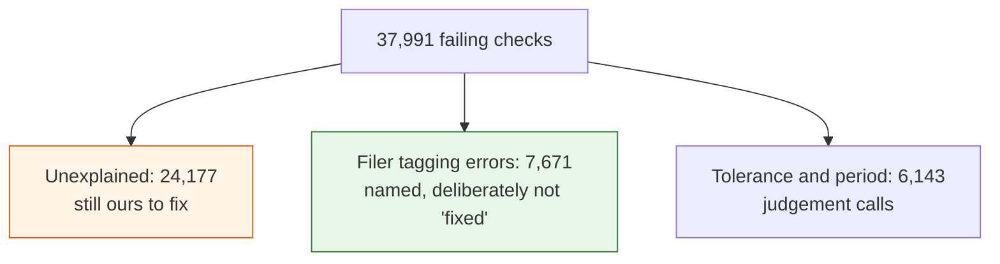

# What to double-check

For Hicham. Two days of work on the data left four things fixed and a handful of judgement calls
made. Tests catch a mistake in the code. They cannot catch a mistake in the *accounting*, and that is
what this asks you to look at.

Nothing here is urgent-and-broken. It is "we decided something on your behalf, please tell us if we
decided wrong".

---

## The short version

Checks that fail went from **9.2 % to 1.8 %** (189,322 down to 37,991 of ~2 million). Companies with
at least one failing check went from **71.6 % to 34.9 %**. Almost none of the original 9 % was real —
it was our checking code being wrong, not the filings.

Four real bugs, fixed:

| | What was wrong | Did users see it? |
|---|---|---|
| 1 | The cash check compared start-of-year cash to end-of-year cash | No — checking only |
| 2 | Foreign filers' home currency and dollar translation both kept, so one statement could mix them | **Yes** |
| 3 | Earnings per share used the group's total profit instead of the parent's share | No — checking only |
| 4 | Where a company shows the currency effect on cash separately, we counted it twice | No — checking only |

Only **number 2** ever affected what a reader saw.

---

## 1. The accounting calls — this is the important part

Five decisions. If any is wrong, the data is wrong in a way no test will catch.

### a. Earnings per share uses the parent's profit, not the group's

A company with subsidiaries reports two profit figures: the consolidated total (including the
minority shareholders' share of subsidiaries) and the part belonging to its own shareholders. We had
been using the first. We now use the second, because EPS is per share *of the parent's shareholders*.

**Check:** is that right in every case you can think of? It cleared 41,549 failures, so if it is
wrong it is wrong at scale.

### b. Pretax minus tax equals the consolidated figure — the opposite preference

Same two figures, opposite direction: pretax income is consolidated, so pretax minus tax should equal
the consolidated after-tax figure, minority share included. EPS wants the parent's; this wants the
group's.

**Check:** agree that these two want opposite things?

### c. Where a company does not label its own EPS numerator, we treat the check as approximate

Two thirds of filings do not tag the earnings figure they divided by their share count. For those we
substitute net income — but a company's real numerator often differs by 1–4 % because of the
two-class method (earnings allocated to unvested shares carrying dividend rights) or preferred
dividends. Both live in the EPS note, not on the face of the income statement, so a check reading the
statement cannot see them.

So the check is split in two. Where the company tags its numerator, it is **exact** (1 %, or a cent).
Where we infer it, it is a separate, clearly-named **approximate** check at **5 %**.

**Check: is 5 % the right allowance?** It has to cover a normal two-class allocation without hiding a
real error. This is the number most worth your judgement, and it is one line to change.

### d. A statement is kept in one currency — the one most of its lines use

A filer publishing in renminbi with a dollar translation gets kept in renminbi; one publishing in
dollars with a euro translation gets kept in dollars. Ties go to the dollar.

**Check: is "whatever most lines use" the rule you want?** The alternative is always preferring the
company's home reporting currency. They agree almost always, and differ on a filer whose translation
is more completely tagged than its original.

### e. We do not "fix" the filer's own tagging mistakes

About **7,671** of the remaining failures are the filing being wrong, not us: a share count tagged in
thousands while the EPS implies units (6,178 of them — the median tagged share count is 26,218, which
is 26 million filed in thousands), a figure whose sign is inverted (876), one side tagged as zero
(617). Our check is right to flag these. We list them; we do not silently correct them.

**Check:** agree that is the right posture? The alternative is quietly repairing the filing, which
would mean showing a number the company did not file.

---

## 2. Open one real company page

This is the one thing that genuinely needs a person and has not been done.

The currency fix changed the stored data, and everything verifying it so far has been numbers
checking numbers. It has been carried through the page-building code in both directions and the
output read — but on a *synthetic* filing. Nobody has opened a real company's page.

**What to do:** pick a Chinese, Hong Kong or Singapore filer — those are where this happens. (Not
Toyota: their 20-F is yen-only, that was a bad example on our side.) The real ones are mostly 20-F
and 6-K filers; renminbi/dollar alone accounts for 2,222 of the 3,502 affected lines in one quarter,
across 167 filings.

**What to look for:**
- one currency from the top of the statement to the bottom
- no blank line where there should be a number
- no figure roughly 7× or 150× out of line with the ones around it

---

## 3. The list of what is left

`filings-hub check-report --csv failures.csv` writes every remaining failing check with the company's
name, which check, and a reason. That file is the honest statement of where we are.

The reasons, across all 37,991:

| Reason | Count | Whose problem |
|---|---|---|
| Unexplained | 24,177 | **Ours to investigate** |
| Share count filed in thousands | 6,178 | The filer's |
| Just over the tolerance | 3,835 | A tolerance question |
| Out by a factor of 2 to 4 (a period) | 2,308 | Probably ours |
| Sign inverted | 876 | The filer's |
| One side tagged zero | 617 | The filer's |

**Check, if you want a sample:** take ten rows marked "unexplained" from a check you know well and
tell us whether the filing or our arithmetic is at fault. That is the fastest way to find the next
cause — every fix so far came from reading real filings, not from theorising.

---

## What we are *not* asking you to check

- **The code.** Tested, and a mistake there shows up as a failing test.
- **Whether the target is zero failures.** It is not. Some failures are the filing being wrong and
  the check is right to say so. The target is *no failure caused by us*, with every other one named.
- **Gross profit and operating income** (6,754 failures). Untouched so far and not yet diagnosed.
  They are next, and they may turn out to need a structural fix rather than a tuning one — the filings
  state their own arithmetic and we do not read it yet. That is a real piece of work, not a tweak.

---

## If you only do one thing

Answer (c): **is 5 % the right allowance on an approximate EPS check?** It affects 15,026 checks, it
is a one-line change, and it is pure accounting judgement — exactly the call we cannot make for you.
