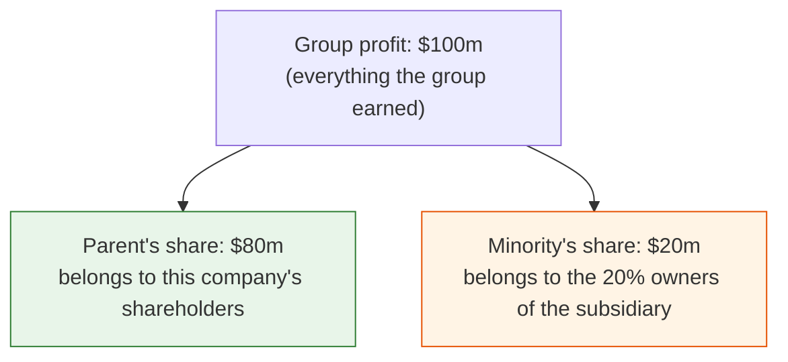
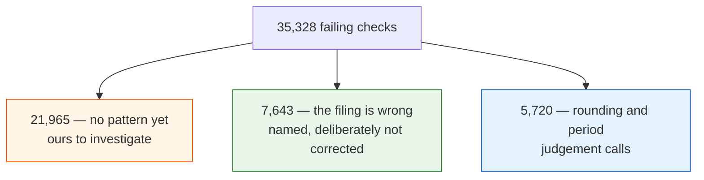

# What to double-check

**For Hicham.**

We re-did the arithmetic inside every filing, using only the company's own numbers. 
Where it did not add up, we went looking for why. Most of the time the fault was ours and we fixed it.

---

## Where things stand

Out of **2,063,641** checks, **35,328 fail**. That is **1.7%**. It used to be 9.2%.

Almost none of that 9.2% was real. It was our checking code being wrong, not the filings.

Four real bugs, now fixed:

| | What was wrong | Did anyone reading the site see it? |
|---|---|---|
| 1 | The cash check compared cash at the *start* of the year against cash at the *end* | to be checked |
| 2 | For foreign companies we kept both currencies, so one statement could mix them | **Yes** |
| 3 | Earnings per share used the whole group's profit instead of the parent's share | to be checked |
| 4 | Where a company lists the currency effect on cash separately, we counted it twice | to be checked |

Only **number 2** ever changed a number a reader could see. That is why it is the one thing below
that needs a real person to go and look.

---

# Part 1 — The five decisions

## a. Earnings per share uses the parent's profit, not the whole group's

**The situation.** Say a company owns 80% of a subsidiary. It has to report two different profit
figures, and both are correct:

Now the company has 40 million shares. What is earnings per share?

* Using the group's $100m → **$2.50**
* Using the parent's $80m → **$2.00**

We used to use the first. **We now use the second**, because earnings per share means earnings per
share *for the people holding this company's shares* — and the minority's $20m is not theirs.

> **Please confirm:** is the parent's share always the right one for EPS? This change cleared 41,549
> failing checks, so if it is wrong, it is wrong on a lot of companies.

## b. But the tax check wants the opposite one

Same two figures. Opposite answer.

Tax is charged on the *whole group's* profit. So when we check "profit before tax, minus tax, equals
profit after tax", every number in that line has to be the group's:

> $130m before tax − $30m tax = **$100m** — the group's figure, *not* the parent's $80m.

So the two checks deliberately pull in opposite directions. EPS wants the parent's number. The tax
check wants the group's.

> **Please confirm:** you agree these two want opposite figures.

## c. Two-thirds of companies do not tell us what they divided by

**The situation.** A company prints "earnings per share: $2.42". To check it, we need the two numbers
they used — the profit on top, and the share count underneath.

Most companies tag the share count. **Only about one in five tag the profit figure** — 40,225
filings out of 210,698. For the other four-fifths we have to guess, and we use net income.

**Why the guess is usually a little bit off.** Take a company with $100m profit and 40m shares. You
would expect $2.50. But suppose $3m of that profit is promised to employees holding restricted shares
that earn dividends. That $3m is not available to ordinary shareholders, so the company takes it out
first:

> ($100m − $3m) ÷ 40m shares = **$2.42**, not $2.50

That is a 3% difference and the company is completely right. The catch: the $3m is disclosed in the
*notes* at the back, not on the face of the income statement — and our check only reads the
statement. **We cannot see it.**

**What we did.** We split the check in two:

| | When | How close it must be |
|---|---|---|
| **Exact** | The company tagged its own profit figure | within 1%, or a cent |
| **Approximate** | We had to guess | within **5%** |

A real one that still fails: American Express, 2020. We compute **$0.455**, they report **$0.41**.
That is 10% apart — beyond our 5%, so it is listed.

> **Please confirm: is 5% the right allowance?** It has to be wide enough to cover a normal
> restricted-share adjustment, but narrow enough that a genuine error still gets caught. This is the
> single most valuable answer you can give us. It is one line to change.

## d. We keep each statement in one currency — whichever most of its lines use

**The situation.** A Chinese company files in renminbi and also provides a US dollar translation of
the same statement. Both sets of numbers are in the same filing.

We used to keep both. So a single statement could end up like this:

| Line | What we stored | |
|---|---|---|
| Revenue | 700,000,000 | ← renminbi |
| Cost of sales | 80,000,000 | ← dollars |
| **Gross profit** | **620,000,000** | **nonsense** |

The two lines are about seven times apart for no reason other than that they are in different money.

**Our rule now:** count the lines, keep the currency most of them use, throw the rest away. A renminbi
filer with a dollar translation stays in renminbi. A dollar filer with a euro translation stays in
dollars. If it is a dead tie, the dollar wins.

> **Please confirm: is "whichever most lines use" the rule you want?** The alternative is to always
> prefer the company's home currency. They give the same answer nearly every time. They disagree only
> when a company tagged its translation more thoroughly than its original — and then our rule picks
> the translation.

## e. When the filing itself is wrong, we say so — we do not fix it

**The situation.** Some of these failures are not our mistake. The filing genuinely contradicts
itself. About **7,643** of the 35,328 are this.

Three examples, all real:

| Company | What we compute | What they report | What happened |
|---|---|---|---|
| AAR Corp | −251,412 | −$0.25 | Share count tagged a million times too small |
| Tenax Therapeutics | +$0.61 | −$0.61 | The sign is flipped — a profit tagged where there is a loss |
| Avon Products | $0.05 | $0.00 | A line tagged as zero when it is not zero |

The most common by far is the share count. The typical one of these reads **26,218** when the company
means **26,218,000** — they filed it in thousands and forgot to say so.

**We could quietly correct these.** We decided not to. If we "fix" it, we are showing a number the
company never filed, and nobody downstream can tell. So we list it and leave it alone.

> **Please confirm:** you agree that is the right posture.

---

# Part 2 — The one thing that needs a person

**Open one real company's page on the site and read it.**

Of the four bugs, the currency one (number 2) is the only one that ever changed what a reader sees.
And everything that has verified it so far has been numbers checking numbers. We pushed a filing
through the page-building code and read what came out — but it was a *made-up* filing. **Nobody has
opened a real company page and looked at it.**

**Who to pick:** a Chinese, Hong Kong or Singapore company. That is where this actually happens —
renminbi and dollars together account for 2,222 of the 3,502 affected lines in a single quarter,
across 167 filings. They are mostly 20-F and 6-K filers.

**Not Toyota.** You checked, and you were right: their 20-F is entirely in yen. That was a bad
example on our side.

**What you are looking for:**

* one currency from the top of the statement to the bottom
* no blank space where a number should be
* nothing about 7× or 150× out of line with the numbers around it — those are the renminbi and yen
  exchange rates, and seeing one is exactly what the mixing bug looked like

---

# Part 3 — What is still failing

The full list is a spreadsheet, already on GitHub:

**[reports/failures-2026-09-15.xlsx](https://github.com/g784dwcd2r-crypto/H/blob/claude/laughing-feynman-7dk0vk/reports/failures-2026-09-15.xlsx)**

GitHub will not preview it — click **View raw** and it downloads. The `reports/README.md` file next
to it explains how to read a row.

Every row says the same thing: *we added up the company's own lines and got this; the company says
that; here is the gap.*

## Sorting the 35,328

| Reason | Count | Whose problem |
|---|---|---|
| No pattern — needs someone to read the filing | 21,965 | **Ours to investigate** |
| Share count filed in thousands | 6,178 | The filer's |
| Just over the rounding limit | 3,515 | A tolerance question |
| Out by a factor of 2 to 4 | 2,205 | **Probably ours** |
| Sign flipped | 871 | The filer's |
| One side tagged as zero | 594 | The filer's |

**"Just over the rounding limit" looks like this** — Art's Way Manufacturing: revenue minus cost of
goods comes to 2,345,561; they print 2,330,654. Fifteen thousand dollars apart on a two-million-dollar
number. That is rounding, and it is noise.

**"Out by a factor of 2 to 4" looks like this** — AAR Corp: we compute gross profit of 225,300,000
and they report 61,500,000. That is not rounding. It is 3.7 times out, which is what a *nine-month*
revenue paired against a *three-month* gross profit looks like. **That one is ours**, and it is the
whole group of 2,205. We have not fixed it yet.

> **If you want to help with the big pile:** take ten rows marked "no pattern" from a check you know
> well, and tell us whether the filing is wrong or our arithmetic is. Every fix so far came from
> reading real filings — never from theorising.

---

# What we are *not* asking you to check

* **The code.** It is tested. A mistake there shows up as a failing test.
* **Whether the goal is zero failures.** It is not. Some failures are the filing being wrong, and the
  check is right to point at them. The goal is *no failure caused by us*, and every other one named.
* **Gross profit and operating income** (6,754 failures). We have not diagnosed these yet — they are
  next. They may need a structural fix rather than a tweak: filings state their own arithmetic in a
  part of the file we do not read yet. That is real work, not a small change.

---

# If you only do one thing

**Answer (c): is 5% the right allowance on an approximate EPS check?**

That number decides pass or fail on **331,012** checks — every filing where we had to guess. 15,026
of them fail today. It is one line to change. And it is pure accounting judgement — exactly the call
we cannot make for you.
