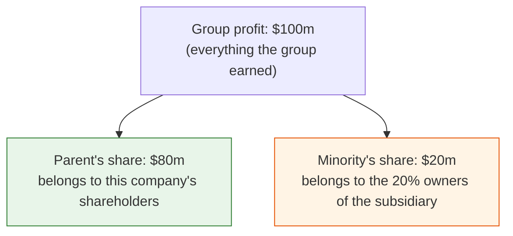
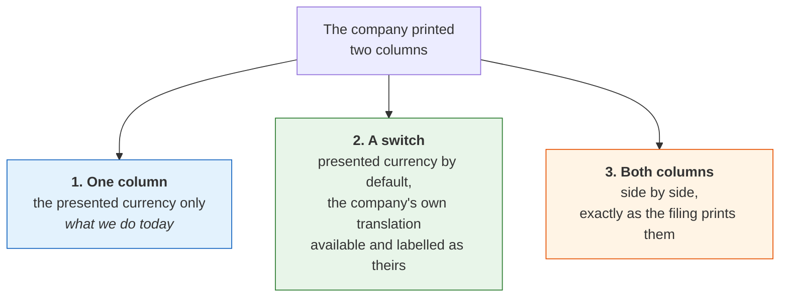
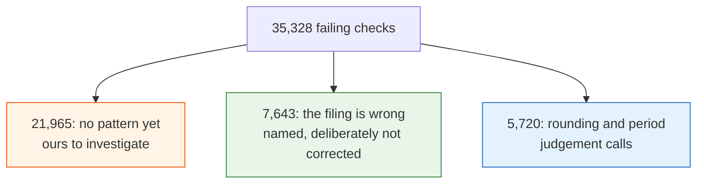

# What to double-check

**For Hicham.**

We re-did the arithmetic inside every filing, using only the company's own numbers.
Where it did not add up, we went looking for why. Most of the time the fault was ours and we fixed it.

---

## What I still need from you

Four of the original five are answered, and checking one of them turned up two new questions. Here
is everything in one place, so you do not have to re-read the document to find out what is left.

| | The question | Status |
|---|---|---|
| **a** | Does earnings per share use the parent's share? | **Answered: yes** |
| **b** | Does the tax check use the group's total? | **Answered: yes,** and you corrected my reasoning |
| **c** | Is 5% the right allowance when we have to guess the top number? | **Open. This is the big one.** |
| **d** | Should a statement keep whichever currency most of its lines use? | **Answered:** the presentation decides. See below for what I found when I checked whether we can read it. |
| **e** | Are we right to list a filing's own tagging errors rather than repair them? | **Answered: yes,** and you corrected one of my examples |
| **f** | **New, from your currency answer.** A company printed two currency columns. We show one. Right? | **Open** |
| **g** | **New.** Which company should we use as the test case for that? | **Open** |
| | Open one real foreign company's page and read it | Not done. Needs a person, nothing to decide. |

Your answer to (b) was worth more than your answer to (a), because you did not just confirm it, you
told me my reasoning was wrong. I had written that the two checks "want opposite figures". You
pointed out that they are not opposites at all, they are two concepts facing two different people:
the state, which taxes the company as a whole and does not care who owns which subsidiary, and a
shareholder, whose claim is on the parent alone.

That is a rule I can apply to the next check. What I had written was not, it was just two answers
that happened to differ. I have replaced it everywhere, including in the code comments, and written
it up in `decisions.md` as the way to decide this class of question in future: **ask who the number
is answering to.**

Nothing in the code changed, because both checks were already taking the right figure.

---

## Where things stand

Out of **2,063,641** checks, **35,328 fail**. That is **1.7%**. It used to be 9.2%.

Almost none of that 9.2% was real. It was our checking code being wrong, not the filings.

Four real bugs, now fixed:

| | What was wrong |
|---|---|
| 1 | The cash check compared cash at the *start* of the year against cash at the *end* |
| 2 | For foreign companies we kept both currencies, so one statement could mix them |
| 3 | Earnings per share used the whole group's profit instead of the parent's share |
| 4 | Where a company lists the currency effect on cash separately, we counted it twice |


---

# Part 1: the decisions

**(a), (b), (d) and (e) are answered, and I have kept them here with your answers in them**, because
the reasoning is the part worth keeping. **(c) is the only one of the original five still open**, and
it is the one worth the most. (f) and (g) are new: they came out of checking your answer to (d), and
(f) is the one where two of your own rules point in different directions.

## a. Earnings per share uses the parent's profit, not the whole group's

**The situation.** Say a company owns 80% of a subsidiary. It has to report two different profit
figures, and both are correct:



Now the company has 40 million shares. What is earnings per share?

* Using the group's $100m → **$2.50**
* Using the parent's $80m → **$2.00**

We used to use the first. **We now use the second**, because earnings per share means earnings per
share *for the people holding this company's shares*, and the minority's $20m is not theirs.

> **Answered: yes.** *"When I buy a stock, I am buying an interest in the parent's share. And
> therefore I have a right to the parent's share, not to the group's profit."* (Hicham, 15 Sep)
> The change cleared 41,549 failing checks.

## b. The tax check uses the group's figure, because it faces someone else

Same two numbers. Different answer. Not because the checks disagree, but because they answer to
different people.

**Tax faces the state.** The state taxes the company as a whole. It does not care who owns which
slice of which subsidiary. So every number in "profit before tax, minus tax, equals profit after
tax" is the group's:

> $130m before tax − $30m tax = **$100m**, the group's figure, *not* the parent's $80m.

**A share faces its holder.** Profit gets divided by who owns what, and the minority's $20m belongs
to someone else.

> **Answered.** *"These are not opposite figures. They are two concepts. A company's tax liability
> is to the state; it doesn't care who owns what portion. Profits are for the shareholders, so they
> are split according to ownership. It's about who you are facing."* (Hicham, 15 Sep)
>
> The code was already doing this correctly. The description above it was wrong: we had called them
> opposite preferences, as if one were an exception to the other. They are two different questions
> with two different counterparties, and each takes the figure its counterparty is owed.

## c. Four companies in five do not tell us what they divided by

**The situation.** A company prints "earnings per share: $2.42". To check it, we need the two numbers
they used: the profit on top, and the share count underneath.

Most companies tag the share count. **Only about one in five tag the profit figure**: 40,225
filings out of 210,698. For the other four-fifths we have to guess, and we use net income.

**Why the guess is usually a little bit off.** Take a company with $100m profit and 40m shares. You
would expect $2.50. But suppose $3m of that profit is promised to employees holding restricted shares
that earn dividends. That $3m is not available to ordinary shareholders, so the company takes it out
first:

> ($100m − $3m) ÷ 40m shares = **$2.42**, not $2.50

That is a 3% difference and the company is completely right. The catch: the $3m is disclosed in the
*notes* at the back, not on the face of the income statement, and our check only reads the
statement. **We cannot see it.**

**What we did.** We split the check in two:

| | When | How close it must be |
|---|---|---|
| **Exact** | The company tagged its own profit figure | within 1%, or a cent |
| **Approximate** | We had to guess | within **5%** |

A real one that still fails: American Express, 2020. We compute **$0.455**, they report **$0.41**.
That is 10% apart, beyond our 5%, so it is listed.

> **Please confirm: is 5% the right allowance?** It has to be wide enough to cover a normal
> restricted-share adjustment, but narrow enough that a genuine error still gets caught. This is the
> single most valuable answer you can give us. It is one line to change.

## d. We keep each statement in one currency: whichever most of its lines use

**The situation.** A Chinese company files in renminbi and also provides a US dollar translation of
the same statement. Both sets of numbers are in the same filing.

We used to keep both. So a single statement could end up like this:

| Line | What we stored | |
|---|---|---|
| Revenue | 700,000,000 | ← renminbi |
| Cost of sales | 80,000,000 | ← dollars |
| **Gross profit** | **620,000,000** | **nonsense** |

The two lines are about seven times apart for no reason other than that they are in different money.

**Our rule now:** count the lines, keep the currency most of them use, throw the rest away. A renminbi
filer with a dollar translation stays in renminbi. A dollar filer with a euro translation stays in
dollars. If it is a dead tie, the dollar wins.

> **Answered: let the presentation decide.** *"Always in the way that the company presents its
> numbers. If there is a way to check what the presented currency is, then that is the rule. If the
> proxy is 'most lines used' then we can go with that as a rule of thumb. But let the presentation of
> the numbers decide."* (Hicham, 15 Sep)

**So I went and checked whether there is a way, and the answer is: not from where we are standing
today, but yes from the filing itself.**

Two things came out of it that are worth knowing.

*The unit is not a proxy.* Every number in a filing carries its own currency code, so we are never
guessing what currency a figure is in. The only thing we are guessing at is **which of two columns
the company put on the face of the statement** when it printed both. That is a narrower question than
I had been treating it as.

*Our rule is already closer to your answer than it sounds.* The vote does not count every number in
the filing. It only counts the lines the company actually presented on a statement, because the count
runs over the SEC's presentation table. So "most lines used" already means "most of the lines the
company printed", which is most of the way to what you asked for.

*What it still cannot do.* The SEC's summary files record both columns and never say which one was
primary. There is no field for it. So on that source the vote is the best available answer, and it is
wrong precisely in the case you would expect: a company that tagged its translation more completely
than its original.

*The filing does carry it,* which makes this one more thing that steps 6 and 7 fix rather than a rule
we have to settle by argument.

**One thing I could not verify, and it is a gap worth closing.** We keep 26 real filings as permanent
tests, and I checked the two foreign ones. Toyota files 2,533 figures and every single one is in yen,
so there is nothing to choose between. Royal Bank of Canada files 6,145 in Canadian dollars, and its
only foreign-currency figures are six in US dollars, one in yen and one in sterling, every one of
which is attached to a specific debt issue or class of share. Those are notes about foreign-currency
instruments, not a translated copy of the accounts.

So **neither of our test filings actually has a convenience translation**, which means the case that
caused our only reader-visible bug is not in the set we test against. I have added getting one to the
plan.

### f. Two of your rules disagree here, and I need you to break the tie

This is the follow-up, and I only saw it once I had gone looking for the presented currency.

Your first rule is that we show what the company printed. A Chinese company printing a renminbi
column and a dollar column beside it **printed both of them**. Our currency rule keeps one and drops
the other from the statement.

So on that company's page today, a reader sees only the renminbi column, and a number the company
genuinely published is not on the page. We still hold every figure, so nothing is lost from the data.
It is a presentation question, not a storage one.



My own read, for what it is worth: option 2. The translation is the company's number rather than
ours, so showing it does not break the first rule as long as the page says whose it is, and an
investor comparing a Chinese company with an American one will want the dollars. But dropping it
outright is the current behaviour and I would rather you chose than have me assume.

**The question: when a company prints two currency columns, which of those three should the page
do?**

### g. Which company should we test this on?

We need one filing in our permanent test set that actually has a convenience translation, and right
now we would be picking blind. You know these names better than I do.

**A Chinese, Hong Kong or Singapore company that prints a US dollar column beside its home
currency.** Any one you would trust as typical. Renminbi and dollars alone is 2,222 of the 3,502
affected figures in a single quarter, so that is the most representative pairing, but I will take
whichever one you think is the fairest test.

## e. When the filing itself is wrong, we say so, we do not fix it

**The situation.** Some of these failures are not our mistake. The filing genuinely contradicts
itself. About **7,643** of the 35,328 are this.

Three examples, all real:

| Company | What we compute | What they report | What happened |
|---|---|---|---|
| AAR Corp | −251,412 | −$0.25 | Share count tagged a million times too small |
| Tenax Therapeutics | +$0.61 | −$0.61 | Not an error. The heading says "Net loss", so the amount under it is positive. See (e). |
| Avon Products | $0.05 | $0.00 | A line tagged as zero when it is not zero |

The most common by far is the share count. The typical one of these reads **26,218** when the company
means **26,218,000**. They filed it in thousands and forgot to say so.

**We could quietly correct these.** We decided not to. If we "fix" it, we are showing a number the
company never filed, and nobody downstream can tell. So we list it and leave it alone.

> **Answered: yes, and what they report always wins.** *"So if what you compute is different, it
> means one of three things in most cases: 1. They recorded numbers in thousands or millions, and
> therefore it needs to be multiplied. 2. They record costs as a 'negative' number. 3. The line item
> they report implies a negative number. For instance 'Net loss'. They then put in a positive number
> because the description already describes it is a loss."* (Hicham, 15 Sep)

**I had Tenax in the wrong column, and your third case is why.**

I listed them under "the filing is wrong". You looked at the actual page and they are not. Their 2012
income statement prints **Net loss $15,712,410** and, underneath it, **net loss per share $(0.61)**.
A reader cannot misunderstand that. The heading carries the sign, so the amount below it is printed
positive, exactly as you describe.

What our check saw was 15,712,410 ÷ 25,928,263 = **+0.61**, against a reported **−0.61**. So the
disagreement is not between us and the company. It is between the company's own tagged amount and
the company's own tagged per-share figure, and the page itself is perfectly clear.

So the check is still right to raise it, because two tags in one filing genuinely contradict each
other. What was wrong was the word we put next to it. **The reason column now tells your third case
apart from a line that is simply inverted:**

| What the report now says | What it means |
|---|---|
| `sign: a loss reported as a positive amount` | Your case 3. The heading says loss, the number under it is positive. The company is right. |
| `sign: the two sides are exact negatives` | A line genuinely the wrong way up, like Texas Pacific's negative total assets |

Your first two cases were already separated out: thousands and millions come through as
`scale: off by a factor of 1,000 or 1,000,000`, and a cost recorded negative lands in the second row
above.

**And the posture itself stands.** We list, we never repair. Which your own sentence is the best
argument for: *they can't lie, otherwise they go to jail.* If we quietly rewrote a number, we would
be replacing something a company is legally accountable for with something nobody is.

---

# Part 2: the one thing that needs a person

**Open one real company's page on the site and read it.**

Of the four bugs, the currency one (number 2) is the only one that ever changed what a reader sees.
And everything that has verified it so far has been numbers checking numbers. We pushed a filing
through the page-building code and read what came out, but it was a *made-up* filing. **Nobody has
opened a real company page and looked at it.**

**Who to pick:** a Chinese, Hong Kong or Singapore company. That is where this happens:
renminbi and dollars together account for 2,222 of the 3,502 affected lines in a single quarter,
across 167 filings. They are mostly 20-F and 6-K filers.

**Not Toyota.** You checked, and you were right: their 20-F is entirely in yen. That was a bad
example on our side.

**Three names, and how to get them.** You asked for three at random and said you would look. Run
this and take any three off the list:

```
LAKE_ROOT=data filings-hub two-currency-filings
```

It names the companies whose filings report the same line twice in two currencies, which is exactly
the case in question, ordered by how many lines they double up. It also prints the exchange rate the
two versions of each line imply, so you can see at a glance which pairing you are looking at: about
7.0 is renminbi, 7.8 is Hong Kong dollars, 150 or so is yen.

You are right that these are not names you would otherwise touch. That is rather the point of asking
you: if a page of one of them is wrong, you will see it in a way that no count of failing checks
will, and other people will be looking at them even if we would not.

**What you are looking for:**

* one currency from the top of the statement to the bottom
* no blank space where a number should be
* nothing about 7× or 150× out of line with the numbers around it. Those are the renminbi and yen
  exchange rates, and seeing one is exactly what the mixing bug looked like

---

# Part 3: what is still failing

The full list is a spreadsheet, already on GitHub:

**[reports/failures-2026-09-15.xlsx](https://github.com/g784dwcd2r-crypto/H/blob/claude/laughing-feynman-7dk0vk/reports/failures-2026-09-15.xlsx)**

GitHub will not preview it: click **View raw** and it downloads. The `reports/README.md` file next
to it explains how to read a row.

Every row says the same thing: *we added up the company's own lines and got this; the company says
that; here is the gap.*

## Sorting the 35,328



| Reason | Count | Whose problem |
|---|---|---|
| No pattern; needs someone to read the filing | 21,965 | **Ours to investigate** |
| Share count filed in thousands | 6,178 | The filer's |
| Just over the rounding limit | 3,515 | A tolerance question |
| Out by a factor of 2 to 4 | 2,205 | **Probably ours** |
| Sign flipped | 871 | The filer's |
| One side tagged as zero | 594 | The filer's |

**"Just over the rounding limit" looks like this.** Art's Way Manufacturing: revenue minus cost of
goods comes to 2,345,561; they print 2,330,654. Fifteen thousand dollars apart on a two-million-dollar
number. That is rounding, and it is noise.

**"Out by a factor of 2 to 4" looks like this.** AAR Corp: we compute gross profit of 225,300,000
and they report 61,500,000. That is not rounding. It is 3.7 times out, which is what a *nine-month*
revenue paired against a *three-month* gross profit looks like. **That one is ours**, and it is the
whole group of 2,205. We have not fixed it yet.

> **If you want to help with the big pile:** take ten rows marked "no pattern" from a check you know
> well, and tell us whether the filing is wrong or our arithmetic is. Every fix so far came from
> reading real filings, never from theorising.

---

# What we are *not* asking you to check

* **The code.** It is tested. A mistake there shows up as a failing test.
* **Whether the goal is zero failures.** It is not. Some failures are the filing being wrong, and the
  check is right to point at them. The goal is *no failure caused by us*, and every other one named.
* **Gross profit and operating income** (6,754 failures). We have not diagnosed these yet; they are
  next. They may need a structural fix rather than a tweak: filings state their own arithmetic in a
  part of the file we do not read yet. That is real work, not a small change.

---

# If you only do one thing

**Answer (c): is 5% the right allowance on an approximate EPS check?**

That number decides pass or fail on **331,012** checks, every filing where we had to guess. 15,026
of them fail today. It is one line to change. And it is pure accounting judgement, exactly the call
we cannot make for you.
